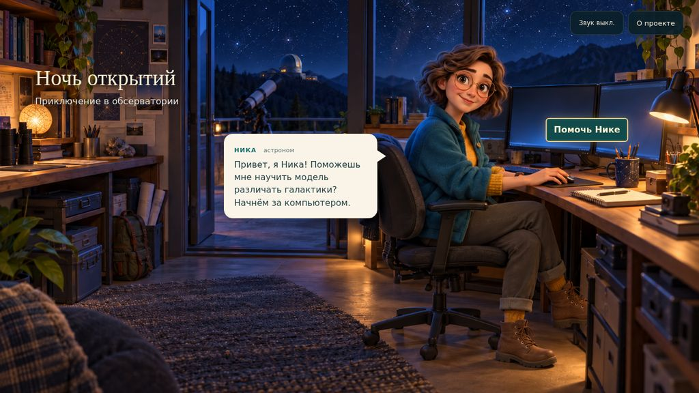
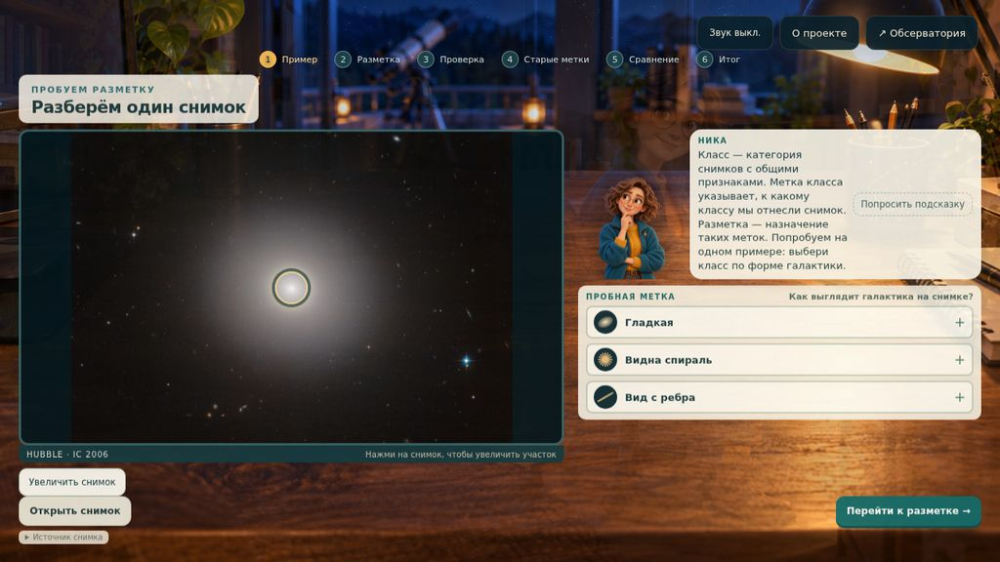
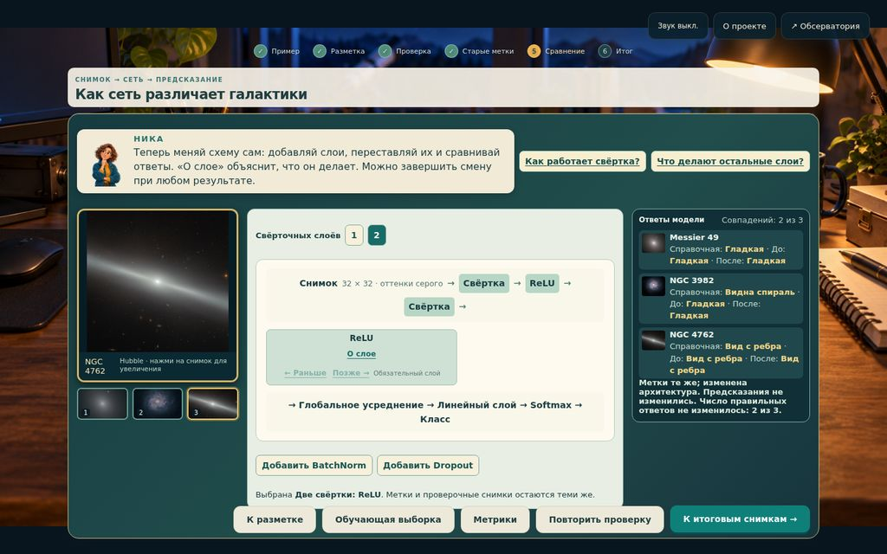

# Ночь открытий: приключение в обсерватории

Помогите астроному Нике разобраться в снимках галактик. Подготовьте
обучающую выборку, проверьте предсказания нейронной сети и измените её
устройство. А затем отправляйтесь исследовать звёздное небо.

Игра об астрономии и машинном обучении для детей примерно от 12 лет.
Создана на [факультете искусственного интеллекта МГУ](https://ai.msu.ru/)
для фестиваля «Наука 0+», 10–11 октября 2026 года.

**[Скачать игру](https://github.com/fall-out-bug/msu_science_day_2026/releases/latest/download/night-of-discoveries.zip)**
· [Выпуски](https://github.com/fall-out-bug/msu_science_day_2026/releases)
· [Памятка стендисту](designlab/galaxy-shift/FACILITATOR.md)

## Как играть

1. Скачайте и распакуйте архив игры целиком.
2. Откройте `index.html` в настольном браузере.
3. Познакомьтесь с Никой и начните ночную смену.

Интернет, установка и учётная запись не нужны. Ника объясняет понятия
по ходу игры; предварительные знания о нейронных сетях не требуются.
Ребёнок может пройти игру самостоятельно, а стендист — помочь по желанию.
Автономная версия хранит журнал прохождения только в текущей вкладке.

## Что вас ждёт

- Настоящие снимки галактик из архива NASA/ESA Hubble: спиральные рукава,
  гладкое свечение и диски, которые видны с ребра.
- Разметка снимков и проверка того, как выбранные метки влияют на модель.
- Первый опыт со свёрточной нейронной сетью вместе с Никой, затем
  самостоятельное изменение и конструктор с 22 архитектурами.
- Звёздная карта, 19 историй о научных открытиях и 24 архивные галактики.

Для разных меток и архитектур заранее выполнено **48 114 обучений**.
Браузер показывает результат выбранного
опыта. Это учебная работа с небольшими выборками; больше слоёв не означает
лучший ответ. [Подробнее о данных и методе](designlab/galaxy-shift/DATA-NOTES.md).

## Кто создал игру

**Анастасия Колесникова**, магистрант факультета ИИ, — научное содержание
и проверка фактов: чтобы галактики оставались галактиками.

**Андрей Жуков**, преподаватель факультета ИИ, — техника и игровые механики:
чтобы обсерватория открывалась, а кнопки делали обещанное.

**GPT-6 Astra**, генеративный ИИ, — код, тексты и сборка.
Работает без кофе, но под присмотром.

## Для разработчиков

Игра написана на JavaScript, HTML и CSS. Для запуска исходников достаточно
открыть [`designlab/galaxy-shift/index.html`](designlab/galaxy-shift/index.html)
в браузере. Сборка и научные расчёты выполняются отдельно.

[Исходники, сборка и проверки](designlab/galaxy-shift/README.md)
· [Дизайн игры](docs/design-2026-10-09/night-of-discoveries.md)
· [Научные эксперименты](designlab/galaxy-shift/experiments/README.md)
· [Сообщить об ошибке](https://github.com/fall-out-bug/msu_science_day_2026/issues/new)

## Лицензии

Наш программный код распространяется по [лицензии MIT](LICENSE).
У научных изображений, каталогов, библиотек и художественных иллюстраций
свои условия использования: [лицензии и атрибуция](THIRD_PARTY_NOTICES.md).
