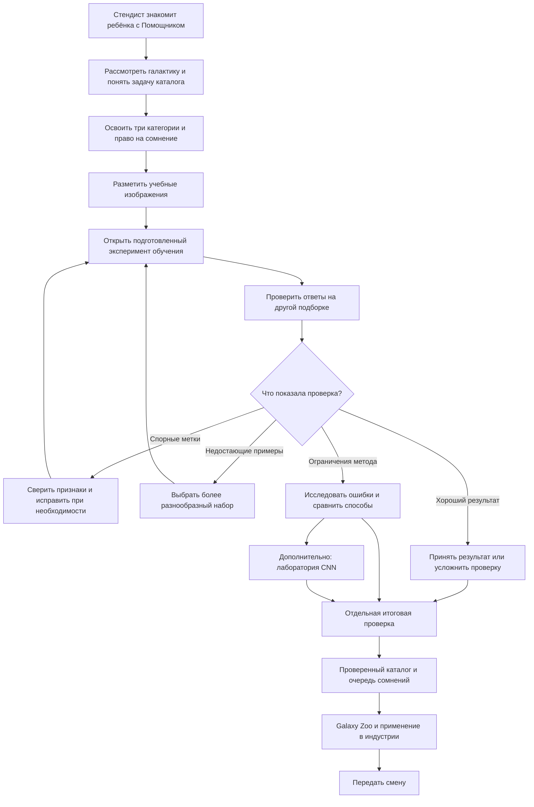
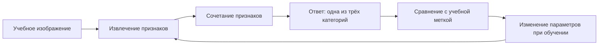
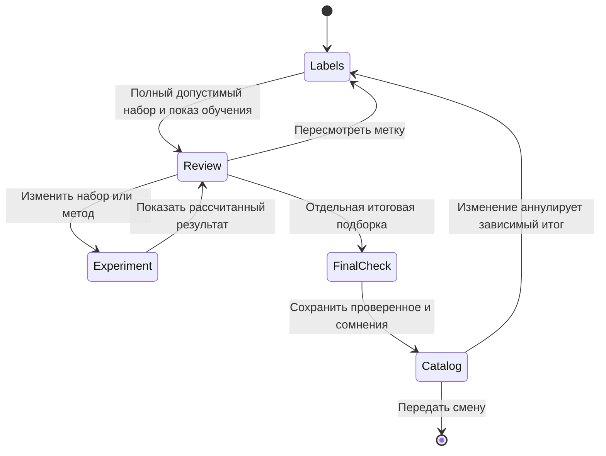

# Первая смена: галактики и машинный помощник

Единый сценарий игры и работы стендиста · редакция 6 октября 2026 · проект для обсуждения

Эта редакция заменяет исследование движущихся следов классификацией изображений галактик. Ника больше не участвует в обязательном сценарии: наставником становится живой стендист. ИИ-помощник остаётся персонажем первой смены. Документ описывает будущую игру, а не уже реализованную механику.

## 1. Замысел

В обсерваторию поступила новая подборка архивных снимков галактик. Исследователям нужен каталог, в котором можно выбирать изображения по видимому строению. У машинного помощника первая смена. Ребёнок вместе со стендистом готовит для него учебные примеры, проверяет предложения на других изображениях и передаёт небольшой проверенный каталог с отдельной очередью сомнительных случаев.

**Цель ребёнка:** подготовить помощника к работе и собрать каталог, которому можно доверять в пределах проверенного задания. Персонаж не получает опыт за количество нажатий: его работу меняют выбранные данные и способ классификации.

**Педагогическая арка:** «Я рассмотрел данные → договорился о группах → подготовил примеры → увидел ответы модели → проверил и улучшил работу → понял, зачем это исследователям и индустрии».

Это учебная работа с архивными изображениями, а не управление настоящим телескопом в реальном времени. Рассвет завершает вымышленную смену; он не ограничивает игрока таймером. Результаты не отправляются автоматически в Galaxy Zoo и не выдаются за вклад в его научный каталог.

Игра целиком работает без интернета. Все эксперименты обучения, ответы и метрики рассчитаны заранее. Выбор ребёнка определяет показанный вариант. Реплики помощника написаны авторами; свободного чата, внешних моделей и обучения во время игры нет. Общие комментарии к этому документу — отдельный сервис для коллег, не зависимость игры.

## 2. Учебная задача и понятия

### Классифицируем видимый облик

Один пример — вырезка снимка с одной выбранной галактикой в центре. Помощник относит пригодное изображение к одной из трёх учебных категорий. Это многоклассовая классификация с обучением по размеченным примерам, а не поиск аномалий.

| Категория на кнопке | Что ищем на снимке | Граница объяснения |
|---|---|---|
| Гладкая | На пригодном изображении виден гладкий профиль без различимой спиральной структуры и без явного диска с ребра | Не утверждаем, что любая гладкая галактика физически эллиптическая |
| Видна спираль | Различимы спиральные рукава | Цвет сам по себе не определяет эту категорию |
| Диск с ребра | Видно тонкое вытянутое изображение диска с признаками наблюдения с ребра | Это ракурс, а не отдельный физический тип галактики |

Это ограниченная учебная схема описания изображения, а не полная астрономическая классификация. Для обязательного набора подбираются ясные примеры с согласованной справочной разметкой. Категории не должны конкурировать на одном учебном изображении. Граница между гладким объектом и диском с ребра проверяется при подготовке данных; одной вытянутости для вывода недостаточно.

**«Не могу уверенно определить» — отдельное действие исследователя, не четвёртый класс.** Оно отправляет изображение на разбор и не записывает случайную метку. Размытый снимок не становится «гладкой галактикой» только потому, что рукавов не видно. Слияния, сложные структуры и пограничные примеры не принуждаются к одной из трёх категорий.

Перед реализацией категории и конкретные изображения требуют научной проверки. Если выбранные материалы не позволяют устойчиво различать эти группы, корректируются подборка и учебная схема, а не подгоняются справочные ответы.

### Что получает модель

| Элемент | Постановка |
|---|---|
| Вход | Изображение выбранной галактики; для простого метода — заранее полученное представление изображения числовыми признаками |
| Учебный ответ | Одна из трёх меток, выбранная ребёнком |
| Результат | Предложенная категория для другого изображения |
| Проверка | Сопоставление с подготовленной справочной разметкой и её основаниями, с учётом неопределённости |
| Результат смены | Проверенная часть учебного каталога и очередь для дополнительного разбора |
| За границами задачи | Определение расстояния, возраста, химического состава, поиск любых аномалий и объявление новых открытий |

### Четыре понятия, которые связывает игра

| Понятие | Что ребёнок делает | Что объясняет стендист |
|---|---|---|
| Наука о данных | Ставит вопрос, смотрит качество снимков, размечает, проверяет и описывает ограничения каталога | «Из данных нужно получить обоснованный ответ, пригодный для работы» |
| Машинное обучение | Готовит примеры с метками и рассматривает ответы на новых изображениях | «Программа использует закономерности в примерах, чтобы отвечать на новых данных» |
| ИИ | Готовит помощника для конкретной задачи и выясняет его ограничения | «Такие системы могут помогать с изображениями, речью и текстом. Машинное обучение — один из способов их создавать» |
| Польза для индустрии | Выясняет, какую часть работы автоматизировали и как проверили результат; переносит опыт на фотографии деталей | «Полезность определяется задачей и проверкой. Одного красивого ответа недостаточно» |

Число классов не определяет наличие машинного обучения. Готовое правило тоже может распределять изображения по группам, но не обучается от того, что ребёнок нажал кнопку. Модель по примерам и правило объясняются раздельно.

## 3. Участники и пространство

### Ребёнок — исследователь

Рассматривает галактики, обосновывает метки, замечает сомнения, выбирает следующий эксперимент и проверяет каталог. Ошибка не приводит к потере смены. За обоснованное сомнение нет штрафа.

### Стендист — наставник

Объясняет научную цель, помогает освоить признаки, задаёт вопросы и связывает действия с понятиями. Не обязан играть роль Ники или читать длинный текст дословно. Первый пример разбирает вместе с ребёнком, затем оставляет ему возможность действовать.

### Помощник — новичок первой смены

Дружелюбный машинный персонаж. Показывает, какие примеры получил, что предложил на новых снимках и как прошла проверка. Не знает автоматически, что человек ошибся, не обижается на исправления и не становится всезнающим преподавателем.

Карточка «О помощнике»:

> Сегодня моя первая смена с галактиками. Покажи мне примеры трёх групп — посмотрим, как я справлюсь с другими изображениями. Мои ответы нужно проверять.
>
> Я — персонаж учебной игры. Реплики подготовили авторы. Здесь показаны заранее рассчитанные эксперименты: ты выбираешь данные и видишь соответствующий результат. Мы изучаем классификацию изображений, а не обучение разговору.

### Обсерватория как рабочее место

Сохраняются атмосфера комнаты, небо за окном и переходы к исследованию. На месте обязательного диалога с Никой появляется рабочее пространство помощника. Архив приносит снимки; стол позволяет приближать изображения и размечать; доска показывает учебную выборку, проверку и каталог. Карта может показывать положение выбранной галактики, если координаты проверены. Ручное наведение телескопа не является обязательным шагом обработки архивного снимка.

Справочник формы и краткая цель всегда доступны. Если стендист занят другим посетителем, ребёнок может продолжить: интерфейс показывает ближайшее действие, но не выдаёт верную метку заранее. История обсерватории и прогулка по небу остаются необязательными остановками с возвратом к смене.

## 4. Маршрут и глубина

Основной маршрут содержит весь цикл «данные → разметка → обучение → проверка → полезный результат». Сравнение методов и CNN — необязательные продолжения. При сокращении времени уменьшается число самостоятельных примеров и используется подготовленный учебный набор, но проверка и финал не исчезают.

Возраст не выбирается на входе. Стендист читает реплики тем, кому трудно читать; самостоятельному ребёнку предлагает обосновать метку; заинтересованному открывает признаки и сравнение моделей. Продолжительность и самостоятельность пока не измерены.

## 5. Сцены и реплики

### Сцена 1. У помощника первая смена

**Экран:** комната, панель нового помощника, входящая подборка галактик. Кнопки «Начать смену» и «О помощнике».

**Стендист:** «Исследователи изучают, как устроены галактики. Чтобы выбирать нужные снимки из большого архива, им нужен каталог. Сегодня подготовим помощника, который предложит, к какой группе отнести изображение».

**Помощник:** «Привет! У меня первая смена. Покажешь, какие признаки будем различать?»

**Действие:** включить помощника, открыть первый снимок. На экране остаётся цель «Подготовить помощника и проверить каталог».

**Связь с опытом ребёнка:** стендист спрашивает «Ты уже встречал ИИ? Что с ним делал?» При необходимости называет ChatGPT, Claude, Алису, ГигаЧат, DeepSeek или Qwen. Это приглашение к разговору, не обязательный перечень сервисов и не онлайн-демонстрация.

### Сцена 2. Сначала увидеть галактику

**Экран:** крупный реальный снимок с проверенным происхождением. Можно приблизить его и отметить интересную деталь. Рядом — второе изображение для сравнения.

**Стендист:** «Что заметил? Есть ли здесь узор? Чем эти два изображения отличаются?»

**Помощник:** «Сохраним твоё наблюдение рядом со снимком».

**Действие:** рассмотреть и указать признак. Это наблюдение ещё не становится учебной меткой. Разглядывание имеет результат: отмеченная деталь остаётся в карточке и помогает объяснить будущий выбор.

**Стендист:** «Мы начали с вопроса и изучаем данные. Прежде чем учить программу, нужно самим понять задачу».

### Сцена 3. Договориться о категориях

**Экран:** три ясных справочных изображения: «Гладкая», «Видна спираль», «Диск с ребра». Под каждой кнопкой — видимый признак. Отдельно — «Не могу уверенно определить».

**Стендист:** «Мы описываем то, что различимо на снимке. Диск с ребра — это вид сбоку. Он не становится другим физическим типом только из-за ракурса».

**Действие:** вместе разобрать один тренировочный пример, затем посмотреть намеренно трудный. Если изображение не позволяет решить, отправить его в очередь разбора.

**Помощник:** «Недостаточно деталей? Оставим этот снимок для дополнительной проверки. Случайная метка не поможет обучению».

**Учебный смысл:** классы задают до разметки. Неопределённость не равна неправильному ответу и не является четвёртым учебным классом.

### Сцена 4. Подготовить учебные примеры

**Экран:** шесть ясных изображений из подготовленной подборки. Ребёнок выбирает метку; карточки собираются на доске по группам. В варианте исходной разметки для эксперимента представлены все три категории.

**Стендист:** «Снимок вместе с твоей меткой — учебный пример. Подготовим несколько таких примеров для помощника».

**Помощник:** «Вот примеры, которые ты мне дал. Какие группы здесь представлены?»

Если ребёнок сомневается, доступен справочник и совместный разбор. Система не подставляет ответ автоматически. Если весь набор отнесён к одной группе, предлагается проверить признаки и состав выборки; это ограничение подготовленного опыта, а не универсальное правило всех методов ML.

**Статус на экране:** количество собственных меток и состав выбранного набора. В коротком режиме ясно отделяются метки ребёнка от заранее подготовленной части архива. Нельзя говорить, что он разметил весь большой набор.

**Кнопка:** «Посмотреть обучение на этих примерах». Подпись: «Учебная симуляция: результаты рассчитаны заранее».

### Сцена 5. Как примеры влияют на ответ

**Экран:** путь «изображение + метка → подготовка модели → ответ на другом изображении». В основном опыте используется метод сравнения похожих примеров по заранее полученным числовым признакам изображения.

**Помощник:** «Этот снимок оказался близок к таким учебным примерам. По их меткам я предложил категорию».

**Действие:** открыть «Почему?» и увидеть конкретные похожие изображения и их метки. Иллюстрация показывает именно основания выбранного метода, а не произвольно подобранные красивые совпадения.

**Стендист:** «Ты не написал для каждой новой картинки готовый ответ. Программа использует учебные примеры. Это один из способов машинного обучения».

**Пояснение симуляции:** «В настоящем эксперименте выполняются расчёты. Здесь мы заранее подготовили варианты, чтобы быстро посмотреть последствия твоих решений без интернета».

Признаки и способ их получения выбираются при подготовке экспериментов. Если используются признаки заранее обученной сети, её подготовка обозначается отдельно: шесть меток ребёнка не выдаются за обучение всей системы с нуля.

### Сцена 6. Первая проверка без обязательного провала

**Экран:** другая подборка галактик. Ребёнок сначала может предположить категорию, затем открыть ответ модели и справочную проверку.

**Стендист:** «Учебные изображения уже знакомы помощнику. Сейчас посмотрим, как он справляется с другими».

**Помощник:** «Вот мои предложения. Сравним их с проверенными примерами и посмотрим, где нужен разбор».

Показываем число совпадений и ошибок, а также результат по каждой из трёх групп. Для младших — изображения и отметки совпадения. Проценты, если нужны, сопровождаются числом примеров. Это результат на выбранной подборке, не качество на всех галактиках.

**Если всё получилось:** «На этой подборке ответы совпали. Можно закончить проверку или взять более трудные изображения». Не ухудшаем результат ради сюжетной неудачи.

**Если ответы расходятся:** «Здесь ответы различаются. Давай разберём признаки и учебные примеры». Несогласие с моделью само по себе не доказывает ошибку ребёнка.

**Стендист объясняет источник проверки:** «Это учебный архив: авторы заранее подобрали примеры со справочными ответами. Благодаря этому мы можем потренироваться и проверить результат».

### Сцена 7. Выбрать, что улучшать

| Наблюдаемая ситуация | Действие ребёнка | Что показывает игра |
|---|---|---|
| Метка не согласуется с видимыми признаками и справочной проверкой | Сверить снимок со справочником и при необходимости изменить метку | Новый подготовленный вариант; какие ответы изменились и какие остались прежними |
| В наборе мало разнообразия | Выбрать подготовленное дополнение с другими ракурсами или примерами недостающей группы | Состав набора до и после; результат на одинаковой разборочной подборке |
| Снимок слишком трудный | Отправить на дополнительный разбор | Сомнение сохранено; случайная метка не попала в обучение |
| Метки обоснованны, ошибки остаются | Посмотреть ограничения признаков или сравнить метод | Исправление разметки не объявляется универсальным лекарством |
| Результат хороший | Принять его либо открыть сложный опыт | Смена может завершиться без обязательного исправления |

**Помощник:** «Что проверим сначала: метки, разнообразие примеров или способ классификации?»

Красная подсветка доступна как подсказка стендиста по учебному архиву, а не как всезнающее суждение модели. Она выделяет пример для разбора; для правильной метки ребёнок обращается к признакам и пояснению. В сложном режиме сначала показывается только расхождение.

**Стендист:** «Исправление может помочь, но результат нужно проверить. Больше примеров тоже не всегда означает лучше: важно, какие они».

После изменения данных прежняя проверка и зависимый итог помечаются устаревшими. Разобранный набор служит для исследования ошибок. Итог смены проверяется на отдельной подборке, не использованной для этих решений.

### Сцена 8. Дополнительно: способы и нейросеть

**Помощник:** «Хочешь сравнить несколько способов выполнения той же задачи?»

Первый опыт сравнивает ручное правило, похожие примеры и дерево решений. Правило задаёт человек; дерево и метод похожих примеров используют обучающую выборку. Классы, исходные изображения и проверочная подборка общие. Для простых методов фиксируется одинаковое представление изображения признаками.

**Стендист:** «Посмотрим не только на число совпадений. Где способы ошибаются и можем ли мы понять их ответ?»

Самая сложная ветка — CNN, свёрточная нейросеть для изображений. В этой ветке сеть получает изображение, а не измерения движения из прежнего сценария. Ребёнок видит несколько цветных блоков: «найти локальные признаки → соединить признаки → предложить категорию». Это схема устройства; она не утверждает, что каждый блок обязательно узнаёт конкретную понятную человеку часть галактики.

**Действие:** выбрать один из двух-трёх заранее подготовленных вариантов сети, предположить результат, открыть сохранённые этапы обучения и проверить на новых изображениях. Свободного конструктора произвольной архитектуры нет: каждый разрешённый вариант обеспечен экспериментом.

**Стендист:** «Мы изменили способ обработки изображения. Это не гарантирует улучшения. Проверим, что получилось».

Для CNN используется расширенный подготовленный набор. Если показываем сравнение с другими моделями, все они используют одинаковое разделение исходных изображений на обучение и проверку; различие представления данных явно объясняется. Если демонстрируем эффект только архитектуры, фиксируем данные и прочие условия эксперимента. Нельзя сравнивать результаты на разных подборках как доказательство превосходства сети.

Ребёнок может сравнить ранний и поздний этапы обучения. Подготовленный опыт переобучения показывает, что результат на учебных изображениях улучшается, а на новых — нет или ухудшается. Этот эффект должен подтверждаться расчётами; не назначается произвольно.

**Помощник:** «Знакомые изображения — ещё не вся задача. Для выбора модели важна отдельная проверка».

### Сцена 9. Передать каталог

**Экран:** итоговая подборка, затем доска каталога. Есть проверенные записи и очередь дополнительного разбора. Неопределённость можно сохранить, не блокируя завершение смены.

**Стендист:** «Какие записи мы готовы передать исследователям, а какие нужно рассмотреть ещё?»

**Помощник:** «Я предложил категории. В каталоге отмечено, что проверено, а где есть сомнения».

**Результат:** скачать журнал с вопросом, изображениями и источниками, выбранным методом, версией учебного набора, результатами отдельной проверки и нерешёнными случаями. На экране различаются предложения модели и проверенные записи.

**Стендист:** «Теперь в нашем учебном каталоге можно выбрать, например, снимки с видимой спиралью. Это помогает подготовить материал для дальнейшего исследования. Но по одной форме мы ещё не объяснили, почему галактики устроены именно так».

Финал описывает действия игрока, не хвалит за любое прохождение и не объявляет открытия. Не выдумываются экономия времени и рост точности. Успех — обоснованный результат с обозначенными границами.

### Сцена 10. Настоящая наука и индустрия

**Стендист:** «Есть настоящий проект Galaxy Zoo. Люди помогают описывать видимый облик галактик, а их ответы используют для научных каталогов и обучения моделей. Наша игра — упрощённый учебный пример этой идеи».

Карточка Galaxy Zoo объясняет, что реальные классификации могут включать последовательность вопросов и ответы нескольких людей. Разногласия и неопределённость сохраняют смысл, а не просто становятся красными ошибками. На карточке есть источники и ссылка для дальнейшего знакомства; переход не нужен для завершения офлайн-игры. Мы не заявляем сотрудничество с проектом или отправку игровых меток в его базу.

**Перенос на индустрию:** ребёнок собирает цепочку для фотографий деталей: «Задача проверки → снимки → размеченные примеры известных категорий → предложение модели → независимая проверка → решение о дополнительном осмотре».

**Стендист:** «Какие данные понадобятся на заводе? Подойдут ли наши галактики? Как проверить, что помощник полезен?»

**Помощник:** «Для другой задачи нужны подходящие примеры и новая проверка».

Финальный вопрос вместо экзамена по определениям: «Если на другом телескопе снимки стали выглядеть иначе и помощник ошибается, что ты предложишь проверить?» Младший ребёнок может выбрать картинки или показать примеры, старший — объяснить качество данных, разметку или условия применения.

## 6. Памятка стендисту

Начать с цели: «Подготовим машинного помощника и проверим каталог галактик». Затем дать ребёнку рассмотреть изображение. Понятие называть после соответствующего действия, когда у слова уже есть смысл.

| Когда нужна помощь | Реплика или действие |
|---|---|
| Непонятно, что делать | «Приблизь снимок и найди признак из справочника» |
| Ребёнок угадывает по цвету | «Посмотрим на строение. Видны ли рукава или диск?» |
| Не уверен в категории | «Можно оставить для разбора. Какой детали нам не хватает?» |
| Спрашивает, зачем размечать, если есть ответы | «Это учебный архив для первой смены. Проверенные примеры помогают нам научиться и проверить помощника» |
| Модель ошиблась | «Что могло повлиять: снимок, примеры, метки или способ обработки?» |
| Всё получилось | «Хочешь закончить смену или испытать помощника на более трудной задаче?» |
| Пришли другие посетители | Оставить ребёнку понятный ближайший шаг; справочник и цель остаются на экране |

Четыре опорных вопроса: **«Что заметил? Почему выбрал эту метку? Что предложил помощник? Как проверим?»** Не задавать их после каждой кнопки и не подсказывать все ответы заранее.

Для младших стендист читает реплики и принимает указание на изображении. Для самостоятельных детей достаточно вопросов в переходах. Сравнение методов и CNN предлагаются по интересу. При работе вдвоём один предлагает метку, другой ищет её основание; затем роли меняются.

Разговор о современных ИИ опирается на опыт ребёнка. Обычное использование готового чат-бота не равнозначно переобучению модели. Возможности конкретных сервисов перед выпуском отдельной справки проверяются по актуальным источникам. В игре не нужны аккаунты, телефоны и личные данные детей.

Перед посетителями: открыть локальную сборку без сети, начать новую смену, проверить доступность основных действий, возврат из справочника и передачу смены. Короткое прохождение всё равно включает отдельную проверку и финал. Обещания длительности даются только после пробного прохождения.

## 7. Контракт предсказуемой симуляции

Все ответы соответствуют выбранному состоянию эксперимента. Разметка не игнорируется и не подменяется удобной веткой. Правильная первая попытка не превращается в провал ради драматургии.

| Выбор | Конечное пространство вариантов | Подготовленный результат |
|---|---|---|
| Метки шести ясных изображений | Три категории на изображение: 729 полных комбинаций | Результаты всех разрешённых комбинаций либо явная причина недоступности обучения |
| «Не могу определить» | Пауза/разбор без записи учебной метки | Возврат к справочнику и примеру; обучение полного набора ждёт разрешения либо явно выбранного готового набора |
| Дополнение выборки | Несколько готовых пакетов; собственные метки сохраняются отдельно | Состав пакета и результаты его сочетания с доступными решениями |
| Выбор метода | Фиксированный перечень способов | Ответы, объяснения и результаты на общей проверке |
| CNN | Два-три фиксированных опыта с сохранёнными этапами | Архитектура, условия обучения, ответы и измеренные метрики |
| Изменение метки | Новая версия эксперимента | Сброс зависимых проверок и финала |

729 — только число вариантов шести троичных меток, а не бюджет всей игры. Дополнения, методы и прочие переключатели умножают число состояний. До реализации нужна полная таблица достижимых комбинаций. Если покрытие слишком велико, уменьшаем число независимых переключателей или предлагаем явно подписанные готовые эксперименты. Нельзя принимать произвольный выбор и показывать не соответствующую ему метрику.

Для каждого варианта сохраняются источник изображений, справочные метки и их основания, признаки, параметры модели, собственные метки игрока, разделение данных и результаты расчёта. Числа предопределены воспроизводимым экспериментом, а не придуманы для желательного сюжета.

Разделение данных выполняется по галактикам, а не только файлам: другой поворот или вырезка того же объекта не считается независимым тестовым объектом. Учебная, разборочная и итоговая подборки различаются. Если итоговую подборку уже раскрыли и затем изменили модель, повторный результат не называется слепой проверкой; нужен другой подготовленный набор либо явное обозначение повторного просмотра.

Все необходимые изображения, шрифты, справочники, подписи, результаты и реплики входят в локальную поставку. Одинаковое состояние даёт одинаковый результат, в том числе после перезагрузки. Внешние ссылки остаются необязательной справкой.

## 8. Что подготовить и проверить

### До реализации

- Выбрать разрешённые к распространению снимки и сохранить объектные идентификаторы, источники, авторство, лицензии и правила преобразований. Текущие снимки для поиска движения не считаются подходящим набором галактик автоматически.
- Согласовать три учебные категории на конкретных изображениях. Подготовить ясные справочные случаи и отдельно — сомнительные; сохранить основания, а не выдавать единственную метку за абсолютную физическую истину.
- Выбрать представление изображений для простого метода, рассчитать ответы для доступных меток и подтвердить содержательное влияние решений ребёнка.
- Составить полную таблицу состояний, включая правильную первую попытку, спорную метку, нехватку разнообразия, ограничения модели и отказ от классификации.
- Для CNN подготовить расширенную выборку, условия сравнения и реальные сохранённые этапы. Красивые активации не подменяют объяснение; показываемые промежуточные результаты принадлежат этому эксперименту.
- Проверить разделение данных по объектам, научные формулировки и содержание карточки Galaxy Zoo.

### На пробном прохождении

Ребёнок понимает, зачем нужен каталог; отличает метку от наблюдения; может показать, какие примеры получил помощник и что проверялось отдельно. Не считает, что исправление гарантирует рост качества, сложная сеть всегда лучше или что его шесть меток научили персонажа разговаривать.

Стендист может провести основную смену по памятке, не читая лекцию. Интерес возникает при рассматривании объектов и исследовании ошибок, а не только от сортировки. Измеряются время, места затруднений и возможность закончить маршрут при ограниченном внимании стендиста.

### В готовой сборке

Проверить полный маршрут без сети, все разрешённые состояния и объяснения, восстановление смены, сброс зависимых результатов после изменения, правильный финал для хорошей первой попытки, очередь сомнений и журнал. Проверить 14-дюймовый Full HD с масштабированием, доступность подсказок и отсутствие перекрытий. При коротком прохождении проверка модели не исчезает.

## 9. Основания, изменения и следующий шаг

### Научная опора

[Каталоги Galaxy Zoo](https://data.galaxyzoo.org/) содержат визуальные классификации, доли голосов и сведения о неопределённости; разные выпуски используют разные схемы описания. Наша трёхкатегорийная схема — авторское учебное упрощение для отобранных изображений, а не дословное воспроизведение полного протокола Galaxy Zoo.

[Объяснение работы машинного обучения командой Galaxy Zoo](https://blog.galaxyzoo.org/2019/05/21/scaling-galaxy-zoo-with-bayesian-neural-networks/) связывает ответы добровольцев с обучением моделей и обсуждает различную уверенность классификаций. Это основание для рассказа о данных и неопределённости, а не подтверждение наших ещё не рассчитанных метрик.

### Что меняется в проекте

| Сохраняем | Заменяем |
|---|---|
| Первую смену помощника, атмосферу обсерватории, журнал и офлайн-работу | Поиск движущихся следов — классификацией изображений галактик |
| Разметку, проверку, сравнение способов и дополнительную нейросеть | Нику в обязательном маршруте — живым стендистом |
| Общую цель объяснить данные, ML, ИИ и пользу для индустрии | Список кандидатов для наблюдения — проверенным учебным каталогом |
| Предсказуемые подготовленные эксперименты | Две метки связей точек — тремя категориями видимого облика |

Этот документ не подтверждает готовность изображений, моделей или новой игровой сборки. Следующий шаг — подобрать небольшой проверенный набор галактик и собрать один законченный эпизод: рассмотреть → разметить → проверить ответ помощника → выбрать обоснованное действие. Только после проверки этого эпизода расширяем всю игру.
