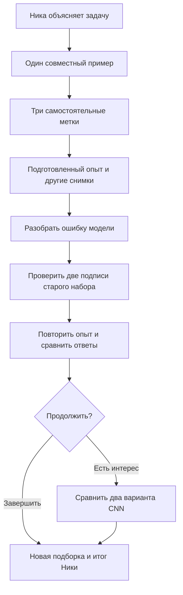
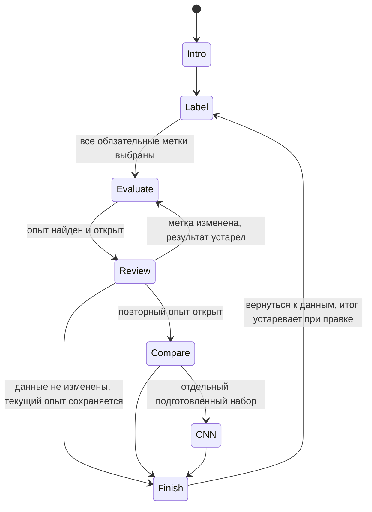

# Первая смена: атлас галактик

Дизайн-документ · редакция «Ника и модель», 6 октября 2026. Согласованный сценарий и план первого игрового эпизода.

Эта редакция заменяет прежний обязательный маршрут. Ника возвращается как исследователь; ребёнок работает с моделью классификации изображений. Microduck отложен: концепты сохранены, персонаж не входит в текущие экраны, реплики и обязательные работы. Дневная лаборатория, Кавказ, современная техника, архив и ковёр остаются художественным направлением.

Документ и кликабельные экраны — проект будущей игры. Рассчитанного пакета экспериментов и новой игровой сборки пока нет. Действующая игра про наблюдения остаётся отдельной поставкой.

## 1. Задача и легенда

Ника — астроном, которая готовится к большому потоку изображений нового орбитального телескопа Nancy Grace Roman. Рассмотреть каждый снимок вручную будет трудно. Она приглашает ребёнка подготовить модель, которая предварительно рассортирует галактики по видимым признакам. В старой учебной подборке есть неверные подписи: команда обнаружит их через проверку, исправит и сравнит ответы модели.

**Обещание ребёнку:** «Помоги Нике научить модель различать галактики и проверь, как она справляется с другими снимками».

Ника занята, но не находится в панике. Нет таймера, угрозы провала дедлайна и обязанности спасать взрослого. Видимая польза работы — следующая подборка получает предварительные категории; человек видит, какие ответы проверены.

**Сноска рядом со снимками:** «В игре используются архивные снимки других телескопов, а не изображения Roman. Мы готовимся к будущему потоку данных, когда снимков станет на порядки больше».

NASA сообщает о запуске Roman 30 августа 2026 года, ожидаемых первых изображениях к началу 2027 года и скорости обзора до тысячи раз выше Hubble. Это мотивация автоматизации, а не обещание результатов нашей модели. [Источник NASA](https://www.nasa.gov/news-release/nasas-dark-universe-seeking-nancy-grace-roman-space-telescope-launches/). Лаборатория в горах работает с доступными архивами; она не управляет орбитальным телескопом. Финал не требует заявки местному телескопу.

## 2. Участники и слова

| Участник | Роль |
|---|---|
| Ника | Ставит задачу, показывает первый пример, вместе с ребёнком разбирает результат. Короткие заранее написанные реплики; свободного чата нет. |
| Ребёнок | Рассматривает снимки, выбирает метки, проверяет ответы, исправляет данные и пробует другой вариант модели. |
| Стендист | Помогает читать и замечать признаки; объясняет сложные случаи и глубину материала по интересу ребёнка. |
| Модель на рабочем экране | Предлагает категории для изображений. Не является отдельным говорящим персонажем. |

Основное слово интерфейса — **модель**. Разметка — подписи к учебным снимкам; обучение — поиск закономерностей по примерам; проверка — сравнение ответов на других снимках со справочными ответами.

Связь с ИИ объясняем один раз: «Сегодня мы учим ИИ различать галактики на изображениях». Не предполагаем заранее, что ребёнок считает любой ИИ разговорным сервисом. Если вопрос возник, стендист поясняет отличие задач. CNN — свёрточная нейронная сеть; термин появляется в дополнительном эксперименте.

**Честное объяснение формата:** «Мы заранее провели опыты с разными данными. Ты выбираешь подписи и видишь результат подходящего опыта». Нет живого обучения, внешнего API, случайных процентов или декоративной долгой загрузки.

## 3. Один короткий маршрут

Ориентир основного прохода — 5–10 минут со стендистом. Это цель для проверки, а не измеренная длительность. Один маршрут для разных возрастов; число объяснений регулирует стендист. Нет экрана выбора возраста.

Для первого среза выбираем три самостоятельных снимка. Четвёртый возможен после проверки длительности и пересчёта пакета вариантов. Первый совместный пример имеет явно подготовленную подпись.

| Этап | Действие и экран | Что ребёнок понимает |
|---|---|---|
| Завязка | Общий план дневной лаборатории; Ника приглашает к столу | Зачем автоматизировать обработку снимков |
| Знакомство | Один крупный снимок и три образца признаков | Что различаем и что такое метка |
| Разметка | Три снимка по одному; приблизить, выбрать подпись, получить помощь | Модель получает примеры с ответами |
| Первая проверка | Другие снимки, ответ модели и справочный ответ | Верная разметка ребёнка не гарантирует хорошую модель при ошибках в старом наборе |
| Исправление | Несколько старых примеров, относящихся к разбираемой проблеме | Подписи в данных тоже надо проверять |
| Повторная проверка | Те же проверочные снимки рядом «до / после» | Что изменилось именно после правки |
| Дополнительно | Два подготовленных варианта CNN на одинаковых данных | Устройство модели тоже влияет на ответы |
| Финал | Ещё не показанная итоговая подборка и краткое резюме Ники | Автоматизация полезна, но ответы требуют проверки |

## 4. Разметка и помощь

Три учебные категории описывают видимый облик: **«Гладкая», «Видна спираль», «Диск с ребра»**. Это не полная физическая классификация. На обязательных снимках признаки должны быть ясными и категории не должны конкурировать. Ника показывает признак на одном общем примере, затем ребёнок действует сам.

На экране — крупное изображение, источник, три подписанные кнопки, приближение и **«Помоги разобраться»**. Помощь показывает, куда смотреть, либо приглашает стендиста; она не записывает случайную метку. В обязательной игре нет отдельного класса сомнения и обязательной очереди сложных объектов.

Научный просмотр изображений — работа авторов до сборки. Трудные случаи, ракурс и различие физического типа и видимого облика — в памятке стендиста. Ребёнок не обязан читать эти ограничения, чтобы продолжить.

## 5. Ошибка как повод исследовать данные

Не объявляем самостоятельную работу ребёнка неверной ради сюжета. Проблему готовим в старой подборке: даже при правильных новых метках в ней могут оставаться ошибочные подписи. Показываем только ошибки, которые действительно есть в выбранном рассчитанном опыте.

Сначала ребёнок видит расхождение на проверочном снимке. Затем вместе с Никой рассматривает два старых учебных примера. Не подсвечиваем заранее все неверные карточки. Подсказка указывает наблюдаемый признак; после выбора можно открыть справочное объяснение.

Реплика Ники: «На этом снимке видны рукава, а подпись говорит “гладкая”. Какую подпись оставим?» Проверочные ответы сами по себе не устанавливают причину ошибки; связь с разметкой проверяем повторным опытом на той же модели.

Если подписи не изменены, сохраняем текущий результат с подписью «Данные не изменены»: можно вернуться к карточкам либо завершить, но не показываем выдуманное «после».

После правки прежний результат помечается как предыдущий. Для нового состояния нужен соответствующий подготовленный опыт. Улучшение каждого ответа не гарантировано. Если ошибок нет, Ника отмечает это и предлагает сравнить с подготовленным примером плохой разметки как с **отдельным опытом**, не подменяя результат ребёнка.

Основной показатель — «Верно определено X из N снимков», рядом конкретные ответы. X и N поступают из расчёта. Accuracy можно раскрыть как название доли верных ответов; F1 не входит в обязательный экран.

## 6. Два варианта CNN

Пробуем короткое сравнение вместо свободного конструктора. Предлагаемый первый фактор — один либо два свёрточных блока. На схеме ребёнок добавляет или убирает второй блок; первый ищет локальные признаки, второй может сочетать их в более сложные. Это объяснение принципа, не гарантия улучшения.

Остальные условия опыта фиксируем: данные и метки, разбиение, подготовка изображений и протокол обучения. Больший вариант имеет больше параметров; это явно записывается в описании опыта. До расчёта не утверждаем, что он лучше. Показываем ответы обоих вариантов, включая неизменившиеся и ухудшившиеся; не рисуем оценку до проверки.

Варианты считаются заранее. Для первого среза сравнение доступно на одном явно обозначенном подготовленном исправленном наборе. Если метки ребёнка отличаются, предлагаем отдельно открыть этот набор; его результат не выдаётся за обучение на текущих метках. После расчётов можно расширить покрытие вариантов.

Экран можно пропустить и закончить смену после работы с данными. Научная и техническая пригодность пары CNN ещё не подтверждена: сначала подготовить опыты, затем зафиксировать её в поставке.

## 7. Лаборатория и навигация

Современная дневная лаборатория в горах Кавказа: крупные экраны, архив, ковёр, за окном верхняя площадка обсерватории. Ника присутствует в сцене и коротких репликах. Утка и латунный помощник отсутствуют в задании на новую графику. Старые изображения с ними остаются только в истории.

Утро — знакомство; день — работа с данными; вечер — завершение. Свет меняется по этапам, без таймера. Один ракурс и несколько приближений; WebGL допустим, но рабочие изображения и кнопки остаются фронтальным HTML-слоем. Мозаика возможна после появления достоверного референса.

Общий план → архив → рабочий стол → проверка → исправление → повторная проверка → дополнительный опыт или финал. Между снимками камера не возвращается в комнату. «Лаборатория» сохраняет текущую работу; «Продолжить» возвращает к ней. «Назад» не отменяет метки. Изменение метки делает зависимый результат устаревшим.

В макетах этой редакции показана схема интерфейса на нейтральном фоне и существующий образ Ники. Это не новый художественный концепт комнаты и не WebGL. Прежние утренние, дневные и вечерние иллюстрации с уткой доступны в истории как снятые с текущего задания.

[Кликабельные экраны](gdd-assets/navigation-nika/preview.html).

## 8. Данные и научное происхождение

Четыре изображения ESA/Hubble в материалах документа — справочные иллюстрации, не готовая обучающая выборка. Их оригиналы, авторство и SHA-256 сохранены. Не выдаём их за Roman и не рассчитываем качество на нескольких красивых демонстрационных снимках.

Для сборки нужны отдельные учебные, проверочные и итоговые галактики. Разные кадры и вырезки одной галактики не должны попадать в разные группы. Справочные метки с основаниями проверяются при подготовке. Непригодный пример заменяется с записью происхождения, а не переименованием категории под ожидаемый ответ.

Для сравнения «до / после» используем одну проверочную подборку и прямо называем её повторной. После подбора данных или архитектуры она уже не является независимым итоговым испытанием. Итоговая подборка не используется при выборе категорий, сюжетной ошибки, данных, базовой модели и пары CNN; эти решения фиксируются до её открытия. Финал относится к текущему базовому опыту с метками ребёнка; отдельное сравнение CNN его не заменяет. Финальная подборка открывается отдельно; повторное открытие не превращает её в новую.

### IC 2006 · справочное изображение

Credit: ESA/Hubble & NASA; Image acknowledgement: Judy Schmidt and J. Blakeslee (Dominion Astrophysical Observatory); Science acknowledgement: M. Carollo (ETH, Switzerland). [Источник](https://esahubble.org/images/heic1508a/) · [CC BY 4.0](https://esahubble.org/copyright/). Без изменений; не обучающий или проверочный набор.

### IC 5332 · справочное изображение

Credit: ESA/Hubble & NASA, R. Chandar, J. Lee and the PHANGS-HST team. [Источник](https://esahubble.org/images/potw2342a/) · [CC BY 4.0](https://esahubble.org/copyright/). Без изменений; не обучающий или проверочный набор.

### NGC 5023 · справочное изображение

Credit: ESA/Hubble & NASA. [Источник](https://esahubble.org/images/potw1512a/) · [CC BY 4.0](https://esahubble.org/copyright/). Без изменений; не обучающий или проверочный набор.

### Messier 85 · справочное изображение

Credit: ESA/Hubble & NASA, R. O'Connell. [Источник](https://esahubble.org/images/potw1905a/) · [CC BY 4.0](https://esahubble.org/copyright/). Без изменений; не обучающий или проверочный набор.

## 9. Сборка первого эпизода

### 1. Что уже есть и что отсутствует

Проверено в исходниках 6 октября 2026: действующая игра `designlab/comparison/night.html` и `night-model.js` посвящена наблюдениям и движущимся объектам. Её состояние, двоичные метки и мастерская `training-workshop.js` не реализуют новый сценарий. Переносим принцип разделения состояния и интерфейса, не подменяем в старой модели названия объектов.

`assets/nightshift/nika-v1.png` — существующий художественный образ Ники; происхождение в соседнем `CREDITS.md`. Для макета он пригоден, для дневной сцены нужно проверить свет и масштаб. Фоны `laboratory-*-v*.png` содержат утку и остаются историческими концептами до отдельной переработки графики.

В `assets/galaxies/sources.json` находятся четыре справочных снимка. Они не образуют готовый набор для обучения и проверки. Нет допущенного манифеста новой игры, рассчитанных опытов, результатов двух CNN и измерения длительности детского прохода.

### 2. Минимальная реализация

Предлагаем отдельный каталог `designlab/galaxy-shift/`, обычные HTML/CSS/JavaScript и локальные ресурсы. Это решение для первого среза. WebGL для комнаты остаётся следующим визуальным слоем: он не управляет данными и результатами. Новая игра не заменяет действующий сайт автоматически.

| Файл | Ответственность |
|---|---|
| `index.html`, `galaxy.css` | Рабочее место, Ника, крупные снимки, доступные кнопки и смена этапов |
| `data.js` | Версия набора, изображения, подписи и источники, подготовленные опыты |
| `model.js` | Чистые переходы, выбранные метки, ключ опыта, актуальность результатов |
| `game.js` | Отрисовка состояния и обработка действий |
| `check-model.mjs` | Достижимые состояния, точное соответствие данных и результатов |
| `check-browser.py` | Проход по UI, возвраты, помощь, отсутствие сетевых зависимостей |
| `build-galaxy.py` | Упаковка после рабочего среза: ресурсы, атрибуция, контрольные суммы |

В первом срезе состояние живёт в памяти вкладки; возврат в лабораторию его сохраняет. Перезагрузка начинает новую смену с ясным предупреждением. localStorage, миграции и экспорт журнала добавляются только при подтверждённой потребности. Общий сервер комментариев относится к документам, не к игре.

### 3. Контракт подготовленных опытов

Свободная разметка должна влиять на показанный опыт. Двух записей «до / после» недостаточно, если три собственные метки ребёнка тоже входят в обучение: они имеют 27 сочетаний. При двух исправляемых старых метках с тремя доступными категориями верхняя граница — 3^5 = 243 состояния одного базового метода. Первый совместный пример и остальная подготовленная выборка фиксированы.

Это проектный предел, не существующий пакет. Перед реализацией генератора подтверждаем число редактируемых карточек. Не возвращаемся автоматически к прежним шести меткам и 729 вариантам. Если расчёт слишком дорог, сокращаем число редактируемых примеров явно, а не игнорируем действия ребёнка.

Ключ опыта включает `datasetVersion`, все эффективные метки в стабильном порядке, `modelVariant` и версию протокола. Запись результата содержит ключ, идентификаторы учебных и проверочных объектов, предсказания, справочные ответы, показатели и происхождение расчёта. Нет подходящей записи — нет результата: интерфейс сообщает, что этот опыт не подготовлен, а выпуск блокируется до покрытия всех разрешённых состояний.

Для CNN-сравнения первого среза готовим ровно два опыта на одном явно обозначенном исправленном наборе. Это отдельная ветка с собственными ключами; нельзя переносить её показатели на текущие пользовательские метки. Покрытие всех 243 состояний двумя архитектурами не является обязательством первой поставки.

Каждый опыт воспроизводим: версии кода и данных, подготовка изображений, разбиение по объектам, seed и условия обучения записаны. Базовую модель и пару CNN выбираем после малого расчётного эксперимента. Если модель не показывает подходящего объяснимого изменения, меняем постановку опыта с документированием, а не сочиняем предсказания. Сценарная ошибка должна наблюдаться в рассчитанном результате, в том числе проверяется ветка без ошибок.

### 4. Состояния и инвалидация

Храним текущие метки и ключ, отдельно снимок первого результата для сравнения. Кнопка сравнения требует нового рассчитанного опыта после изменения. Переход назад не меняет метки. Правка аннулирует актуальность зависимых проверки и финала, но прежние ответы можно видеть с подписью «до изменения».

Если эффективные метки не изменились, ключ и текущий результат сохраняются; показываем «Данные не изменены», предлагаем вернуться к карточкам или закончить. Не создаём фиктивный результат «после». Финал использует актуальный базовый опыт с метками ребёнка; отдельная CNN-ветка не выбирает модель основной смены. Итоговая подборка не участвует в выборе данных, категорий, сюжетной ошибки, модели или пары CNN.

Проверочная подборка повторно используется для сравнения «до / после». Итоговые объекты отделены по галактикам и впервые открываются в финале. Флаг просмотра финальной подборки сохраняется до сброса всей смены; после возврата она не называется невиданной.

### 5. Очерёдность сборки

1. **Подготовить данные и один причинный опыт.** Допустить ясные изображения и справочные метки, разделить объекты, получить реальную ошибку старой разметки и результат исправления. Выход: воспроизводимый маленький пакет, а не экран с ожидаемыми процентами.
2. **Собрать основной путь на рабочем столе.** Ника → три метки → проверка → исправление → повторная проверка → финал. Сначала проверить конечное число вариантов и ключи, затем подключить интерфейс. Изображения уже настоящие; декор комнаты может быть временным.
3. **Добавить сравнение двух CNN.** Рассчитать фиксированную пару, показать схему одного изменения и конкретные ответы. Сохранить возможность закончить основной путь раньше.
4. **Проверить со стендистом и детьми.** Измерить время, затруднения и понимание; сократить шаги при необходимости.
5. **Довести пространство и упаковать.** Единая дневная лаборатория без утки, Ника, утро/день/вечер, фиксированная камера и доступный слой управления. Выбор WebGL-библиотеки — после пробы на стендовом устройстве, не обязательное условие расчёта данных.

Этапы 1–3 — ближайший план, ещё не выполненная сборка. Публикация и замена действующей игры являются отдельным решением после проверенного среза.

### 6. Проверки перед показом

- Источники, атрибуция, разрешённые преобразования и SHA-256 каждой картинки; отсутствие одной галактики в разных группах.
- Покрытие всех разрешённых ключей, показатели пересчитаны из ответов; результат не улучшается только от клика «повторить».
- Верные и неверные метки ребёнка, помощь, изменение старой подписи, ветка без ошибки, возврат из финала и корректная инвалидация.
- Раздельный набор CNN явно обозначен; сравнение не меняет метки основной смены и не выдаётся за её результат.
- Весь путь после распаковки через `file://` без HTTP-запросов, без `fetch` локального JSON, CDN и обязательного сервера; данные подключаются обычным локальным script.
- Клавиатура, видимый фокус, reduced motion, 1280×720, 390 px и масштаб 150%; изображение не обрезает диагностический признак.
- Научные и детские проверки фиксируются отдельно от автоматических тестов. Проверки старой ночной игры не доказывают готовность новой.

## 10. Памятка стендиста и приёмка

Полные реплики и помощь вынесены в [сценарий](first-shift-scenario.html). Стендист поясняет признаки, помогает при сомнении и спрашивает: «Что мы изменили? На каких снимках проверили? Почему Нике теперь легче работать?»

Техническая готовность: весь путь проходит без сети, одинаковые действия показывают один результат, изменение данных сбрасывает актуальность проверки, финал не восстанавливается для чужой версии набора, источники включены в ZIP.

Педагогическая проверка отдельно: ребёнок отличает свои подписи от ответа модели, замечает изменение после правки и может объяснить пользу автоматизации. Цель 5–10 минут подтверждается наблюдением, не числом экранов. Взрослый пробный проход не заменяет детский.

## 11. Решения по комментариям

| Предложение | Принятое решение |
|---|---|
| Вернуть Нику и мотивировать большим потоком данных | Принято; завязка про Roman и подготовку на архивных снимках |
| Убрать ИИ-помощника | Утка отложена, модель на экране; ИИ не приравниваем к LLM |
| Исправить старую разметку | Принято; сначала конкретная ошибка, затем исследование примеров |
| Автоматически подсветить все ошибки | Не используем: подсказка раскрывает признак, а не список ответов |
| Упростить сомнения и научные оговорки | Помощь ребёнку и памятка стендиста; проверка исходных данных остаётся |
| Добавить понятие модели | Принято, объяснение через примеры и новые снимки |
| Эксперименты с CNN | Пробуем два рассчитанных варианта, отдельный необязательный шаг |
| Метрики обязательно растут | Не обещаем: ответы и показатели следуют рассчитанному опыту |
| Вернуть старое оформление | Кавказ и современная дневная лаборатория сохранены; возврат оформления не требуется |

[Предыдущий дизайн и его комментарии](galaxy-game-design-before-nika.html) · [Прежний сценарий с комментариями коллеги](first-shift-scenario-before-nika.html). Привязки прежних комментариев сохранены; эта редакция получает новые идентификаторы фрагментов.
