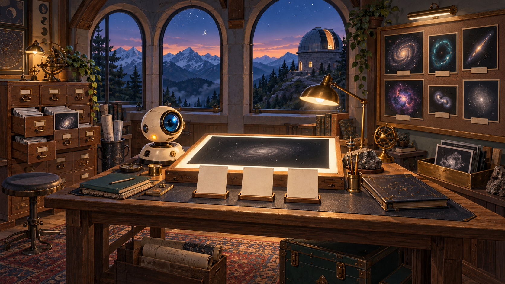
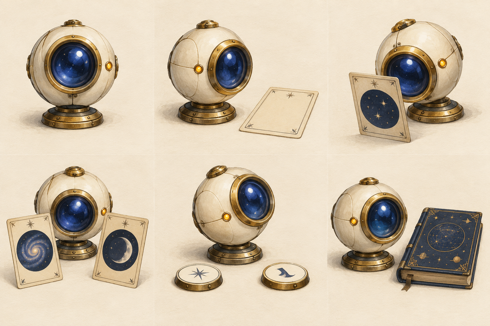
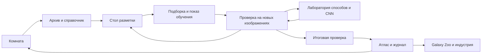
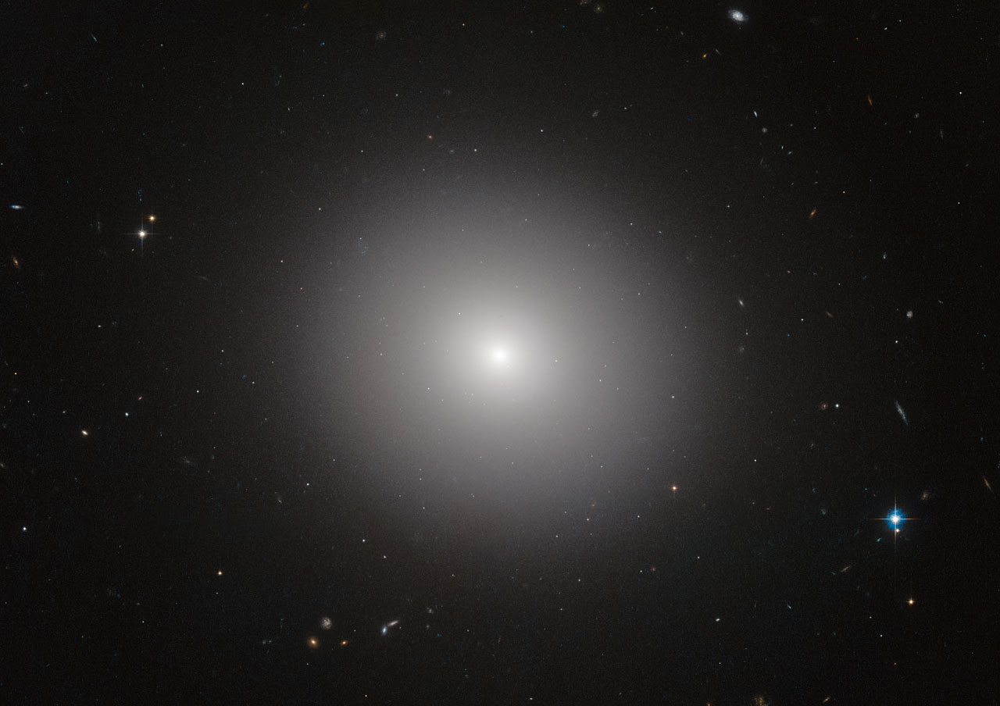
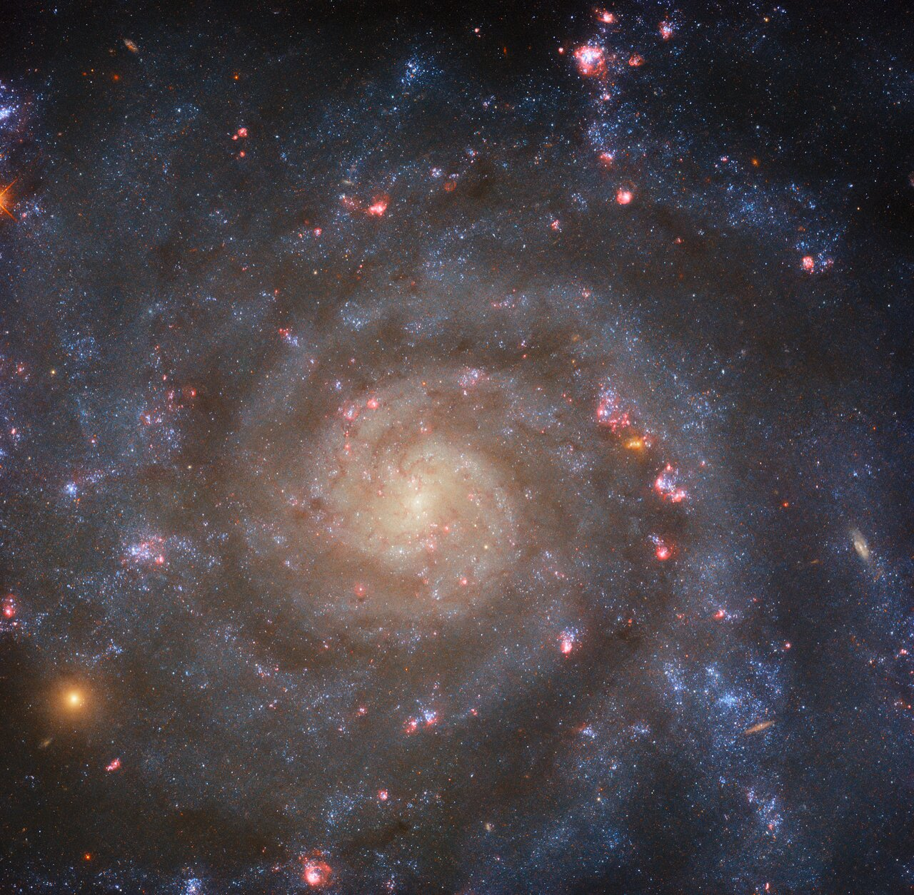
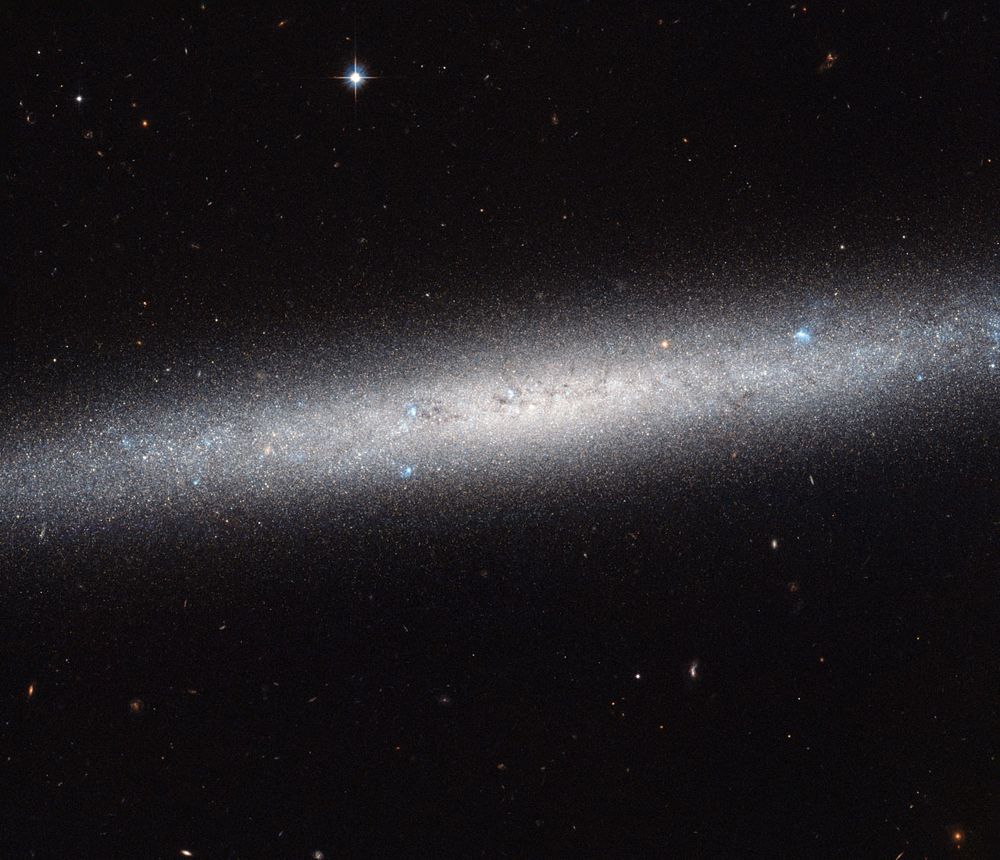
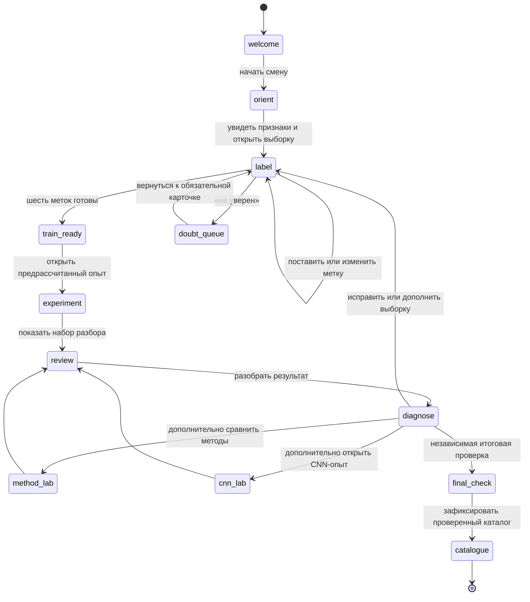

# Первая смена: атлас галактик

Дизайн-документ игры · 6 октября 2026 · проект для обсуждения и подготовки вертикального среза

**Рабочее название:** «Первая смена: атлас галактик». «Космический зоопарк» — возможное название дополнительной выставки внутри игры и отсылка к Galaxy Zoo, а не заявление о партнёрстве. Основной сценарий: [сцены, реплики и работа стендиста](first-shift-scenario.html).

Документ определяет будущую игру. Иллюстрации окружения — концепты, схемы экранов — проект, демонстраторы механик — пробы взаимодействия. Это не готовая игровая сборка. Целевые длительности, размеры и качество модели ниже — проектные условия, если явно не указано измерение.

## 1. Игра в одном абзаце

Ребёнок заступает на смену в горную обсерваторию. У нового машинного помощника тоже первый рабочий день. Вместе со стендистом ребёнок рассматривает настоящие снимки галактик, готовит примеры их видимого облика, проверяет ответы помощника и собирает маленький проверенный атлас. По мере работы комната меняется: прибывшие снимки переходят из архива на стол, затем — на стену атласа; спорные случаи остаются отдельной очередью. К рассвету видно, что сделала команда и что ещё предстоит исследовать.

**Обещание игроку:** «Помоги новому ИИ разобраться в галактиках и собери атлас, которому можно доверять».

**Обещание факультета:** через конкретные действия объяснить данные, разметку, обучение, независимую проверку и применение ИИ в реальной работе. Большая модель и сложные термины не являются наградой сами по себе.

## 2. Принятые ограничения и проектные решения

| Решение | Статус | Следствие |
|---|---|---|
| Галактики вместо движущихся следов | Принято в обсуждении | Один пример — изображение галактики, три учебные категории |
| Живой стендист вместо Ники | Принято | Персонаж в комнате — только помощник; инструкция доступна и без непрерывной речи взрослого |
| Все вычислительные варианты подготовлены заранее | Принято | Runtime выбирает пакет результатов; живого обучения, API и генеративного чата нет |
| Игра работает без интернета | Принято | Локальные изображения, реплики, шрифты, результаты, справки и сохранения |
| Общие комментарии к опубликованному документу | Реализовано для сценария; применяется к GDD | Это отдельный сервер обсуждения, не часть офлайн-игры |
| Иллюстрированная комната и крупный рабочий стол | Предлагаемый основной визуальный подход | Пространственная игра с переходами; разметка не превращается в постоянную таблицу |
| Основная механика — рассмотреть, затем выбрать метку | Рекомендовано для первого среза | Drag-and-drop только необязательное ускорение |
| Три категории видимого облика | Учебная схема, требует проверки на изображениях | «Гладкая», «Видна спираль», «Диск с ребра»; сомнение вне классов |
| Vanilla JS, DOM и canvas | Рекомендуемое переиспользование текущего стека | Новый движок и WebGL не нужны для этой версии |

## 3. Игровое переживание и педагогика

### Почему это должно быть интересно

Первый интерес — разглядеть необычный настоящий объект. Второй — помочь персонажу, который не умеет всё заранее. Третий — увидеть последствия собственного решения: изменение примера влияет на конкретные ответы помощника, а проверенные записи становятся частью общей стены атласа.

У игры нет заработка очков за слепую скорость и нет обязательного поражения перед успехом. Важные события — найденная деталь, обоснованная метка, разобранное расхождение и честное «недостаточно данных». Если метки удачны с первой попытки, история продолжается без выдуманной ошибки.

| Действие | Видимое последствие | Понятие |
|---|---|---|
| Приблизить изображение и отметить деталь | Деталь сохраняется в карточке как основание наблюдения | Данные и признаки |
| Выбрать категорию | Пример занимает место в учебной подборке | Разметка |
| Открыть эксперимент | На новом изображении появляется ответ и объяснение выбранного способа | Машинное обучение |
| Сверить ответ с проверкой | Виден конкретный правильный или ошибочный ответ | Качество на новых данных |
| Исправить метку или выбрать дополнение | Сравнение ответов до/после, включая отсутствие изменений | Влияние данных |
| Передать атлас | Отделены проверенные записи, предложения и сомнения | Ответственное использование результата |

### Возраст и темп

Один сюжет без выбора возраста. Стендист регулирует глубину объяснения, интерфейс предлагает дополнительные шаги по интересу. Для планирования первого теста предполагаем основную смену порядка 8–12 минут и ещё 5–8 минут на лабораторию; это гипотеза, не обещание посетителям. Короткий проход должен содержать хотя бы разметку, один новый проверочный пример и итог.

Двое детей могут меняться ролями «предлагает метку / ищет основание». Игра не требует читать мелкий текст и не превращает помощь стендиста в скрытую обязательную операцию.

## 4. Мир и визуальная композиция

### Окружение: рабочая обсерватория

Камера неподвижна, с мягким приближением к выбранному рабочему месту. За арочным окном — горы, купол и ночь. Внутри — дерево, эмаль, бумажные карточки, аккуратные оптические приборы. Техника выглядит доступной для исследования; помещение не похоже на космический военный командный центр.

Окружение рисуется растром. Текст, кнопки и состояния не запекаются в картинку. Перспективные предметы дают атмосферу, а удобство чтения обеспечивает отдельный фронтальный рабочий экран.



Художественный концепт, созданный image_gen; галактики внутри рисунка иллюстративны. Научные снимки показаны отдельно ниже.

| Зона | Расположение в комнате | Игровая функция | Изменение за смену |
|---|---|---|---|
| Архив | Левая часть | Получить подготовленную подборку | Пачка снимков становится меньше |
| Стол исследования | Центр, главный визуальный акцент | Приблизить снимок, заметить деталь, выбрать метку | Появляются карточки выбранных примеров |
| Помощник | Небольшой прибор рядом со столом | Показать эксперимент, объяснить ответ | Индикация текущего рабочего состояния |
| Атлас | Правая стена | Смотреть проверенные записи | Пустые места заполняются карточками |
| Очередь разбора | Отдельный лоток рядом с атласом | Сохранить сомнительные случаи | Сомнения видны, но не считаются провалом |
| Окно и купол | Дальний план | Атмосфера, необязательная справка | В финале появляется рассвет |

Переход: **комната → архив → стол → проверка → атлас → комната**. После значимого действия ребёнок возвращается к видимому изменению в комнате. Не заставляем проходить её заново после каждой метки: разметка небольшой серии происходит на одном столе.

### Визуальные параметры

| Элемент | Направление |
|---|---|
| Палитра | Чернильно-синий `#152D43`, тёплая бумага `#F3EBDD`, янтарный `#E7B65A`, спокойный бирюзовый `#73B5AE` |
| Предупреждения | Цвет плюс текст и значок; «нужно проверить» не обязательно красное |
| Типографика | Локальный кириллический шрифт с проверенной лицензией либо системный fallback; основной текст целимся в 18–20 CSS px |
| Кнопки | Целевая область не меньше 44×44 CSS px; подпись — действие |
| Иллюстрации | Мягкая живописность, читаемые силуэты, спокойный фон вокруг снимков |
| Научные изображения | Нейтральная тёмная подложка; без цветового фильтра «под стиль игры» |
| Анимация | Короткий переход между состояниями, ориентир 200–400 мс; без постоянных мерцаний и обязательного движения |
| Звук | По умолчанию выключен; мягкий отклик действий, ничего важного только через звук |

Все значения — стартовые проектные ориентиры. Контраст и читаемость проверяются в отрисованном интерфейсе, в том числе при масштабе 125% и 150%.

## 5. Помощник как персонаж

### Образ

Небольшой настольный оптический прибор: устойчивое основание, светлая эмалевая оболочка, одна линза и спокойный индикатор. Он физически находится в комнате. Ребёнок помогает готовить исследовательский инструмент, а не кормит виртуального питомца или заботится о его настроении.

Рабочее обращение — «Помощник». Имя можно выбрать после просмотра концептов. Не привязываем персонажа к бренду конкретной модели ИИ.



Художественный концепт image_gen: шесть состояний одного прибора, не готовый игровой атлас анимаций.

| Состояние | Что видно | Реплика |
|---|---|---|
| Знакомство | Линза активируется, рядом появляется первый снимок | «У меня первая смена. Покажешь, какие признаки будем различать?» |
| Ожидает примеры | Видна небольшая незаполненная подборка | «Мне нужны изображения с метками» |
| Примеры готовы | Карточки собраны; доступна кнопка эксперимента | «Посмотрим, как я справлюсь с другими снимками?» |
| Показывает результат | Подсвечен выбранный ответ и основание | «Я предложил эту категорию по таким примерам» |
| Есть расхождение | Спокойный индикатор и знак вопроса | «Здесь ответы различаются. Давай проверим» |
| Смена завершена | Рядом лежит журнал, не медаль «идеальный ИИ» | «В атласе видно, что проверено и где ещё есть вопросы» |

Эмоции не заменяют сведения о модели. Грустный персонаж не используется как наказание за неверную метку. Во время готового эксперимента не показываем фиктивную многоминутную загрузку обучения: открываем сохранённые этапы с подписью.

## 6. Отсылка к зоопарку: атлас разнообразия

Galaxy Zoo даёт смысловую опору: множество разных форм, внимательное наблюдение, общий вклад людей. Визуальный образ — полевой атлас, музейная коллекция снимков и карточки с заметками. Галактики не превращаются в зверей, категории не называются биологическими видами, класс «диск с ребра» не изображается новым типом живого существа.

### Три способа использовать мотив

| Вариант | Как выглядит | Где полезен | Решение |
|---|---|---|---|
| Атлас наблюдателя | Карточки, закладки, поля для заметок, галерея проверенных изображений | Основной маршрут и финал | Основной вариант |
| Прогулка по галерее форм | Три части выставки, переходы между галактиками, стенд «ещё разбираемся» | Дополнительное знакомство | После базового среза |
| Буквальный зверинец | Персонажи-звери и клетки | Отвлекает от свойств реальных снимков | Не используем |

В финале — карточка «Это похоже на настоящую науку» с Galaxy Zoo, проверенными источниками и необязательным QR/ссылкой для знакомства позже. Логотип проекта не используется как наш бренд; никаких обещаний официального участия. Снимки не отправляются в Galaxy Zoo автоматически.

## 7. Экраны и переходы



| Экран | Главное действие | Что постоянно видно | Что раскрывается по запросу |
|---|---|---|---|
| Комната | Открыть актуальное рабочее место | Цель смены, прогресс, помощник | История обсерватории, настройки |
| Справочник | Сравнить три эталона | Изображения и один признак у каждого | Ограничения категорий |
| Стол | Рассмотреть и выбрать метку | Крупный снимок, 3 выбора, сомнение, номер примера | Источник, подсказка, измерения |
| Учебная подборка | Проверить состав и открыть эксперимент | Собственные метки, подготовленная часть набора | История изменений |
| Проверка | Сопоставить ответ и основание | Один новый снимок, ответ, сверка | Распределение ошибок по группам |
| Лаборатория | Выбрать подготовленный вариант | Какие условия меняем | Сохранённые этапы и детали метода |
| Атлас | Передать смену | Проверенные записи и сомнения отдельно | Журнал, источники, отраслевой пример |

### Компоновка для 14-дюймового ноутбука

Основной расчёт — CSS viewport, а не число физических пикселей. Full HD при масштабе 150% даёт существенно меньше пространства. Проектируем рабочий стол прежде всего для 1280×720 CSS px и проверяем более низкую доступную высоту с браузерными панелями.

Центральный снимок получает около 55–65% ширины рабочей области. Справа — компактная колонка решений; подпись помощника занимает одну-две строки. Источник и научные пояснения закрыты по умолчанию. На узком экране кнопки перемещаются под снимок; изображение и решение не разделяются большим полотном текста.

**Запрет на скрытые действия:** никакой важной кнопки только по hover, никакого обязательного перетаскивания, никакого уменьшения всего интерфейса до нечитаемого масштаба. Tab проходит контролы в осмысленном порядке; Enter/Space подтверждают; Escape закрывает справку и возвращает фокус.

## 8. Варианты центральной механики

Варианты решают одну учебную задачу. Отличаются способом взаимодействия, а не научной постановкой. В HTML ниже размещены демонстрационные раскладки: они не обучают модель и не оценивают корректность меток.

В HTML-версии здесь доступна интерактивная проба трёх раскладок. Это демонстрация управления без обучения и оценки меток.

### A. Стол исследователя — основной выбор

Один крупный снимок, лупа, три эталона и кнопки категорий. Ребёнок сначала рассматривает объект, затем выбирает метку. Можно отметить интересную деталь; она сохраняется как заметка, но не становится автоматически числовым признаком модели.

**Последовательность:** открыть → приблизить → выбрать метку → увидеть карточку на доске → следующий пример. «Не уверен» оставляет решение открытым и предлагает справочник. Первый снимок разбирается со стендистом, остальные — самостоятельно.

**Сильная сторона:** видно, что ребёнок классифицирует, удобно обсуждать основания. **Риск:** однообразие серии. **Как проверить:** наблюдать, продолжает ли ребёнок рассматривать изображения или начинает нажимать наугад; менять сложность случаев, а не добавлять фейерверки.

### B. Раскладка атласа — обзор и исправления

Небольшая группа карточек и три подписанные области. Клик по карточке открывает крупный просмотр; категорию можно выбрать кнопкой или перенести карточку. Надпись и миниатюра эталона помогают отличать области без знания терминов.

**Использование:** проверка состава уже размеченной выборки, поиск однообразия, исправление конкретной метки. **Риск:** ребёнок сортирует по декоративному цвету рамки. Все неразмеченные карточки выглядят одинаково; цвет группы появляется только после решения.

Это не обязательный первый экран: для знакомства с объектом важнее крупный снимок.

### C. Сопоставление примеров — объяснение модели

Новый объект в центре и несколько действительно близких учебных изображений рядом. Ребёнок предполагает ответ и открывает метки соседей. Видит, почему метод похожих примеров дал именно этот ответ.

**Использование:** сцена «Почему?» и разбор ошибки. **Риск:** подмена настоящего основания визуально удобными картинками. Соседи и расстояния берутся из того же подготовленного эксперимента, что и ответ.

**Рекомендация:** A — основной процесс; B — обзор; C — объяснение. Не предлагаем ребёнку три разных интерфейса для одной операции на входе. Сначала проверяем одну связку A → B → C на реальных изображениях.

## 9. Галактики и научные данные

Три категории — «Гладкая», «Видна спираль», «Диск с ребра». Они описывают видимое строение в ограниченной учебной подборке. Физический тип и ракурс не смешиваются: гладкий вид не гарантирует эллиптическую природу, а вид с ребра сам по себе не создаёт новый тип галактики.

Справочник показывает и границу применимости. Размытое изображение или сложная структура отправляются в очередь разбора. «Не уверен» не становится четвёртым классом. Отсутствие видимых рукавов на плохом снимке не считается доказательством гладкого строения.

### IC 2006 · Гладкая



Гладкий профиль без различимых рукавов. Это пример видимого облика; не любое гладкое изображение устанавливает эллиптическую природу.

Источник: [IC 2006 · ESA/Hubble](https://esahubble.org/images/heic1508a/). Credit: ESA/Hubble & NASA; Image acknowledgement: Judy Schmidt and J. Blakeslee (Dominion Astrophysical Observatory); Science acknowledgement: M. Carollo (ETH, Switzerland). [CC BY 4.0](https://esahubble.org/copyright/). Официальный screensize JPEG, без изменений.

### IC 5332 · Видна спираль



Спиральная структура хорошо видна. Цвет не служит самостоятельным основанием учебной метки.

Источник: [IC 5332 · ESA/Hubble](https://esahubble.org/images/potw2342a/). Credit: ESA/Hubble & NASA, R. Chandar, J. Lee and the PHANGS-HST team. [CC BY 4.0](https://esahubble.org/copyright/). Официальный screensize JPEG, без изменений.

### NGC 5023 · Диск с ребра



Диск виден с ребра. Источник описывает объект как спиральную галактику: ракурс и физический тип различаются.

Источник: [NGC 5023 · ESA/Hubble](https://esahubble.org/images/potw1512a/). Credit: ESA/Hubble & NASA. [CC BY 4.0](https://esahubble.org/copyright/). Официальный screensize JPEG, без изменений.

### Messier 85 · Внешний облик и физический тип — разные вопросы


Дополнительный разговор: видимый гладкий облик не определяет всю физическую природу объекта. Не заставляем выбирать «Не уверен» только из-за промежуточного физического типа.

Источник: [Messier 85 · ESA/Hubble](https://esahubble.org/images/potw1905a/). Credit: ESA/Hubble & NASA, R. O'Connell. [CC BY 4.0](https://esahubble.org/copyright/). Официальный screensize JPEG, без изменений.


Красивые обзорные изображения в этом документе служат визуальными примерами. Они не образуют автоматически обучающую выборку: у разных телескопов различаются разрешение, цветовое представление и поле зрения. Модель может выучить эти различия вместо формы галактики. Подборка для игры требует отдельного допуска и единообразной подготовки.

### Допуск изображения в игру

1. Идентификатор объекта, источник, авторство и лицензия на локальное распространение.
2. Описание обработки: вырезка, масштаб, поворот, цветовое представление; научный смысл изменений проверен.
3. Справочная категория, основание и неопределённость. Один ответ не выдаётся за абсолютную истину о природе объекта.
4. Решение: ясный учебный пример, проверочный пример либо спорный случай для демонстрации ограничения.
5. Разделение по объектам: снимки и повороты одной галактики не попадают одновременно в обучение и независимый тест.
6. Контроль целостности файла и включение всех зависимостей в офлайн-пакет.

Синтетические галактики допустимы только как подписанная иллюстрация интерфейса. Они не выдаются за реальные наблюдения и не смешиваются с проверочными данными.

## 10. Работа стендиста и обратная связь

Стартовая реплика: «У помощника первая смена. Подготовим ему примеры галактик, проверим ответы и соберём каталог». Во время работы стендист спрашивает: «Что заметил? Почему выбрал эту метку? Что предложил помощник? Как проверим?»

| Событие | Обратная связь игры | Действие стендиста |
|---|---|---|
| Ребёнок выбрал метку | Карточка получила метку; ещё нет зелёного «правильно» | Попросить основание на одном показательном примере |
| Ребёнок сомневается | Доступен справочник и очередь разбора | Уточнить, какой детали не хватает |
| Проверка выявила расхождение | Показать объект и справочное основание | Отделить ошибку разметки от ограничения модели |
| Метки исправлены, ответ не изменился | Честно показать отсутствие изменения | Обсудить, что ещё влияет на результат |
| Первая попытка удачна | Разрешить завершение или сложный опыт | Не придумывать обязательный провал |
| Модель справилась не со всем | Разделить проверенные записи и сомнения | Завершить смену с обоснованным ограничением |

Итог — не экзамен на термины. Ребёнок объясняет, какую работу выполнил помощник и как её проверяли. Пример с заводом переносит ту же цепочку на фотографии деталей и известные категории дефектов. Сомнение и новый неизвестный дефект требуют отдельной проверки, а не автоматического назначения знакомого класса.

## 11. Техническое устройство

### 1. Решения и ограничения

Игра работает в современном браузере без сети. Ребёнок вместе со стендистом готовит ИИ-помощника к **многоклассовой классификации изображений галактик**. Обязательные категории — `smooth` («Гладкая»), `spiral` («Видна спираль») и `edge_on` («Диск с ребра»). Это три взаимоисключающие учебные метки для заранее допущенных изображений, а не полная астрономическая классификация.

В основной смене модель получает шесть эффективных меток: ребёнок ставит их сам либо в коротком маршруте добавляет свои к явно отделённым подготовленным меткам. Для трёх категорий существует `3^6 = 729` возможных векторов разметки. У каждого допустимого вектора заранее рассчитан результат эксперимента: предложения на наборе разбора, матрица ошибок, объяснение и следующая содержательная ветка. Игра не запускает обучение модели, не вызывает API и не выдаёт предрасчёт за вычисление в данный момент.

Стендист — живой наставник, а не персонаж в интерфейсе. ИИ-помощник — единственный персонаж: он показывает, какие примеры получил, что предложил и какие ограничения обнаружились. Реплики, метрики и варианты ответов лежат локально.

#### Неизменяемые технические границы

- Базовый runtime: статические HTML, CSS и JavaScript без фреймворка, сборщика и нового игрового движка.
- Изображения галактик рендерятся через `` с локальным файлом или `<canvas>` при необходимости увеличения/аннотаций. Canvas не является источником истины разметки.
- Ника, наведение телескопа, карта неба и механика трёх кадров не переносятся как обязательные механики: они относятся к предыдущей задаче наблюдений.
- Свободного чата, внешних LLM, сетевой аналитики, реального обучения CNN и серверного хранения нет.
- «Не могу уверенно определить» — действие интерфейса и запись в очередь сомнений, не четвёртая метка и не один из 729 векторов.

### 2. Что подтверждено в локальном состоянии

Ниже зафиксированы проверенные свойства репозитория, на которые можно опираться, а не требования к новому продукту.

| Наблюдение | Основание | Следствие для новой игры |
| --- | --- | --- |
| `app/index.html` — локальная автономная поставка, описанная в README; README не подтверждает, какой runtime сейчас опубликован. | `README.md`, `app/index.html` | Способ автономной поставки полезен как прецедент, но не задаёт место новой реализации. |
| Публичный сценарий расширяет зафиксированный образ comparison runtime: `tools/scenario-review/Dockerfile.web` наследует `sd2026-comparison:before-comments-20261006`, а `designlab/comparison/Dockerfile` публикует `night.html` как `index.html`. | `tools/scenario-review/Dockerfile.web`, `designlab/comparison/Dockerfile` | Ближайший runtime для новой версии — `designlab/comparison`; публикация требует отдельного решения после готовности среза. |
| В `app/` и comparison runtime применяются локальные JS/CSS-файлы, DOM и canvas; npm содержит только Prettier. | `app/index.html`, `designlab/comparison/index.html`, `package.json` | React, Phaser или сборщик для новой механики не нужны. |
| Текущая ночная игра отделяет правила кампании от DOM: `NightModel` не рисует экран, а `night.js` управляет состояниями и локальным сохранением. | `designlab/comparison/night-model.js`, `designlab/comparison/night.js` | Такое же разделение следует сохранить, но с новым доменом галактик. |
| Предыдущая ночная смена сохраняет JSON в `localStorage`, умеет инвалидировать результат обучения при изменении разметки и проверяет подпись снапшота при восстановлении. | `designlab/comparison/night.js`, `designlab/comparison/night-model.js` | Это полезный прецедент, но старое состояние нельзя читать как состояние новой игры. |
| Скрипт `build-night.py` упаковывает явный список локальных ресурсов и добавляет контентные хэши к ссылкам. | `designlab/comparison/build-night.py` | Новая поставка должна иметь явный манифест и не зависеть от случайных файлов рабочей папки. |

Размер, происхождение и научная пригодность будущих изображений галактик пока не проверены. Поэтому названия файлов, метрики и квоты ниже — проектные решения до приёмки набора данных.

### 3. Архитектура поставки

Предлагаемая директория находится рядом с текущей поставкой, чтобы не смешивать её с переходным кодом ночной смены.

```text
designlab/galaxy-shift/
├── index.html                 # точка входа; открывается по file:// и HTTP
├── galaxy-shift.css           # адаптивный layout, reduced motion, печать
├── data/
│   ├── manifest.js            # версия данных, пути, provenance, контрольные суммы
│   ├── samples.js             # описания изображений, категории, доступность
│   ├── experiments.js         # таблица 729 предрассчитанных результатов
│   ├── copy.js                # реплики помощника и короткие объяснения
│   └── gallery/               # локальные WEBP/PNG; без ленивой загрузки по сети
├── src/
│   ├── model.js               # чистые правила, валидация, переходы, миграции
│   ├── state.js               # создание/сохранение/восстановление смены
│   ├── ui.js                  # DOM-рендер и обработчики событий
│   ├── image-viewer.js        # zoom, фокус, доступные подписи, canvas-аннотации
│   ├── presenter.js           # панель стендиста и режим объяснения
│   └── export.js              # локальная выгрузка журнала как HTML/JSON
└── tools/
    ├── build-galaxy-shift.py  # проверка манифеста и автономная ZIP-поставка
    └── check-galaxy-shift.mjs # инварианты данных и переходов
```

Сценарный текст остаётся в `docs/`, а не копируется руками в код: `data/copy.js` получает короткие реплики, утверждённые из сценария. Одна версия набора (`datasetVersion`) связывает изображения, справочную разметку, эксперименты и тексты объяснений.

#### Слои и ответственность

| Модуль | Делает | Не делает |
| --- | --- | --- |
| `model.js` | Валидирует метку, строит ключ из шести меток и полной конфигурации опыта, находит вариант эксперимента, инвалидирует зависимые результаты. | Не читает DOM, `localStorage` или изображения. |
| `state.js` | Загружает JSON, применяет миграцию, сохраняет только валидное состояние. | Не считает метрики и не выбирает «правильный» ответ. |
| `ui.js` | Показывает этап, карточки, состояние кнопок и доступные действия. | Не содержит скрытый ключ разметки и не меняет состояние напрямую. |
| `image-viewer.js` | Рисует изображение/маркер, обеспечивает масштабирование и клавиатурное управление. | Не меняет метку при визуальном клике без явного выбора категории. |
| `presenter.js` | Показывает стендисту вопрос следующего шага и расширенное объяснение. | Не открывает правильные ответы ребёнку до разрешённой сцены. |
| `experiments.js` | Содержит только заранее рассчитанные результаты и объяснения. | Не выполняет обучение или случайный выбор. |

### 4. Данные и предрассчитанные эксперименты

#### Единица изображения

Каждый игровой пример — локальная вырезка с одной галактикой в центре. В `samples.js` хранятся только идентификаторы, видимые метаданные, путь к уже допущенному файлу и роль в игре. Справочная метка не показывается до точки, определённой сценарием.

```js
const SAMPLE = {
  id: 'train-03',
  image: 'data/gallery/train-03.webp',
  alt: 'Астрономическое изображение: одна галактика расположена в центре кадра.',
  role: 'training',                 // training | review | final | reference | doubtful
  referenceLabel: 'spiral',         // доступно модели, но не обычному UI до разбора
  admissibleLabels: ['smooth', 'spiral', 'edge_on'],
  provenanceId: 'gz-source-042',
  teachingNotes: ['spiral_arms_visible'],
  quality: 'clear',                 // clear | difficult; difficult не попадает в шесть обязательных
  width: 768,
  height: 768
};
```

У `doubtful` нет принудительной справочной метки для ребёнка: это материал очереди сомнений после основной проверки. Он не используется для вычисления метрик и не может тихо превратиться в один из трёх классов.

До выбора метки `alt` остаётся нейтральным и не называет категорию или её отличительный признак. Это предотвращает случайную подсказку читателю экрана. В карточке стендиста может быть отдельный набор вопросов внимания («Что на форме кажется круглым, вытянутым или узорчатым?»), но он не раскрывает эталон и не включается в игроковый DOM как скрытый текст. После выбора можно открыть доступное объяснение наблюдаемых признаков и основания справочной разметки. Эквивалентный самостоятельный сценарий для незрячего ребёнка требует отдельного пользовательского теста: нельзя объявлять его решённым одним `alt` или вынуждать ребёнка угадывать по названию кнопки.

#### Ключ эксперимента

Порядок шести обучающих идентификаторов фиксирован в `manifest.js` и показывается в интерфейсе как шесть карточек. Метки кодируются цифрами: `smooth = 0`, `spiral = 1`, `edge_on = 2`. Ключ — шесть цифр в фиксированном порядке; например, `[spiral, smooth, spiral, edge_on, smooth, edge_on]` даёт `101202`.

Числовой индекс таблицы определён однозначно как число в троичной системе с этими шестью цифрами: `index = Σ(code[i] × 3^(5 - i))`, от 0 до 728. В сохранении остаются и строковый ключ, и массив названий меток: это делает данные проверяемыми человеком и не зависит от неявного порядка объектов JavaScript.

Схема ниже иллюстрирует формат: числа условные, не результат рассчитанного игрового эксперимента. В готовой таблице метрики проверяются по полному массиву предсказаний.

```js
const EXPERIMENT = {
  id: 'v1-101202',
  datasetVersion: 'galaxy-v1',
  labels: ['spiral', 'smooth', 'spiral', 'edge_on', 'smooth', 'edge_on'],
  trainingSummary: {
    labelled: 6,
    classCounts: { smooth: 2, spiral: 2, edge_on: 2 },
    noteId: 'balanced_examples'
  },
  classifier: {
    methodId: 'similarity-v1',
    trainingSetId: 'core-six-v1',
    supplementId: null,
    featurePipelineVersion: 'image-features-v1',
    kind: 'prepared-image-classifier',
    label: 'Модель по примерам',
    explanationId: 'similarity_uses_examples'
  },
  review: {
    setId: 'review-a',
    total: 9,
    correct: 7,
    confusion: [[2, 0, 1], [0, 3, 0], [1, 0, 2]],
    predictions: [ // сокращённый пример; реальная запись содержит все 9
      { sampleId: 'check-01', predicted: 'smooth', explanationId: 'match_smooth_profile' }
    ]
  },
  diagnosis: { kind: 'label_review', sampleIds: ['train-02'], copyId: 'review_one_label' },
  cnnLab: { experimentId: 'cnn-balanced-v1', available: true }
};
```

Псевдовероятность или декоративная шкала уверенности не добавляются. Если позднее потребуется оценка уверенности, для неё отдельно определяются метод расчёта и корректное объяснение.

#### Непротиворечивость набора 729 вариантов

Генератор подготовки данных, запускаемый до поставки, обязан:

1. создать ровно 729 записей для фиксированной конфигурации метода и набора из шести карточек и трёх допустимых меток;
2. проверить, что каждая запись относится к той же `datasetVersion`;
3. проверить размер матрицы ошибок `3×3`, сумму ячеек, равную `review.total`, и принадлежность всех предсказаний набору разбора;
4. проверить, что диагноз не выдаёт ссылок на скрытую справочную разметку до этапа разбора;
5. проверить, что каждая ветка улучшения ссылается на существующий следующий эксперимент;
6. записать хэш входного набора и хэш таблицы экспериментов в манифест.

Не следует хранить 729 копий галереи. Общие изображения хранятся один раз; эксперимент хранит небольшие числовые результаты и идентификаторы реплик.

### 5. Состояния смены и защита от утечки контрольных данных

#### Конечный автомат



`train_ready` доступен при шести эффективных учебных метках. В полной смене ребёнок может поставить все шесть. В короткой смене часть меток приходит из явно отделённого, заранее подготовленного набора, а ребёнок добавляет оставшиеся; в сумме модель всегда получает шесть записей. Подготовленные метки визуально и в журнале отделены от собственных решений ребёнка. Сомнение полезно как разговор со стендистом, но обязательная карточка должна вернуться к явному выбору одной из трёх категорий, чтобы сохранялся размер пространства 729.

#### Ревизии и инвалидация

```js
const STATE = {
  schemaVersion: 1,
  datasetVersion: 'galaxy-v1',
  phase: 'label',
  labels: { 'train-01': 'spiral' },
  labelRevision: 4,
  experimentRevision: 6,
  activeExperiment: null,          // { id, experimentRevision, signature }
  review: { setId: null, result: null },
  finalCheck: { setId: null, result: null },
  exposedSetIds: [],
  labs: { method: null, cnn: null },
  catalogue: [],
  doubtQueue: ['doubt-01'],
  presenterMode: false
};
```

После любого изменения `labels` или параметра, входящего в подпись (`methodId`, состав учебного набора/дополнение либо версия признаков):

- увеличивается `experimentRevision`; при изменении меток дополнительно увеличивается `labelRevision`;
- удаляются `activeExperiment`, результат проверки, выводы лабораторий и несохранённый каталог, созданные от старой подписи;
- скрываются ранее показанные результаты набора разбора и итогового heldout;
- UI возвращается в `label` или `train_ready` с понятной репликой «Условия опыта изменились — открой новый опыт и проверь его заново».

`signature` вычисляется детерминированно из `datasetVersion`, фиксированного порядка шести карточек, шести меток, `methodId`, `trainingSetId`, `supplementId` и `featurePipelineVersion`. Любой результат разрешено показать или сохранить только когда совпадают `experimentRevision` и эта полная подпись. Восстановление после перезагрузки повторно валидирует условие и отбрасывает устаревшие результаты.

#### Набор разбора и итоговый heldout

- `review-a` — набор разбора: он даёт ребёнку обратную связь и может быть показан повторно только как уже знакомая тренировочная проверка. Его нельзя называть независимой оценкой после первого раскрытия.
- `final-a` — итоговый heldout: он не отображается в обучающей панели, диагностике разметки, метод-лаборатории и CNN-подборе до единственной итоговой проверки.
- Метки `referenceLabel` обоих наборов не попадают в DOM, HTML-экспорт до разрешённого разбора или тексты кнопок. Полностью спрятать их от технически мотивированного человека в автономной игре невозможно; педагогическая защита — честный интерфейс и отдельные роли наборов, не защита от взлома.
- `exposedSetIds` записывает факт показа набора. Сброс UI, новая вкладка или «новая смена» на том же устройстве не делают уже увиденный `final-a` невиденным: он помечается как повторный пример и не даёт новую итоговую метрику. Для новой независимой проверки нужен другой нераскрытый набор или другой пользовательский профиль/устройство.
- Итоговую метрику строит только `final-a`, невиденный на момент последнего выбора метода, дополнения и признаков. Если он был раскрыт, финал сообщает ограничение вместо повторной цифры.

Это решение важнее красивой цифры «качества»: ребёнок должен увидеть, что проверка на уже просмотренных карточках не подтверждает способность помощника работать с новыми изображениями.

### 6. Экран и механики

#### Пространство

Обсерватория остаётся атмосферной рамкой, но без персонажа Ники и без обязательной карты. Основной экран — рабочая поверхность каталога:

1. слева крупная карточка галактики с безопасным увеличением и подписью происхождения;
2. справа три крупные кнопки категорий, краткая подсказка признака и действие «Не уверен»;
3. сверху панель помощника: шесть полученных примеров, текущая задача и стадия смены;
4. снизу журнал: обучающий набор, новая проверка, очередь сомнений, итоговый каталог;
5. отдельная кнопка «Для стендиста» открывает краткий вопрос следующего шага, не заменяя живой разговор.

Стендист может рассказать про ChatGPT, Claude, Алису, ГигаЧат, DeepSeek и Qwen в начале, но бренды не нужны для хода игры и не создают сетевую зависимость. Карточка помощника ясно говорит, что его реплики подготовлены авторами, а опыт обучения рассчитан заранее.

#### Ветви улучшения

Диагноз определяется записью эксперимента, а не тем, что «система знает ответ лучше ребёнка».

| Диагноз | Что видит ребёнок | Следующее действие | Чему учит |
| --- | --- | --- | --- |
| Ошибка учебной метки | На подготовленном тренировочном архиве есть карточка для перепроверки с видимыми признаками и справочником. | Сам решает изменить метку или обосновать прежнюю. | Метки влияют на обучение. |
| Примеры односторонние | Доска показывает, что одна категория почти не представлена или все примеры слишком похожи. | Добавляет предложенную подготовленную карточку того же типа. | Важны разнообразие и покрытие будущих случаев. |
| Граница изображения | На новых снимках часть объектов плохо различима. | Отправляет их в очередь сомнений. | Не всякий пример нужно принуждать к ответу. |
| Хороший результат | Помощник справился с базовым набором разбора. | Ребёнок может завершить смену **или**, по желанию, открыть отдельный более трудный набор. | Один успех не доказывает универсальность. |

Красная подсветка допустима только в режиме «проверенный учебный архив»: подпись сообщает, что это заранее подготовленная тренировка с эталоном. Она не должна возникать как магическое знание помощника о только что поставленной детской метке.

#### Честная дополнительная ветка CNN

CNN — отдельная лаборатория для заинтересованных, доступная после основной проверки. Она не даёт ребёнку свободно собирать фактически неисполняемую сеть и не обещает, что больше цветных блоков автоматически лучше.

Показываются два-три зафиксированных опыта на **том же** наборе и с явно заданными условиями:

- базовая модель по примерам;
- компактная CNN с заранее рассчитанными результатами;
- CNN с более богатой подготовленной выборкой либо примером переобучения.

У каждого опыта видны: какие изображения были в учебном наборе, какие — в проверочном, количество слоёв как схематический рисунок, ответы на нескольких новых карточках и ограничения. Цветные блоки означают слои обработки изображения, но не рисуют несуществующие «мысли нейросети». Сначала ребёнок предсказывает, какой вариант поможет; затем открывает зафиксированный результат. При равных входных условиях маленькая модель может оказаться полезнее, а итоговый выбор остаётся «проверить на новых данных».

### 7. Допуск данных и офлайн-пакет

#### Условия допуска одной карточки

До попадания в обязательные шесть карточка должна иметь:

- подтверждённое происхождение, лицензию/условия использования и локально сохранённую ссылку на первоисточник;
- научно просмотренную справочную разметку и обоснование именно для учебных трёх категорий;
- достаточную читаемость при целевом размере экрана; сложные, сливающиеся и неоднозначные объекты идут в необязательную очередь сомнений;
- уникальный стабильный `id`, размеры, `alt` на русском и хэш файла;
- проверку, что не является почти тем же кадром/вариантом объекта в train и heldout;
- запрет на подмену недоступного исходника похожим изображением без нового допуска.

Galaxy Zoo упоминается в финальном материале как реальный гражданский научный проект, но игра не отправляет разметку участника в Galaxy Zoo и не называет учебные метки вкладом в его каталог. Ссылка, источник и лицензионные условия проверяются при подготовке данных; в автономную поставку включается краткая атрибуция.

#### `file://`-совместимость

Все исходные данные подключаются обычными `<script src>` или встроенными статическими JavaScript-объектами. Нельзя полагаться на `fetch('data/*.json')`, ES-модули с неподдерживаемыми браузером политиками, Service Worker, IndexedDB как обязательное хранилище или CORS-заголовки: эти пути ненадёжны при двойном клике по `index.html`.

Пути только относительные (`data/gallery/train-01.webp`), без начального `/`, внешних URL в `src`, CDN и веб-шрифтов. После распаковки ZIP сохраняется структура каталогов. Браузерный запуск по HTTP полезен для разработки, но не является условием фестивального запуска.

#### Целевые бюджеты поставки

Это целевые ограничения, не измеренный текущий размер.

| Объект | Цель | Причина |
| --- | ---: | --- |
| Основной HTML + CSS + JS без изображений | до 350 KB gzip | Быстрое открытие со старого ноутбука и простая проверка. |
| Одна галактика | до 180 KB WebP, PNG только когда это научно необходимо | Изображение остаётся достаточно крупным для признаков. |
| Полная галерея обязательной и контрольной смены | до 12 MB | ZIP легко переносить и распаковать на фестивале. |
| Полная автономная поставка с историей Galaxy Zoo и CNN-иллюстрациями | до 20 MB | Оставляет место для лицензий и локальной документации. |
| Карта предрассчитанных 729 вариантов | до 1.5 MB JSON-подобных данных после минификации | Не препятствует работе офлайн и остаётся проверяемой. |

При превышении сначала удаляются дубли изображений и неиспользуемые размеры, а не снижаются требования к научному происхождению. Нужны миниатюра и основной размер одной карточки, а не несколько почти одинаковых копий.

### 8. Сохранение, восстановление и миграция

Хранилище: `localStorage` с ключом `science-day-galaxy-shift-v1`. Оно хранит только прогресс на данном устройстве; общий сервер, учётная запись и обмен с коллегами не требуются.

При недоступном `localStorage` игра продолжает работать в памяти и заметно предлагает локально скачать журнал. Экспорт содержит: версию набора, выбранные метки, подпись эксперимента, итоговые результаты и текстовые объяснения; он не включает скрытые метки набора разбора или итогового heldout, если соответствующий разбор не был открыт.

Восстановление допустимо только когда совпадает `datasetVersion`. При новой версии набора безопасное поведение — начать новую смену и оставить прежний экспорт доступным для скачивания, а не подставлять новые изображения под старые `id`.

```js
function migrate(raw) {
  if (raw.schemaVersion === 1 && raw.datasetVersion === MANIFEST.datasetVersion) return validate(raw);
  if (raw.schemaVersion === 0) return validate({ ...fresh(), labels: raw.labels ?? {} });
  return fresh({ notice: 'Набор сменился: начнём новую смену.' });
}
```

Миграция не должна угадывать соответствие категорий после их научного переопределения. Изменение названий или смысла `smooth`, `spiral`, `edge_on` повышает `datasetVersion`.

### 9. Проверка

#### Матрица проверок

| Область | Проверка | Критерий |
| --- | --- | --- |
| Данные | Проверка манифеста, хэшей, provenance и ролей изображений. | Ни одна обязательная карточка без источника или научного допуска не попадает в пакет. |
| 729 вариантов | Генератор перебирает все ключи. | Ровно 729, нет пропусков/дубликатов; каждая матрица ошибок согласована с total. |
| Чистая модель | Unit-тесты `label`, `signature`, переходов и инвалидации. | Смена одной метки уничтожает результаты старой подписи. |
| Набор разбора и heldout | Тесты доступа по фазам, DOM-снимок до проверки, повторный запуск после сброса UI. | Скрытые метки не отрисованы до разрешённого разбора; раскрытый финальный набор не выдаётся за новый. |
| CNN-ветка | Тест связей условий, идентификаторов опытов и подписи «предрассчитано». | Нельзя назвать расчёт текущим обучением или показать результат чужого набора. |
| Сохранение | Сохранить, перезагрузить, изменить метку, восстановить. | Устаревшая проверка не возвращается как действующая. |
| `file://` | Распаковать ZIP, открыть `index.html` без сервера и с отключённой сетью. | Видны изображения, работает смена, экспорт и понятная деградация без localStorage. |
| Доступность | Клавиатура, фокус, экранный диктор, 320 px, `prefers-reduced-motion`. | Все три категории и «не уверен» достижимы; изображения имеют смысловые `alt`. |
| Визуал | Ручной просмотр на проекторе/планшете. | Категории, текущая стадия и очередь сомнений читаемы с обычной дистанции стенда. |

Текущие проверки ночной игры не являются проверкой новой механики. Можно перенять их принцип «модель отдельно от браузера», но тесты должны быть новыми и относиться к галактикам.

#### Вертикальный срез — критерий готовности до полной игры

Первый реализуемый срез ограничивается одним рабочим столом и нужен, чтобы проверить, что интерактив действительно перевешивает возможную сухость классификации.

Срез принят, если без сети и на `file://` ребёнок может:

1. увидеть одну реальную локальную карточку галактики и справочник трёх категорий;
2. вместе со стендистом или самостоятельно получить шесть эффективных меток, явно различая собственные и подготовленные;
3. открыть один честно подписанный предрассчитанный опыт;
4. проверить не менее трёх новых карточек из отдельного набора;
5. изменить одну метку и увидеть, что прежний результат стал недействителен;
6. завершить мини-каталог и увидеть, что сомнительная карточка не притворилась четвёртым классом.

Срез также должен включать хотя бы один ясный Galaxy Zoo-контекст с подтверждённым источником и одну карточку стендиста: «Что мы показали помощнику? Как проверили ответ на новом снимке?» До него не строятся полный декор обсерватории, конструктор CNN или расширенный каталог.

### 10. Риски и решения

| Риск | Решение | Статус |
| --- | --- | --- |
| Три визуальные категории не всегда взаимоисключающие. | В обязательный набор допускаются только ясные примеры; пограничные — в очередь сомнений. Научный просмотр до реализации. | Требует данных. |
| Предрасчёт ощущается как обман. | Ясно назвать его учебным опытом с заранее подготовленными вариантами; не показывать ложную анимацию вычисления. | Решено в дизайне. |
| 729 таблиц раздувают код и сложно проверяются вручную. | Генерировать таблицу из версии данных; автоматически проверять полноту и инварианты; хранить ссылки, а не копии изображений. | Предлагается. |
| Ребёнок просто кликает метки, не рассматривая форму. | Начинать с сравнения изображений и видимых признаков; стендист задаёт один вопрос до первой метки. | Сценарное требование. |
| «Красные ошибки» лишают ребёнка авторства. | Использовать их только в заранее объявленном тренировочном архиве; давать основание и возможность не соглашаться до разбора. | Предлагается. |
| CNN превращается в бессмысленный конструктор блоков. | Только несколько фиксированных опытов с одинаковой задачей, разными условиями и независимой проверкой. | Решено в дизайне. |
| Локальное сохранение ведёт себя по-разному при `file://`. | Не делать его условием прохождения; предлагать экспорт; тестировать минимум Chrome, Firefox и Safari на целевых устройствах. | Требует проверки. |
| Обсерватория становится дорогим визуальным обходом вокруг карточек. | Вертикальный срез сначала доказывает основной цикл на одном рабочем столе; декор добавляется после плейтеста. | Решение о порядке работ. |

### 11. Очерёдность реализации

1. Научно допустить изображения и создать манифест, три категории и отдельные train/review/final/сомнительные наборы.
2. Сгенерировать и проверить 729 экспериментов с текстовыми диагнозами.
3. Реализовать чистую модель состояния, инвалидацию и автономный вертикальный срез.
4. Провести ручной плейтест со стендистом на разных детях; измерить, понимают ли они связь «метки → новый ответ → проверка».
5. Только после этого добавить комнату обсерватории, карточки Galaxy Zoo, расширенный итог и CNN-лабораторию.

Такой порядок сохраняет самое ценное: игра показывает не иллюстрацию кнопки «обучить», а управляемый ребёнком цикл работы с данными, который можно честно объяснить и технически стабильно показать без интернета.


## 12. Производство графики и звука

| Материал | Для первого среза | Требование |
|---|---|---|
| Комната ночью | 1 фон, ориентир 1920×1080 | Чистые области под контролы; без текста и научных данных в рисунке |
| Рассвет | Вариант того же ракурса | Геометрия и активные зоны совпадают |
| Помощник | Базовый образ и 4–6 состояний | Одинаковые масштаб, точка опоры и силуэт |
| Рабочий стол | Фон или фрагмент комнаты | Снимок на нейтральной подложке |
| Галактики | Набор после научного допуска | Реальные локальные файлы с атрибуцией |
| Эталоны категорий | 3 ясных снимка | Не подменяют собой все разнообразие класса |
| UI | DOM-контролы и простые пиктограммы | Кириллица, клавиатура, масштабирование |
| Звук | Необязательные короткие отклики | Локальные лицензированные файлы, отключение |

AI-концепты публикуются с промптами и отметкой происхождения. Это художественное направление, не автоматически готовые спрайты и не доказательство соответствия научным данным. Разрезание концепта на рабочие слои, настройка поз и тест попаданий — отдельная работа после выбора направления.

## 13. План реализации и критерии приёмки

### Срез 1. Один законченный опыт

Комната → первое реальное изображение → справочник → ограниченная разметка → один подготовленный эксперимент → отдельная проверка → запись в атласе. Работает без сети. Стендист может объяснить весь путь по короткой памятке. Есть ветка сомнения и успешная первая попытка.

**Выход среза:** не количество экранов, а наблюдение за ребёнком или пробным взрослым пользователем: понимает ли он, что размечает, почему это влияет на помощника и зачем нужна проверка. Пробный взрослый проход не заменяет детскую проверку.

### Срез 2. Разнообразие и исправления

Шесть самостоятельных меток, полный набор разрешённых вариантов, обзор выборки, исправление, объяснение похожих примеров, сохранения и сброс зависимого финала. Проверяем все достижимые состояния таблицей, а не только счастливый путь.

### Срез 3. Лаборатория и завершение

Сравнение способов, ограниченная CNN-ветка с проверенными результатами, отдельная итоговая подборка, журнал, Galaxy Zoo и отраслевой перенос. Прогулка по небу и дополнительные истории подключаются после устойчивого основного маршрута.

### Проверки выпуска

- Запуск распакованной поставки через `file://` без сетевых запросов.
- Предсказуемость результата после одинаковых действий и восстановления сохранения.
- Все разрешённые метки и комбинации методов/наборов имеют подготовленные результаты либо понятное объяснение недоступности.
- Ошибки и неопределённость не исчезают при возврате назад; прежний финал не остаётся актуальным после изменения.
- Нет утечки одной галактики между учебной и итоговой подборками.
- 1280×720 CSS px, доступная меньшая высота, масштаб 125/150%, узкая раскладка; клавиатура и reduced motion.
- Подписи, научные источники, лицензии и контрольные суммы входят в поставку.
- Все декоративные графики, концепты и рассчитанные результаты обозначены по происхождению.

## 14. Риски и решения до начала сборки

| Риск или открытый вопрос | Почему важен | Следующее действие |
|---|---|---|
| Категории не различимы на выбранных снимках | Ребёнок учится угадывать вместо наблюдения | Научная проверка маленькой подборки и справочника |
| Сортировка быстро надоедает | Учебная корректность не гарантирует игру | Проверить эпизод с рассматриванием, объяснением и видимым атласом |
| Число подготовленных вариантов растёт | Нельзя обещать свободные действия без данных для результата | Зафиксировать полную матрицу состояний до производства экспериментов |
| Модель использует особенности телескопа вместо формы | Красивый результат может быть методически неверен | Единообразные изображения и анализ разбиения |
| Помощник воспринимается всезнающим | Теряется смысл проверки | Показывать основания и источник справочного ответа |
| Стендист занят | Ребёнок теряет цель | Короткие контекстные инструкции и доступный справочник |
| Детские длительности неизвестны | Нельзя обещать фестивальную пропускную способность | Пробные проходы с фиксацией времени и затруднений |
| Концепт выглядит лучше рабочего UI | Нельзя считать иллюстрацию приёмкой игры | Отдельный отрисованный срез с реальными контролами |

## 15. Статус документа и материалы

Сценарий согласован по направлению: галактики, живой стендист, помощник первой смены, офлайн-симуляция. Этот GDD предлагает конкретный визуальный и технический способ реализации. Изображения окружения и персонажа — концепты; научные иллюстрации — справочные примеры; метрики будущей игры пока не рассчитаны.

- [Сценарий и реплики](first-shift-scenario.html).
- [Промпты художественных концептов](gdd-assets/concepts/PROMPTS.md).
- [Источники, лицензии и SHA-256 научных изображений](gdd-assets/galaxies/sources.json).
- Художественные иллюстрации созданы встроенным image_gen; схемы подготовлены в Mermaid; раскладки механик — HTML/CSS.
- Публичный документ содержит общие комментарии без имени; офлайн-копия содержит локальные заметки браузера.


Следующий практический шаг: выбрать окружение и основную связку механик A → B → C, допустить маленький набор реальных изображений и собрать один законченный игровой эпизод. Полная переделка действующей игры не выполняется в рамках подготовки этого документа.

## 16. Актуальные изменения: дневная лаборатория и Microduck

Эта редакция заменяет прежние решения разделов 2, 4, 5 и 11 об облике помощника, ночной комнате, финальном рассвете и отказе от WebGL. Старые концепты выше оставлены для истории обсуждения; они больше не являются заданием художнику. Педагогика классификации и контракт офлайн-результатов сохраняются.

### Было → стало

| Было в первом концепте | Принятое направление |
|---|---|
| Ночная комната, к финалу рассвет | Дневной разбор ночных наблюдений; к вечеру подготовка следующего задания |
| Ретрооптика и латунный настольный шар | Современная лаборатория; образ и пластика помощника по Microduck |
| Горы как общий декоративный фон | Кавказ — значимая часть сцены: рельеф, лесистые склоны, научный городок и верхняя площадка |
| Только растровая комната; WebGL не нужен | WebGL допустим для пространства, света и персонажа; читаемый интерфейс разметки отдельным слоем |
| Любая историческая деталь по художественной фантазии | Архивы и ковёр сохраняют обжитость; конкретная архызская мозаика без фотографии не реконструируется |

### Помощник: Microduck как основной референс

Берём за основу образ и характер движений [Microduck от Pollen Robotics](https://pollen-robotics.com/microduck/). Официальные материалы для дальнейшей работы: [фото и клипы](https://pollen-robotics.com/microduck/press-kit/), [симулятор](https://huggingface.co/spaces/pollen-robotics/microduck-simulator), [программный стек](https://github.com/pollen-robotics/microduck). Эти ссылки требуют сети; сама будущая игра использует локальные ресурсы.

Источник описывает небольшого двуногого робота, ходьбу, приседание и вставание. Следующая таблица — предложенная игровая постановка движений, а не перечень просмотренных или уже перенесённых анимационных клипов.

| Событие игры | Постановка движения | Что узнаёт ребёнок |
|---|---|---|
| Начало смены | Несколько шагов к рабочему месту, поворот к ребёнку | У команды появился новый помощник |
| Ожидание выбора | Спокойная поза; короткий поворот к снимку после действия | Сейчас решение принимает человек |
| Примеры собраны | Поворот от карточек к экрану | Можно проверить модель на других изображениях |
| Показ результата | Перевод внимания на ответ, без перекрытия снимка | Ответ модели показан на экране |
| Несогласие | Небольшой наклон головы, затем неподвижная поза | Нужно проверить ответ; никто не «провинился» |
| Конец смены | Подходит к экрану программы наблюдений, смотрит на результат | Работа команды становится следующим шагом исследования |

Не запускаем непрерывный танец или хождение во время чтения. Полные движения персонажа могут быть длиннее прежнего ориентира 200–400 мс для интерфейсного перехода; ввод они не блокируют. При уменьшении движения в настройках остаются устойчивые позы и текстовые статусы.

У реального Microduck движения связаны с обучением с подкреплением. В нашей игре ребёнок размечает изображения для классификации: это другая задача. Походка заранее анимирована и не становится лучше от исправления меток. Реплика стендиста: «У робота могут быть разные системы: одна помогает двигаться, другую мы сейчас учим различать изображения». Не заявляем, что настоящий Microduck уже умеет классифицировать галактики.

Перенос готовой 3D-модели или клипов пока не выполнен. В официальном пресс-ките явно сказано, что открытость относится к программному стеку, а не к механическим и электронным чертежам. При выборе конкретных файлов отдельно фиксируем их происхождение и условия использования; лицензия кода не заменяет условия на все медиа сайта. Это не препятствует использованию ссылки как дизайн-референса.

### Лаборатория, Кавказ и ход смены

Рабочий день начинается в современной лаборатории с большими экранами и оборудованием. Архивы, старые снимки и ковёр показывают преемственность и присутствие людей. За окном читаются горы Кавказа и телескоп на верхней площадке. Лаборатория ниже по склону — композиционное решение для нашей сцены, не утверждение об обязательном устройстве любой обсерватории.

Свет меняется по завершённым этапам истории, без таймера и наказания за медленную работу: начало дня → работа с примерами → проверка → вечерняя передача результата. Финальный рассвет из первого концепта отменён.

Предлагаемый исследовательский вопрос: «Команда изучает форму галактик. Поможем составить каталог и выберем объект, для которого нужен более подробный снимок». Это предложение для следующей детализации сценария. Плохой снимок может стать основанием нового наблюдения; непонятное правило разметки сначала обсуждают с человеком. Не каждое сомнение модели автоматически превращается в заявку телескопу.

Архызская мозаика остаётся возможным элементом после появления достоверного визуального референса. Сейчас не рисуем вымышленное панно под видом существующего и не включаем его в обязательную механику.

### Техническое следствие и следующий визуальный срез

Офлайн-симуляция модели не ограничивает выбор графического движка. Предпочтительный следующий срез — WebGL-сцена с фиксированной камерой, несколькими приближениями, сменой освещения и локальной анимацией помощника. Научный снимок показывается без перспективного искажения и художественных фильтров; кнопки и подписи остаются доступными HTML-элементами. Выбор конкретной библиотеки требует проверки на стендовом устройстве, но запрета на WebGL больше нет.

Следующий визуальный результат должен показать дневной общий план, приближение к рабочему месту и вечерний финал с одним и тем же помощником. Нынешние рисунки обсерватории и шара не считаются таким результатом. Произвольные движения не меняют результаты модели: анимация реагирует на состояние сценария, а не управляет педагогической логикой.
