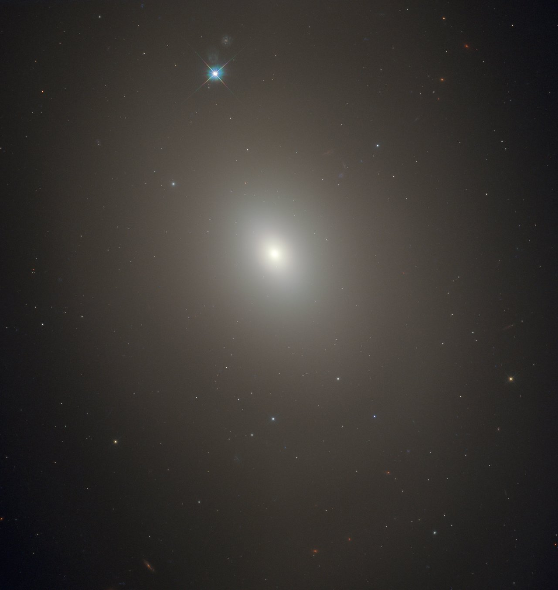

# Примеры галактик для дизайн-документа

Эти четыре снимка нужны для разговора о том, **что видно на изображении**. Это не готовая обучающая выборка для игры и не эталон физического типа объекта. Перед добавлением в игровой набор потребуются: согласованная схема разметки, несколько примеров каждого класса, независимые разборочная и итоговая подборки и научная проверка всех меток.

Ниже названия категорий точно соответствуют текущему сценарию: «Гладкая», «Видна спираль» и «Диск с ребра». Последняя описывает ракурс, а не физический тип. Поэтому один и тот же объект в другом ракурсе мог бы выглядеть иначе.

## Три ясных примера для справочника

| Игровая категория | Объект и что можно показать | Локальный файл | Основание и полный кредит |
| --- | --- | --- | --- |
| **Гладкая** | **IC 2006.** На снимке виден ровный светлый профиль без различимых рукавов. ESA/Hubble называет объект эллиптической галактикой. В игре правильнее говорить о видимом гладком облике, а не обещать, что гладкость кадра сама установила физическую природу. | [heic1508a.jpg](assets/galaxies/heic1508a.jpg) | [ESA/Hubble: IC 2006](https://esahubble.org/images/heic1508a/). Credit: **ESA/Hubble & NASA; Image acknowledgement: Judy Schmidt and J. Blakeslee (Dominion Astrophysical Observatory); Science acknowledgement: M. Carollo (ETH, Switzerland)**. |
| **Видна спираль** | **IC 5332.** Хорошо различимы рукава, закрученные вокруг яркого центра. ESA/Hubble описывает её как почти обращённую к нам спиральную галактику. | [potw2342a.jpg](assets/galaxies/potw2342a.jpg) | [ESA/Hubble: IC 5332](https://esahubble.org/images/potw2342a/). Credit: **ESA/Hubble & NASA, R. Chandar, J. Lee and the PHANGS-HST team**. |
| **Диск с ребра** | **NGC 5023.** Тонкий вытянутый диск виден с ребра; спиральные рукава с такого ракурса не различимы. Это удачный контраст с IC 5332: обе — спиральные галактики по описанию источника, но изображение даёт разные видимые признаки. | [potw1512a.jpg](assets/galaxies/potw1512a.jpg) | [ESA/Hubble: NGC 5023](https://esahubble.org/images/potw1512a/). Credit: **ESA/Hubble & NASA**. |

## Пример границы между видимым обликом и физическим типом

**Messier 85** — дополнительная иллюстрация для разговора со старшими детьми. По описанию ESA/Hubble её свойства промежуточны между линзовидными и эллиптическими галактиками. Это не делает метку «Гладкая» автоматически ошибочной и не требует принудительно выбрать «Не уверен»: внешний облик и физическая классификация отвечают на разные вопросы.

[Оригинальная карточка ESA/Hubble](https://esahubble.org/images/potw1905a/). Credit: **ESA/Hubble & NASA, R. O'Connell**. Для учебного примера неразличимого изображения нужен отдельный материал, на котором видимой информации действительно недостаточно.

## Лицензия и локальные копии

Все файлы — немодифицированные версии `screensize JPEG`, скачанные с `cdn.esahubble.org`; каждый меньше 1 МБ. ESA/Hubble выпускает изображения по [CC BY 4.0](https://esahubble.org/copyright/): полный кредит должен оставаться видимым вместе с изображением; материалы нельзя использовать так, будто ESA/Hubble поддерживает игру. Реестр URL, ролей, кредитов и контрольных сумм хранится в [sources.json](assets/galaxies/sources.json).

## Как честно сослаться на Galaxy Zoo

Название «зоопарк» стоит использовать как отсылку к настоящему гражданскому научному проекту, а не как повод превращать галактики в животных. Подходящая реплика стендиста:

> «В Galaxy Zoo люди тоже описывают видимый облик галактик. Но настоящий проект задаёт цепочку вопросов и собирает много ответов на один снимок. Наша игра — маленький учебный опыт: мы видим только три понятных категории и обязательно оставляем право сказать “нужно разобрать ещё”.»

Это соответствует [официальной странице данных Galaxy Zoo](https://data.galaxyzoo.org/index.html): исходный проект Galaxy Zoo использовал несколько категорий, а последующие проекты — деревья вопросов. Для Galaxy Zoo: Hubble первый вопрос разделял объекты на гладкие, объекты с признаками/диском и звёзды/артефакты; последующие вопросы зависели от первого ответа. [Описание дерева решений Galaxy Zoo](https://blog.galaxyzoo.org/2015/04/06/visualizing-the-decision-trees-for-galaxy-zoo/) и [публикация команды Galaxy Zoo: Hubble](https://academic.oup.com/mnras/article/464/4/4176/2527878) отдельно подтверждают, что это классификация видимого облика, а не прямой вывод о физическом устройстве галактики.

Для моста к ML можно сказать точнее: Galaxy Zoo публикует и ответы добровольцев, и результаты моделей, обученных на таких классификациях. Но игровой набор не является данными Galaxy Zoo, не отправляет в проект разметку ребёнка и не должен выдавать свои предрассчитанные эксперименты за их модель.
