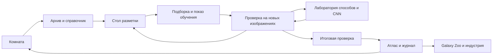

# Первая смена: атлас галактик

Дизайн-документ игры · 6 октября 2026 · проект для обсуждения и подготовки вертикального среза

**Рабочее название:** «Первая смена: атлас галактик». «Космический зоопарк» — возможное название дополнительной выставки внутри игры и отсылка к Galaxy Zoo, а не заявление о партнёрстве. Основной сценарий: [сцены, реплики и работа стендиста](../redesign-2026-10-05/first-shift-scenario.md).

Документ определяет будущую игру. Иллюстрации окружения — концепты, схемы экранов — проект, демонстраторы механик — пробы взаимодействия. Это не готовая игровая сборка. Целевые длительности, размеры и качество модели ниже — проектные условия, если явно не указано измерение.

## 1. Игра в одном абзаце

Ребёнок заступает на смену в горную обсерваторию. У нового машинного помощника тоже первый рабочий день. Вместе со стендистом ребёнок рассматривает настоящие снимки галактик, готовит примеры их видимого облика, проверяет ответы помощника и собирает маленький проверенный атлас. По мере работы комната меняется: прибывшие снимки переходят из архива на стол, затем — на стену атласа; спорные случаи остаются отдельной очередью. К рассвету видно, что сделала команда и что ещё предстоит исследовать.

**Обещание игроку:** «Помоги новому ИИ разобраться в галактиках и собери атлас, которому можно доверять».

**Обещание факультета:** через конкретные действия объяснить данные, разметку, обучение, независимую проверку и применение ИИ в реальной работе. Большая модель и сложные термины не являются наградой сами по себе.

## 2. Принятые ограничения и проектные решения

| Решение | Статус | Следствие |
|---|---|---|
| Галактики вместо движущихся следов | Принято в обсуждении | Один пример — изображение галактики, три учебные категории |
| Живой стендист вместо Ники | Принято | Персонаж в комнате — только помощник; инструкция доступна и без непрерывной речи взрослого |
| Все вычислительные варианты подготовлены заранее | Принято | Runtime выбирает пакет результатов; живого обучения, API и генеративного чата нет |
| Игра работает без интернета | Принято | Локальные изображения, реплики, шрифты, результаты, справки и сохранения |
| Общие комментарии к опубликованному документу | Реализовано для сценария; применяется к GDD | Это отдельный сервер обсуждения, не часть офлайн-игры |
| Иллюстрированная комната и крупный рабочий стол | Предлагаемый основной визуальный подход | Пространственная игра с переходами; разметка не превращается в постоянную таблицу |
| Основная механика — рассмотреть, затем выбрать метку | Рекомендовано для первого среза | Drag-and-drop только необязательное ускорение |
| Три категории видимого облика | Учебная схема, требует проверки на изображениях | «Гладкая», «Видна спираль», «Диск с ребра»; сомнение вне классов |
| Vanilla JS, DOM и canvas | Рекомендуемое переиспользование текущего стека | Новый движок и WebGL не нужны для этой версии |

## 3. Игровое переживание и педагогика

### Почему это должно быть интересно

Первый интерес — разглядеть необычный настоящий объект. Второй — помочь персонажу, который не умеет всё заранее. Третий — увидеть последствия собственного решения: изменение примера влияет на конкретные ответы помощника, а проверенные записи становятся частью общей стены атласа.

У игры нет заработка очков за слепую скорость и нет обязательного поражения перед успехом. Важные события — найденная деталь, обоснованная метка, разобранное расхождение и честное «недостаточно данных». Если метки удачны с первой попытки, история продолжается без выдуманной ошибки.

| Действие | Видимое последствие | Понятие |
|---|---|---|
| Приблизить изображение и отметить деталь | Деталь сохраняется в карточке как основание наблюдения | Данные и признаки |
| Выбрать категорию | Пример занимает место в учебной подборке | Разметка |
| Открыть эксперимент | На новом изображении появляется ответ и объяснение выбранного способа | Машинное обучение |
| Сверить ответ с проверкой | Виден конкретный правильный или ошибочный ответ | Качество на новых данных |
| Исправить метку или выбрать дополнение | Сравнение ответов до/после, включая отсутствие изменений | Влияние данных |
| Передать атлас | Отделены проверенные записи, предложения и сомнения | Ответственное использование результата |

### Возраст и темп

Один сюжет без выбора возраста. Стендист регулирует глубину объяснения, интерфейс предлагает дополнительные шаги по интересу. Для планирования первого теста предполагаем основную смену порядка 8–12 минут и ещё 5–8 минут на лабораторию; это гипотеза, не обещание посетителям. Короткий проход должен содержать хотя бы разметку, один новый проверочный пример и итог.

Двое детей могут меняться ролями «предлагает метку / ищет основание». Игра не требует читать мелкий текст и не превращает помощь стендиста в скрытую обязательную операцию.

## 4. Мир и визуальная композиция

### Окружение: рабочая обсерватория

Камера неподвижна, с мягким приближением к выбранному рабочему месту. За арочным окном — горы, купол и ночь. Внутри — дерево, эмаль, бумажные карточки, аккуратные оптические приборы. Техника выглядит доступной для исследования; помещение не похоже на космический военный командный центр.

Окружение рисуется растром. Текст, кнопки и состояния не запекаются в картинку. Перспективные предметы дают атмосферу, а удобство чтения обеспечивает отдельный фронтальный рабочий экран.

<!-- ROOM_CONCEPT -->

| Зона | Расположение в комнате | Игровая функция | Изменение за смену |
|---|---|---|---|
| Архив | Левая часть | Получить подготовленную подборку | Пачка снимков становится меньше |
| Стол исследования | Центр, главный визуальный акцент | Приблизить снимок, заметить деталь, выбрать метку | Появляются карточки выбранных примеров |
| Помощник | Небольшой прибор рядом со столом | Показать эксперимент, объяснить ответ | Индикация текущего рабочего состояния |
| Атлас | Правая стена | Смотреть проверенные записи | Пустые места заполняются карточками |
| Очередь разбора | Отдельный лоток рядом с атласом | Сохранить сомнительные случаи | Сомнения видны, но не считаются провалом |
| Окно и купол | Дальний план | Атмосфера, необязательная справка | В финале появляется рассвет |

Переход: **комната → архив → стол → проверка → атлас → комната**. После значимого действия ребёнок возвращается к видимому изменению в комнате. Не заставляем проходить её заново после каждой метки: разметка небольшой серии происходит на одном столе.

### Визуальные параметры

| Элемент | Направление |
|---|---|
| Палитра | Чернильно-синий `#152D43`, тёплая бумага `#F3EBDD`, янтарный `#E7B65A`, спокойный бирюзовый `#73B5AE` |
| Предупреждения | Цвет плюс текст и значок; «нужно проверить» не обязательно красное |
| Типографика | Локальный кириллический шрифт с проверенной лицензией либо системный fallback; основной текст целимся в 18–20 CSS px |
| Кнопки | Целевая область не меньше 44×44 CSS px; подпись — действие |
| Иллюстрации | Мягкая живописность, читаемые силуэты, спокойный фон вокруг снимков |
| Научные изображения | Нейтральная тёмная подложка; без цветового фильтра «под стиль игры» |
| Анимация | Короткий переход между состояниями, ориентир 200–400 мс; без постоянных мерцаний и обязательного движения |
| Звук | По умолчанию выключен; мягкий отклик действий, ничего важного только через звук |

Все значения — стартовые проектные ориентиры. Контраст и читаемость проверяются в отрисованном интерфейсе, в том числе при масштабе 125% и 150%.

## 5. Помощник как персонаж

### Образ

Небольшой настольный оптический прибор: устойчивое основание, светлая эмалевая оболочка, одна линза и спокойный индикатор. Он физически находится в комнате. Ребёнок помогает готовить исследовательский инструмент, а не кормит виртуального питомца или заботится о его настроении.

Рабочее обращение — «Помощник». Имя можно выбрать после просмотра концептов. Не привязываем персонажа к бренду конкретной модели ИИ.

<!-- ASSISTANT_CONCEPT -->

| Состояние | Что видно | Реплика |
|---|---|---|
| Знакомство | Линза активируется, рядом появляется первый снимок | «У меня первая смена. Покажешь, какие признаки будем различать?» |
| Ожидает примеры | Видна небольшая незаполненная подборка | «Мне нужны изображения с метками» |
| Примеры готовы | Карточки собраны; доступна кнопка эксперимента | «Посмотрим, как я справлюсь с другими снимками?» |
| Показывает результат | Подсвечен выбранный ответ и основание | «Я предложил эту категорию по таким примерам» |
| Есть расхождение | Спокойный индикатор и знак вопроса | «Здесь ответы различаются. Давай проверим» |
| Смена завершена | Рядом лежит журнал, не медаль «идеальный ИИ» | «В атласе видно, что проверено и где ещё есть вопросы» |

Эмоции не заменяют сведения о модели. Грустный персонаж не используется как наказание за неверную метку. Во время готового эксперимента не показываем фиктивную многоминутную загрузку обучения: открываем сохранённые этапы с подписью.

## 6. Отсылка к зоопарку: атлас разнообразия

Galaxy Zoo даёт смысловую опору: множество разных форм, внимательное наблюдение, общий вклад людей. Визуальный образ — полевой атлас, музейная коллекция снимков и карточки с заметками. Галактики не превращаются в зверей, категории не называются биологическими видами, класс «диск с ребра» не изображается новым типом живого существа.

### Три способа использовать мотив

| Вариант | Как выглядит | Где полезен | Решение |
|---|---|---|---|
| Атлас наблюдателя | Карточки, закладки, поля для заметок, галерея проверенных изображений | Основной маршрут и финал | Основной вариант |
| Прогулка по галерее форм | Три части выставки, переходы между галактиками, стенд «ещё разбираемся» | Дополнительное знакомство | После базового среза |
| Буквальный зверинец | Персонажи-звери и клетки | Отвлекает от свойств реальных снимков | Не используем |

В финале — карточка «Это похоже на настоящую науку» с Galaxy Zoo, проверенными источниками и необязательным QR/ссылкой для знакомства позже. Логотип проекта не используется как наш бренд; никаких обещаний официального участия. Снимки не отправляются в Galaxy Zoo автоматически.

## 7. Экраны и переходы

| Экран | Главное действие | Что постоянно видно | Что раскрывается по запросу |
|---|---|---|---|
| Комната | Открыть актуальное рабочее место | Цель смены, прогресс, помощник | История обсерватории, настройки |
| Справочник | Сравнить три эталона | Изображения и один признак у каждого | Ограничения категорий |
| Стол | Рассмотреть и выбрать метку | Крупный снимок, 3 выбора, сомнение, номер примера | Источник, подсказка, измерения |
| Учебная подборка | Проверить состав и открыть эксперимент | Собственные метки, подготовленная часть набора | История изменений |
| Проверка | Сопоставить ответ и основание | Один новый снимок, ответ, сверка | Распределение ошибок по группам |
| Лаборатория | Выбрать подготовленный вариант | Какие условия меняем | Сохранённые этапы и детали метода |
| Атлас | Передать смену | Проверенные записи и сомнения отдельно | Журнал, источники, отраслевой пример |

### Компоновка для 14-дюймового ноутбука

Основной расчёт — CSS viewport, а не число физических пикселей. Full HD при масштабе 150% даёт существенно меньше пространства. Проектируем рабочий стол прежде всего для 1280×720 CSS px и проверяем более низкую доступную высоту с браузерными панелями.

Центральный снимок получает около 55–65% ширины рабочей области. Справа — компактная колонка решений; подпись помощника занимает одну-две строки. Источник и научные пояснения закрыты по умолчанию. На узком экране кнопки перемещаются под снимок; изображение и решение не разделяются большим полотном текста.

**Запрет на скрытые действия:** никакой важной кнопки только по hover, никакого обязательного перетаскивания, никакого уменьшения всего интерфейса до нечитаемого масштаба. Tab проходит контролы в осмысленном порядке; Enter/Space подтверждают; Escape закрывает справку и возвращает фокус.

## 8. Варианты центральной механики

Варианты решают одну учебную задачу. Отличаются способом взаимодействия, а не научной постановкой. В HTML ниже размещены демонстрационные раскладки: они не обучают модель и не оценивают корректность меток.

<!-- MECHANIC_DEMO -->

### A. Стол исследователя — основной выбор

Один крупный снимок, лупа, три эталона и кнопки категорий. Ребёнок сначала рассматривает объект, затем выбирает метку. Можно отметить интересную деталь; она сохраняется как заметка, но не становится автоматически числовым признаком модели.

**Последовательность:** открыть → приблизить → выбрать метку → увидеть карточку на доске → следующий пример. «Не уверен» оставляет решение открытым и предлагает справочник. Первый снимок разбирается со стендистом, остальные — самостоятельно.

**Сильная сторона:** видно, что ребёнок классифицирует, удобно обсуждать основания. **Риск:** однообразие серии. **Как проверить:** наблюдать, продолжает ли ребёнок рассматривать изображения или начинает нажимать наугад; менять сложность случаев, а не добавлять фейерверки.

### B. Раскладка атласа — обзор и исправления

Небольшая группа карточек и три подписанные области. Клик по карточке открывает крупный просмотр; категорию можно выбрать кнопкой или перенести карточку. Надпись и миниатюра эталона помогают отличать области без знания терминов.

**Использование:** проверка состава уже размеченной выборки, поиск однообразия, исправление конкретной метки. **Риск:** ребёнок сортирует по декоративному цвету рамки. Все неразмеченные карточки выглядят одинаково; цвет группы появляется только после решения.

Это не обязательный первый экран: для знакомства с объектом важнее крупный снимок.

### C. Сопоставление примеров — объяснение модели

Новый объект в центре и несколько действительно близких учебных изображений рядом. Ребёнок предполагает ответ и открывает метки соседей. Видит, почему метод похожих примеров дал именно этот ответ.

**Использование:** сцена «Почему?» и разбор ошибки. **Риск:** подмена настоящего основания визуально удобными картинками. Соседи и расстояния берутся из того же подготовленного эксперимента, что и ответ.

**Рекомендация:** A — основной процесс; B — обзор; C — объяснение. Не предлагаем ребёнку три разных интерфейса для одной операции на входе. Сначала проверяем одну связку A → B → C на реальных изображениях.

## 9. Галактики и научные данные

Три категории — «Гладкая», «Видна спираль», «Диск с ребра». Они описывают видимое строение в ограниченной учебной подборке. Физический тип и ракурс не смешиваются: гладкий вид не гарантирует эллиптическую природу, а вид с ребра сам по себе не создаёт новый тип галактики.

Справочник показывает и границу применимости. Размытое изображение или сложная структура отправляются в очередь разбора. «Не уверен» не становится четвёртым классом. Отсутствие видимых рукавов на плохом снимке не считается доказательством гладкого строения.

<!-- GALAXY_EXAMPLES -->

Красивые обзорные изображения в этом документе служат визуальными примерами. Они не образуют автоматически обучающую выборку: у разных телескопов различаются разрешение, цветовое представление и поле зрения. Модель может выучить эти различия вместо формы галактики. Подборка для игры требует отдельного допуска и единообразной подготовки.

### Допуск изображения в игру

1. Идентификатор объекта, источник, авторство и лицензия на локальное распространение.
2. Описание обработки: вырезка, масштаб, поворот, цветовое представление; научный смысл изменений проверен.
3. Справочная категория, основание и неопределённость. Один ответ не выдаётся за абсолютную истину о природе объекта.
4. Решение: ясный учебный пример, проверочный пример либо спорный случай для демонстрации ограничения.
5. Разделение по объектам: снимки и повороты одной галактики не попадают одновременно в обучение и независимый тест.
6. Контроль целостности файла и включение всех зависимостей в офлайн-пакет.

Синтетические галактики допустимы только как подписанная иллюстрация интерфейса. Они не выдаются за реальные наблюдения и не смешиваются с проверочными данными.

## 10. Работа стендиста и обратная связь

Стартовая реплика: «У помощника первая смена. Подготовим ему примеры галактик, проверим ответы и соберём каталог». Во время работы стендист спрашивает: «Что заметил? Почему выбрал эту метку? Что предложил помощник? Как проверим?»

| Событие | Обратная связь игры | Действие стендиста |
|---|---|---|
| Ребёнок выбрал метку | Карточка получила метку; ещё нет зелёного «правильно» | Попросить основание на одном показательном примере |
| Ребёнок сомневается | Доступен справочник и очередь разбора | Уточнить, какой детали не хватает |
| Проверка выявила расхождение | Показать объект и справочное основание | Отделить ошибку разметки от ограничения модели |
| Метки исправлены, ответ не изменился | Честно показать отсутствие изменения | Обсудить, что ещё влияет на результат |
| Первая попытка удачна | Разрешить завершение или сложный опыт | Не придумывать обязательный провал |
| Модель справилась не со всем | Разделить проверенные записи и сомнения | Завершить смену с обоснованным ограничением |

Итог — не экзамен на термины. Ребёнок объясняет, какую работу выполнил помощник и как её проверяли. Пример с заводом переносит ту же цепочку на фотографии деталей и известные категории дефектов. Сомнение и новый неизвестный дефект требуют отдельной проверки, а не автоматического назначения знакомого класса.

## 11. Техническое устройство

<!-- TECHNICAL_DESIGN -->

## 12. Производство графики и звука

| Материал | Для первого среза | Требование |
|---|---|---|
| Комната ночью | 1 фон, ориентир 1920×1080 | Чистые области под контролы; без текста и научных данных в рисунке |
| Рассвет | Вариант того же ракурса | Геометрия и активные зоны совпадают |
| Помощник | Базовый образ и 4–6 состояний | Одинаковые масштаб, точка опоры и силуэт |
| Рабочий стол | Фон или фрагмент комнаты | Снимок на нейтральной подложке |
| Галактики | Набор после научного допуска | Реальные локальные файлы с атрибуцией |
| Эталоны категорий | 3 ясных снимка | Не подменяют собой все разнообразие класса |
| UI | DOM-контролы и простые пиктограммы | Кириллица, клавиатура, масштабирование |
| Звук | Необязательные короткие отклики | Локальные лицензированные файлы, отключение |

AI-концепты публикуются с промптами и отметкой происхождения. Это художественное направление, не автоматически готовые спрайты и не доказательство соответствия научным данным. Разрезание концепта на рабочие слои, настройка поз и тест попаданий — отдельная работа после выбора направления.

## 13. План реализации и критерии приёмки

### Срез 1. Один законченный опыт

Комната → первое реальное изображение → справочник → ограниченная разметка → один подготовленный эксперимент → отдельная проверка → запись в атласе. Работает без сети. Стендист может объяснить весь путь по короткой памятке. Есть ветка сомнения и успешная первая попытка.

**Выход среза:** не количество экранов, а наблюдение за ребёнком или пробным взрослым пользователем: понимает ли он, что размечает, почему это влияет на помощника и зачем нужна проверка. Пробный взрослый проход не заменяет детскую проверку.

### Срез 2. Разнообразие и исправления

Шесть самостоятельных меток, полный набор разрешённых вариантов, обзор выборки, исправление, объяснение похожих примеров, сохранения и сброс зависимого финала. Проверяем все достижимые состояния таблицей, а не только счастливый путь.

### Срез 3. Лаборатория и завершение

Сравнение способов, ограниченная CNN-ветка с проверенными результатами, отдельная итоговая подборка, журнал, Galaxy Zoo и отраслевой перенос. Прогулка по небу и дополнительные истории подключаются после устойчивого основного маршрута.

### Проверки выпуска

- Запуск распакованной поставки через `file://` без сетевых запросов.
- Предсказуемость результата после одинаковых действий и восстановления сохранения.
- Все разрешённые метки и комбинации методов/наборов имеют подготовленные результаты либо понятное объяснение недоступности.
- Ошибки и неопределённость не исчезают при возврате назад; прежний финал не остаётся актуальным после изменения.
- Нет утечки одной галактики между учебной и итоговой подборками.
- 1280×720 CSS px, доступная меньшая высота, масштаб 125/150%, узкая раскладка; клавиатура и reduced motion.
- Подписи, научные источники, лицензии и контрольные суммы входят в поставку.
- Все декоративные графики, концепты и рассчитанные результаты обозначены по происхождению.

## 14. Риски и решения до начала сборки

| Риск или открытый вопрос | Почему важен | Следующее действие |
|---|---|---|
| Категории не различимы на выбранных снимках | Ребёнок учится угадывать вместо наблюдения | Научная проверка маленькой подборки и справочника |
| Сортировка быстро надоедает | Учебная корректность не гарантирует игру | Проверить эпизод с рассматриванием, объяснением и видимым атласом |
| Число подготовленных вариантов растёт | Нельзя обещать свободные действия без данных для результата | Зафиксировать полную матрицу состояний до производства экспериментов |
| Модель использует особенности телескопа вместо формы | Красивый результат может быть методически неверен | Единообразные изображения и анализ разбиения |
| Помощник воспринимается всезнающим | Теряется смысл проверки | Показывать основания и источник справочного ответа |
| Стендист занят | Ребёнок теряет цель | Короткие контекстные инструкции и доступный справочник |
| Детские длительности неизвестны | Нельзя обещать фестивальную пропускную способность | Пробные проходы с фиксацией времени и затруднений |
| Концепт выглядит лучше рабочего UI | Нельзя считать иллюстрацию приёмкой игры | Отдельный отрисованный срез с реальными контролами |

## 15. Статус документа и материалы

Сценарий согласован по направлению: галактики, живой стендист, помощник первой смены, офлайн-симуляция. Этот GDD предлагает конкретный визуальный и технический способ реализации. Изображения окружения и персонажа — концепты; научные иллюстрации — справочные примеры; метрики будущей игры пока не рассчитаны.

<!-- ARTIFACT_INDEX -->

Следующий практический шаг: выбрать окружение и основную связку механик A → B → C, допустить маленький набор реальных изображений и собрать один законченный игровой эпизод. Полная переделка действующей игры не выполняется в рамках подготовки этого документа.

## 16. Актуальные изменения: дневная лаборатория и Microduck

Эта редакция заменяет прежние решения разделов 2, 4, 5 и 11 об облике помощника, ночной комнате, финальном рассвете и отказе от WebGL. Старые концепты выше оставлены для истории обсуждения; они больше не являются заданием художнику. Педагогика классификации и контракт офлайн-результатов сохраняются.

### Было → стало

| Было в первом концепте | Принятое направление |
|---|---|
| Ночная комната, к финалу рассвет | Дневной разбор ночных наблюдений; к вечеру подготовка следующего задания |
| Ретрооптика и латунный настольный шар | Современная лаборатория; образ и пластика помощника по Microduck |
| Горы как общий декоративный фон | Кавказ — значимая часть сцены: рельеф, лесистые склоны, научный городок и верхняя площадка |
| Только растровая комната; WebGL не нужен | WebGL допустим для пространства, света и персонажа; читаемый интерфейс разметки отдельным слоем |
| Любая историческая деталь по художественной фантазии | Архивы и ковёр сохраняют обжитость; конкретная архызская мозаика без фотографии не реконструируется |

### Помощник: Microduck как основной референс

Берём за основу образ и характер движений [Microduck от Pollen Robotics](https://pollen-robotics.com/microduck/). Официальные материалы для дальнейшей работы: [фото и клипы](https://pollen-robotics.com/microduck/press-kit/), [симулятор](https://huggingface.co/spaces/pollen-robotics/microduck-simulator), [программный стек](https://github.com/pollen-robotics/microduck). Эти ссылки требуют сети; сама будущая игра использует локальные ресурсы.

Источник описывает небольшого двуногого робота, ходьбу, приседание и вставание. Следующая таблица — предложенная игровая постановка движений, а не перечень просмотренных или уже перенесённых анимационных клипов.

| Событие игры | Постановка движения | Что узнаёт ребёнок |
|---|---|---|
| Начало смены | Несколько шагов к рабочему месту, поворот к ребёнку | У команды появился новый помощник |
| Ожидание выбора | Спокойная поза; короткий поворот к снимку после действия | Сейчас решение принимает человек |
| Примеры собраны | Поворот от карточек к экрану | Можно проверить модель на других изображениях |
| Показ результата | Перевод внимания на ответ, без перекрытия снимка | Ответ модели показан на экране |
| Несогласие | Небольшой наклон головы, затем неподвижная поза | Нужно проверить ответ; никто не «провинился» |
| Конец смены | Подходит к экрану программы наблюдений, смотрит на результат | Работа команды становится следующим шагом исследования |

Не запускаем непрерывный танец или хождение во время чтения. Полные движения персонажа могут быть длиннее прежнего ориентира 200–400 мс для интерфейсного перехода; ввод они не блокируют. При уменьшении движения в настройках остаются устойчивые позы и текстовые статусы.

У реального Microduck движения связаны с обучением с подкреплением. В нашей игре ребёнок размечает изображения для классификации: это другая задача. Походка заранее анимирована и не становится лучше от исправления меток. Реплика стендиста: «У робота могут быть разные системы: одна помогает двигаться, другую мы сейчас учим различать изображения». Не заявляем, что настоящий Microduck уже умеет классифицировать галактики.

Перенос готовой 3D-модели или клипов пока не выполнен. В официальном пресс-ките явно сказано, что открытость относится к программному стеку, а не к механическим и электронным чертежам. При выборе конкретных файлов отдельно фиксируем их происхождение и условия использования; лицензия кода не заменяет условия на все медиа сайта. Это не препятствует использованию ссылки как дизайн-референса.

### Лаборатория, Кавказ и ход смены

Рабочий день начинается в современной лаборатории с большими экранами и оборудованием. Архивы, старые снимки и ковёр показывают преемственность и присутствие людей. За окном читаются горы Кавказа и телескоп на верхней площадке. Лаборатория ниже по склону — композиционное решение для нашей сцены, не утверждение об обязательном устройстве любой обсерватории.

Свет меняется по завершённым этапам истории, без таймера и наказания за медленную работу: начало дня → работа с примерами → проверка → вечерняя передача результата. Финальный рассвет из первого концепта отменён.

Предлагаемый исследовательский вопрос: «Команда изучает форму галактик. Поможем составить каталог и выберем объект, для которого нужен более подробный снимок». Это предложение для следующей детализации сценария. Плохой снимок может стать основанием нового наблюдения; непонятное правило разметки сначала обсуждают с человеком. Не каждое сомнение модели автоматически превращается в заявку телескопу.

Архызская мозаика остаётся возможным элементом после появления достоверного визуального референса. Сейчас не рисуем вымышленное панно под видом существующего и не включаем его в обязательную механику.

### Техническое следствие и следующий визуальный срез

Офлайн-симуляция модели не ограничивает выбор графического движка. Предпочтительный следующий срез — WebGL-сцена с фиксированной камерой, несколькими приближениями, сменой освещения и локальной анимацией помощника. Научный снимок показывается без перспективного искажения и художественных фильтров; кнопки и подписи остаются доступными HTML-элементами. Выбор конкретной библиотеки требует проверки на стендовом устройстве, но запрета на WebGL больше нет.

Следующий визуальный результат должен показать дневной общий план, приближение к рабочему месту и вечерний финал с одним и тем же помощником. Нынешние рисунки обсерватории и шара не считаются таким результатом. Произвольные движения не меняют результаты модели: анимация реагирует на состояние сценария, а не управляет педагогической логикой.
