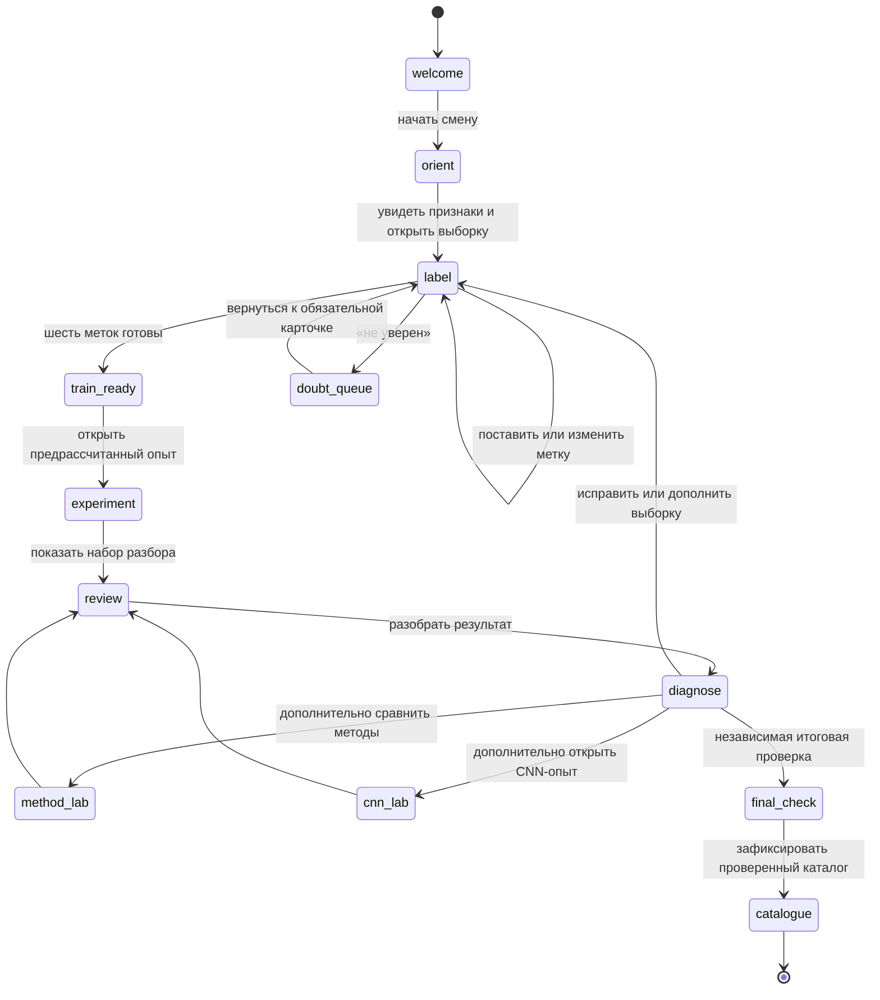

# Технический дизайн: «Первая смена помощника — каталог галактик»

Статус: проект для следующей реализации · 6 октября 2026 года.

Этот документ определяет техническое устройство будущей игры из [сценария первой смены](../redesign-2026-10-05/first-shift-scenario.md). Он не меняет текущую игру и не утверждает, что её данные уже подготовлены.

## 1. Решения и ограничения

Игра работает в современном браузере без сети. Ребёнок вместе со стендистом готовит ИИ-помощника к **многоклассовой классификации изображений галактик**. Обязательные категории — `smooth` («Гладкая»), `spiral` («Видна спираль») и `edge_on` («Диск с ребра»). Это три взаимоисключающие учебные метки для заранее допущенных изображений, а не полная астрономическая классификация.

В основной смене модель получает шесть эффективных меток: ребёнок ставит их сам либо в коротком маршруте добавляет свои к явно отделённым подготовленным меткам. Для трёх категорий существует `3^6 = 729` возможных векторов разметки. У каждого допустимого вектора заранее рассчитан результат эксперимента: предложения на наборе разбора, матрица ошибок, объяснение и следующая содержательная ветка. Игра не запускает обучение модели, не вызывает API и не выдаёт предрасчёт за вычисление в данный момент.

Стендист — живой наставник, а не персонаж в интерфейсе. ИИ-помощник — единственный персонаж: он показывает, какие примеры получил, что предложил и какие ограничения обнаружились. Реплики, метрики и варианты ответов лежат локально.

### Неизменяемые технические границы

- Базовый runtime: статические HTML, CSS и JavaScript без фреймворка, сборщика и нового игрового движка.
- Изображения галактик рендерятся через `` с локальным файлом или `<canvas>` при необходимости увеличения/аннотаций. Canvas не является источником истины разметки.
- Ника, наведение телескопа, карта неба и механика трёх кадров не переносятся как обязательные механики: они относятся к предыдущей задаче наблюдений.
- Свободного чата, внешних LLM, сетевой аналитики, реального обучения CNN и серверного хранения нет.
- «Не могу уверенно определить» — действие интерфейса и запись в очередь сомнений, не четвёртая метка и не один из 729 векторов.

## 2. Что подтверждено в локальном состоянии

Ниже зафиксированы проверенные свойства репозитория, на которые можно опираться, а не требования к новому продукту.

| Наблюдение | Основание | Следствие для новой игры |
| --- | --- | --- |
| `app/index.html` — локальная автономная поставка, описанная в README; README не подтверждает, какой runtime сейчас опубликован. | [README](../../README.md), [app/index.html](../../app/index.html) | Способ автономной поставки полезен как прецедент, но не задаёт место новой реализации. |
| Публичный сценарий расширяет зафиксированный образ comparison runtime: `tools/scenario-review/Dockerfile.web` наследует `sd2026-comparison:before-comments-20261006`, а `designlab/comparison/Dockerfile` публикует `night.html` как `index.html`. | [Dockerfile.web](../../tools/scenario-review/Dockerfile.web), [comparison Dockerfile](../../designlab/comparison/Dockerfile) | Ближайший runtime для новой версии — `designlab/comparison`; публикация требует отдельного решения после готовности среза. |
| В `app/` и comparison runtime применяются локальные JS/CSS-файлы, DOM и canvas; npm содержит только Prettier. | [app/index.html](../../app/index.html), [comparison index](../../designlab/comparison/index.html), [package.json](../../package.json) | React, Phaser или сборщик для новой механики не нужны. |
| Текущая ночная игра отделяет правила кампании от DOM: `NightModel` не рисует экран, а `night.js` управляет состояниями и локальным сохранением. | [night-model.js](../../designlab/comparison/night-model.js), [night.js](../../designlab/comparison/night.js) | Такое же разделение следует сохранить, но с новым доменом галактик. |
| Предыдущая ночная смена сохраняет JSON в `localStorage`, умеет инвалидировать результат обучения при изменении разметки и проверяет подпись снапшота при восстановлении. | [night.js](../../designlab/comparison/night.js), [night-model.js](../../designlab/comparison/night-model.js) | Это полезный прецедент, но старое состояние нельзя читать как состояние новой игры. |
| Скрипт `build-night.py` упаковывает явный список локальных ресурсов и добавляет контентные хэши к ссылкам. | [build-night.py](../../designlab/comparison/build-night.py) | Новая поставка должна иметь явный манифест и не зависеть от случайных файлов рабочей папки. |

Размер, происхождение и научная пригодность будущих изображений галактик пока не проверены. Поэтому названия файлов, метрики и квоты ниже — проектные решения до приёмки набора данных.

## 3. Архитектура поставки

Предлагаемая директория находится рядом с текущей поставкой, чтобы не смешивать её с переходным кодом ночной смены.

```text
designlab/galaxy-shift/
├── index.html                 # точка входа; открывается по file:// и HTTP
├── galaxy-shift.css           # адаптивный layout, reduced motion, печать
├── data/
│   ├── manifest.js            # версия данных, пути, provenance, контрольные суммы
│   ├── samples.js             # описания изображений, категории, доступность
│   ├── experiments.js         # таблица 729 предрассчитанных результатов
│   ├── copy.js                # реплики помощника и короткие объяснения
│   └── gallery/               # локальные WEBP/PNG; без ленивой загрузки по сети
├── src/
│   ├── model.js               # чистые правила, валидация, переходы, миграции
│   ├── state.js               # создание/сохранение/восстановление смены
│   ├── ui.js                  # DOM-рендер и обработчики событий
│   ├── image-viewer.js        # zoom, фокус, доступные подписи, canvas-аннотации
│   ├── presenter.js           # панель стендиста и режим объяснения
│   └── export.js              # локальная выгрузка журнала как HTML/JSON
└── tools/
    ├── build-galaxy-shift.py  # проверка манифеста и автономная ZIP-поставка
    └── check-galaxy-shift.mjs # инварианты данных и переходов
```

Сценарный текст остаётся в `docs/`, а не копируется руками в код: `data/copy.js` получает короткие реплики, утверждённые из сценария. Одна версия набора (`datasetVersion`) связывает изображения, справочную разметку, эксперименты и тексты объяснений.

### Слои и ответственность

| Модуль | Делает | Не делает |
| --- | --- | --- |
| `model.js` | Валидирует метку, строит ключ из шести меток и полной конфигурации опыта, находит вариант эксперимента, инвалидирует зависимые результаты. | Не читает DOM, `localStorage` или изображения. |
| `state.js` | Загружает JSON, применяет миграцию, сохраняет только валидное состояние. | Не считает метрики и не выбирает «правильный» ответ. |
| `ui.js` | Показывает этап, карточки, состояние кнопок и доступные действия. | Не содержит скрытый ключ разметки и не меняет состояние напрямую. |
| `image-viewer.js` | Рисует изображение/маркер, обеспечивает масштабирование и клавиатурное управление. | Не меняет метку при визуальном клике без явного выбора категории. |
| `presenter.js` | Показывает стендисту вопрос следующего шага и расширенное объяснение. | Не открывает правильные ответы ребёнку до разрешённой сцены. |
| `experiments.js` | Содержит только заранее рассчитанные результаты и объяснения. | Не выполняет обучение или случайный выбор. |

## 4. Данные и предрассчитанные эксперименты

### Единица изображения

Каждый игровой пример — локальная вырезка с одной галактикой в центре. В `samples.js` хранятся только идентификаторы, видимые метаданные, путь к уже допущенному файлу и роль в игре. Справочная метка не показывается до точки, определённой сценарием.

```js
const SAMPLE = {
  id: 'train-03',
  image: 'data/gallery/train-03.webp',
  alt: 'Астрономическое изображение: одна галактика расположена в центре кадра.',
  role: 'training',                 // training | review | final | reference | doubtful
  referenceLabel: 'spiral',         // доступно модели, но не обычному UI до разбора
  admissibleLabels: ['smooth', 'spiral', 'edge_on'],
  provenanceId: 'gz-source-042',
  teachingNotes: ['spiral_arms_visible'],
  quality: 'clear',                 // clear | difficult; difficult не попадает в шесть обязательных
  width: 768,
  height: 768
};
```

У `doubtful` нет принудительной справочной метки для ребёнка: это материал очереди сомнений после основной проверки. Он не используется для вычисления метрик и не может тихо превратиться в один из трёх классов.

До выбора метки `alt` остаётся нейтральным и не называет категорию или её отличительный признак. Это предотвращает случайную подсказку читателю экрана. В карточке стендиста может быть отдельный набор вопросов внимания («Что на форме кажется круглым, вытянутым или узорчатым?»), но он не раскрывает эталон и не включается в игроковый DOM как скрытый текст. После выбора можно открыть доступное объяснение наблюдаемых признаков и основания справочной разметки. Эквивалентный самостоятельный сценарий для незрячего ребёнка требует отдельного пользовательского теста: нельзя объявлять его решённым одним `alt` или вынуждать ребёнка угадывать по названию кнопки.

### Ключ эксперимента

Порядок шести обучающих идентификаторов фиксирован в `manifest.js` и показывается в интерфейсе как шесть карточек. Метки кодируются цифрами: `smooth = 0`, `spiral = 1`, `edge_on = 2`. Ключ — шесть цифр в фиксированном порядке; например, `[spiral, smooth, spiral, edge_on, smooth, edge_on]` даёт `101202`.

Числовой индекс таблицы определён однозначно как число в троичной системе с этими шестью цифрами: `index = Σ(code[i] × 3^(5 - i))`, от 0 до 728. В сохранении остаются и строковый ключ, и массив названий меток: это делает данные проверяемыми человеком и не зависит от неявного порядка объектов JavaScript.

Схема ниже иллюстрирует формат: числа условные, не результат рассчитанного игрового эксперимента. В готовой таблице метрики проверяются по полному массиву предсказаний.

```js
const EXPERIMENT = {
  id: 'v1-101202',
  datasetVersion: 'galaxy-v1',
  labels: ['spiral', 'smooth', 'spiral', 'edge_on', 'smooth', 'edge_on'],
  trainingSummary: {
    labelled: 6,
    classCounts: { smooth: 2, spiral: 2, edge_on: 2 },
    noteId: 'balanced_examples'
  },
  classifier: {
    methodId: 'similarity-v1',
    trainingSetId: 'core-six-v1',
    supplementId: null,
    featurePipelineVersion: 'image-features-v1',
    kind: 'prepared-image-classifier',
    label: 'Модель по примерам',
    explanationId: 'similarity_uses_examples'
  },
  review: {
    setId: 'review-a',
    total: 9,
    correct: 7,
    confusion: [[2, 0, 1], [0, 3, 0], [1, 0, 2]],
    predictions: [ // сокращённый пример; реальная запись содержит все 9
      { sampleId: 'check-01', predicted: 'smooth', explanationId: 'match_smooth_profile' }
    ]
  },
  diagnosis: { kind: 'label_review', sampleIds: ['train-02'], copyId: 'review_one_label' },
  cnnLab: { experimentId: 'cnn-balanced-v1', available: true }
};
```

Псевдовероятность или декоративная шкала уверенности не добавляются. Если позднее потребуется оценка уверенности, для неё отдельно определяются метод расчёта и корректное объяснение.

### Непротиворечивость набора 729 вариантов

Генератор подготовки данных, запускаемый до поставки, обязан:

1. создать ровно 729 записей для фиксированной конфигурации метода и набора из шести карточек и трёх допустимых меток;
2. проверить, что каждая запись относится к той же `datasetVersion`;
3. проверить размер матрицы ошибок `3×3`, сумму ячеек, равную `review.total`, и принадлежность всех предсказаний набору разбора;
4. проверить, что диагноз не выдаёт ссылок на скрытую справочную разметку до этапа разбора;
5. проверить, что каждая ветка улучшения ссылается на существующий следующий эксперимент;
6. записать хэш входного набора и хэш таблицы экспериментов в манифест.

Не следует хранить 729 копий галереи. Общие изображения хранятся один раз; эксперимент хранит небольшие числовые результаты и идентификаторы реплик.

## 5. Состояния смены и защита от утечки контрольных данных

### Конечный автомат



`train_ready` доступен при шести эффективных учебных метках. В полной смене ребёнок может поставить все шесть. В короткой смене часть меток приходит из явно отделённого, заранее подготовленного набора, а ребёнок добавляет оставшиеся; в сумме модель всегда получает шесть записей. Подготовленные метки визуально и в журнале отделены от собственных решений ребёнка. Сомнение полезно как разговор со стендистом, но обязательная карточка должна вернуться к явному выбору одной из трёх категорий, чтобы сохранялся размер пространства 729.

### Ревизии и инвалидация

```js
const STATE = {
  schemaVersion: 1,
  datasetVersion: 'galaxy-v1',
  phase: 'label',
  labels: { 'train-01': 'spiral' },
  labelRevision: 4,
  experimentRevision: 6,
  activeExperiment: null,          // { id, experimentRevision, signature }
  review: { setId: null, result: null },
  finalCheck: { setId: null, result: null },
  exposedSetIds: [],
  labs: { method: null, cnn: null },
  catalogue: [],
  doubtQueue: ['doubt-01'],
  presenterMode: false
};
```

После любого изменения `labels` или параметра, входящего в подпись (`methodId`, состав учебного набора/дополнение либо версия признаков):

- увеличивается `experimentRevision`; при изменении меток дополнительно увеличивается `labelRevision`;
- удаляются `activeExperiment`, результат проверки, выводы лабораторий и несохранённый каталог, созданные от старой подписи;
- скрываются ранее показанные результаты набора разбора и итогового heldout;
- UI возвращается в `label` или `train_ready` с понятной репликой «Условия опыта изменились — открой новый опыт и проверь его заново».

`signature` вычисляется детерминированно из `datasetVersion`, фиксированного порядка шести карточек, шести меток, `methodId`, `trainingSetId`, `supplementId` и `featurePipelineVersion`. Любой результат разрешено показать или сохранить только когда совпадают `experimentRevision` и эта полная подпись. Восстановление после перезагрузки повторно валидирует условие и отбрасывает устаревшие результаты.

### Набор разбора и итоговый heldout

- `review-a` — набор разбора: он даёт ребёнку обратную связь и может быть показан повторно только как уже знакомая тренировочная проверка. Его нельзя называть независимой оценкой после первого раскрытия.
- `final-a` — итоговый heldout: он не отображается в обучающей панели, диагностике разметки, метод-лаборатории и CNN-подборе до единственной итоговой проверки.
- Метки `referenceLabel` обоих наборов не попадают в DOM, HTML-экспорт до разрешённого разбора или тексты кнопок. Полностью спрятать их от технически мотивированного человека в автономной игре невозможно; педагогическая защита — честный интерфейс и отдельные роли наборов, не защита от взлома.
- `exposedSetIds` записывает факт показа набора. Сброс UI, новая вкладка или «новая смена» на том же устройстве не делают уже увиденный `final-a` невиденным: он помечается как повторный пример и не даёт новую итоговую метрику. Для новой независимой проверки нужен другой нераскрытый набор или другой пользовательский профиль/устройство.
- Итоговую метрику строит только `final-a`, невиденный на момент последнего выбора метода, дополнения и признаков. Если он был раскрыт, финал сообщает ограничение вместо повторной цифры.

Это решение важнее красивой цифры «качества»: ребёнок должен увидеть, что проверка на уже просмотренных карточках не подтверждает способность помощника работать с новыми изображениями.

## 6. Экран и механики

### Пространство

Обсерватория остаётся атмосферной рамкой, но без персонажа Ники и без обязательной карты. Основной экран — рабочая поверхность каталога:

1. слева крупная карточка галактики с безопасным увеличением и подписью происхождения;
2. справа три крупные кнопки категорий, краткая подсказка признака и действие «Не уверен»;
3. сверху панель помощника: шесть полученных примеров, текущая задача и стадия смены;
4. снизу журнал: обучающий набор, новая проверка, очередь сомнений, итоговый каталог;
5. отдельная кнопка «Для стендиста» открывает краткий вопрос следующего шага, не заменяя живой разговор.

Стендист может рассказать про ChatGPT, Claude, Алису, ГигаЧат, DeepSeek и Qwen в начале, но бренды не нужны для хода игры и не создают сетевую зависимость. Карточка помощника ясно говорит, что его реплики подготовлены авторами, а опыт обучения рассчитан заранее.

### Ветви улучшения

Диагноз определяется записью эксперимента, а не тем, что «система знает ответ лучше ребёнка».

| Диагноз | Что видит ребёнок | Следующее действие | Чему учит |
| --- | --- | --- | --- |
| Ошибка учебной метки | На подготовленном тренировочном архиве есть карточка для перепроверки с видимыми признаками и справочником. | Сам решает изменить метку или обосновать прежнюю. | Метки влияют на обучение. |
| Примеры односторонние | Доска показывает, что одна категория почти не представлена или все примеры слишком похожи. | Добавляет предложенную подготовленную карточку того же типа. | Важны разнообразие и покрытие будущих случаев. |
| Граница изображения | На новых снимках часть объектов плохо различима. | Отправляет их в очередь сомнений. | Не всякий пример нужно принуждать к ответу. |
| Хороший результат | Помощник справился с базовым набором разбора. | Ребёнок может завершить смену **или**, по желанию, открыть отдельный более трудный набор. | Один успех не доказывает универсальность. |

Красная подсветка допустима только в режиме «проверенный учебный архив»: подпись сообщает, что это заранее подготовленная тренировка с эталоном. Она не должна возникать как магическое знание помощника о только что поставленной детской метке.

### Честная дополнительная ветка CNN

CNN — отдельная лаборатория для заинтересованных, доступная после основной проверки. Она не даёт ребёнку свободно собирать фактически неисполняемую сеть и не обещает, что больше цветных блоков автоматически лучше.

Показываются два-три зафиксированных опыта на **том же** наборе и с явно заданными условиями:

- базовая модель по примерам;
- компактная CNN с заранее рассчитанными результатами;
- CNN с более богатой подготовленной выборкой либо примером переобучения.

У каждого опыта видны: какие изображения были в учебном наборе, какие — в проверочном, количество слоёв как схематический рисунок, ответы на нескольких новых карточках и ограничения. Цветные блоки означают слои обработки изображения, но не рисуют несуществующие «мысли нейросети». Сначала ребёнок предсказывает, какой вариант поможет; затем открывает зафиксированный результат. При равных входных условиях маленькая модель может оказаться полезнее, а итоговый выбор остаётся «проверить на новых данных».

## 7. Допуск данных и офлайн-пакет

### Условия допуска одной карточки

До попадания в обязательные шесть карточка должна иметь:

- подтверждённое происхождение, лицензию/условия использования и локально сохранённую ссылку на первоисточник;
- научно просмотренную справочную разметку и обоснование именно для учебных трёх категорий;
- достаточную читаемость при целевом размере экрана; сложные, сливающиеся и неоднозначные объекты идут в необязательную очередь сомнений;
- уникальный стабильный `id`, размеры, `alt` на русском и хэш файла;
- проверку, что не является почти тем же кадром/вариантом объекта в train и heldout;
- запрет на подмену недоступного исходника похожим изображением без нового допуска.

Galaxy Zoo упоминается в финальном материале как реальный гражданский научный проект, но игра не отправляет разметку участника в Galaxy Zoo и не называет учебные метки вкладом в его каталог. Ссылка, источник и лицензионные условия проверяются при подготовке данных; в автономную поставку включается краткая атрибуция.

### `file://`-совместимость

Все исходные данные подключаются обычными `<script src>` или встроенными статическими JavaScript-объектами. Нельзя полагаться на `fetch('data/*.json')`, ES-модули с неподдерживаемыми браузером политиками, Service Worker, IndexedDB как обязательное хранилище или CORS-заголовки: эти пути ненадёжны при двойном клике по `index.html`.

Пути только относительные (`data/gallery/train-01.webp`), без начального `/`, внешних URL в `src`, CDN и веб-шрифтов. После распаковки ZIP сохраняется структура каталогов. Браузерный запуск по HTTP полезен для разработки, но не является условием фестивального запуска.

### Целевые бюджеты поставки

Это целевые ограничения, не измеренный текущий размер.

| Объект | Цель | Причина |
| --- | ---: | --- |
| Основной HTML + CSS + JS без изображений | до 350 KB gzip | Быстрое открытие со старого ноутбука и простая проверка. |
| Одна галактика | до 180 KB WebP, PNG только когда это научно необходимо | Изображение остаётся достаточно крупным для признаков. |
| Полная галерея обязательной и контрольной смены | до 12 MB | ZIP легко переносить и распаковать на фестивале. |
| Полная автономная поставка с историей Galaxy Zoo и CNN-иллюстрациями | до 20 MB | Оставляет место для лицензий и локальной документации. |
| Карта предрассчитанных 729 вариантов | до 1.5 MB JSON-подобных данных после минификации | Не препятствует работе офлайн и остаётся проверяемой. |

При превышении сначала удаляются дубли изображений и неиспользуемые размеры, а не снижаются требования к научному происхождению. Нужны миниатюра и основной размер одной карточки, а не несколько почти одинаковых копий.

## 8. Сохранение, восстановление и миграция

Хранилище: `localStorage` с ключом `science-day-galaxy-shift-v1`. Оно хранит только прогресс на данном устройстве; общий сервер, учётная запись и обмен с коллегами не требуются.

При недоступном `localStorage` игра продолжает работать в памяти и заметно предлагает локально скачать журнал. Экспорт содержит: версию набора, выбранные метки, подпись эксперимента, итоговые результаты и текстовые объяснения; он не включает скрытые метки набора разбора или итогового heldout, если соответствующий разбор не был открыт.

Восстановление допустимо только когда совпадает `datasetVersion`. При новой версии набора безопасное поведение — начать новую смену и оставить прежний экспорт доступным для скачивания, а не подставлять новые изображения под старые `id`.

```js
function migrate(raw) {
  if (raw.schemaVersion === 1 && raw.datasetVersion === MANIFEST.datasetVersion) return validate(raw);
  if (raw.schemaVersion === 0) return validate({ ...fresh(), labels: raw.labels ?? {} });
  return fresh({ notice: 'Набор сменился: начнём новую смену.' });
}
```

Миграция не должна угадывать соответствие категорий после их научного переопределения. Изменение названий или смысла `smooth`, `spiral`, `edge_on` повышает `datasetVersion`.

## 9. Проверка

### Матрица проверок

| Область | Проверка | Критерий |
| --- | --- | --- |
| Данные | Проверка манифеста, хэшей, provenance и ролей изображений. | Ни одна обязательная карточка без источника или научного допуска не попадает в пакет. |
| 729 вариантов | Генератор перебирает все ключи. | Ровно 729, нет пропусков/дубликатов; каждая матрица ошибок согласована с total. |
| Чистая модель | Unit-тесты `label`, `signature`, переходов и инвалидации. | Смена одной метки уничтожает результаты старой подписи. |
| Набор разбора и heldout | Тесты доступа по фазам, DOM-снимок до проверки, повторный запуск после сброса UI. | Скрытые метки не отрисованы до разрешённого разбора; раскрытый финальный набор не выдаётся за новый. |
| CNN-ветка | Тест связей условий, идентификаторов опытов и подписи «предрассчитано». | Нельзя назвать расчёт текущим обучением или показать результат чужого набора. |
| Сохранение | Сохранить, перезагрузить, изменить метку, восстановить. | Устаревшая проверка не возвращается как действующая. |
| `file://` | Распаковать ZIP, открыть `index.html` без сервера и с отключённой сетью. | Видны изображения, работает смена, экспорт и понятная деградация без localStorage. |
| Доступность | Клавиатура, фокус, экранный диктор, 320 px, `prefers-reduced-motion`. | Все три категории и «не уверен» достижимы; изображения имеют смысловые `alt`. |
| Визуал | Ручной просмотр на проекторе/планшете. | Категории, текущая стадия и очередь сомнений читаемы с обычной дистанции стенда. |

Текущие проверки ночной игры не являются проверкой новой механики. Можно перенять их принцип «модель отдельно от браузера», но тесты должны быть новыми и относиться к галактикам.

### Вертикальный срез — критерий готовности до полной игры

Первый реализуемый срез ограничивается одним рабочим столом и нужен, чтобы проверить, что интерактив действительно перевешивает возможную сухость классификации.

Срез принят, если без сети и на `file://` ребёнок может:

1. увидеть одну реальную локальную карточку галактики и справочник трёх категорий;
2. вместе со стендистом или самостоятельно получить шесть эффективных меток, явно различая собственные и подготовленные;
3. открыть один честно подписанный предрассчитанный опыт;
4. проверить не менее трёх новых карточек из отдельного набора;
5. изменить одну метку и увидеть, что прежний результат стал недействителен;
6. завершить мини-каталог и увидеть, что сомнительная карточка не притворилась четвёртым классом.

Срез также должен включать хотя бы один ясный Galaxy Zoo-контекст с подтверждённым источником и одну карточку стендиста: «Что мы показали помощнику? Как проверили ответ на новом снимке?» До него не строятся полный декор обсерватории, конструктор CNN или расширенный каталог.

## 10. Риски и решения

| Риск | Решение | Статус |
| --- | --- | --- |
| Три визуальные категории не всегда взаимоисключающие. | В обязательный набор допускаются только ясные примеры; пограничные — в очередь сомнений. Научный просмотр до реализации. | Требует данных. |
| Предрасчёт ощущается как обман. | Ясно назвать его учебным опытом с заранее подготовленными вариантами; не показывать ложную анимацию вычисления. | Решено в дизайне. |
| 729 таблиц раздувают код и сложно проверяются вручную. | Генерировать таблицу из версии данных; автоматически проверять полноту и инварианты; хранить ссылки, а не копии изображений. | Предлагается. |
| Ребёнок просто кликает метки, не рассматривая форму. | Начинать с сравнения изображений и видимых признаков; стендист задаёт один вопрос до первой метки. | Сценарное требование. |
| «Красные ошибки» лишают ребёнка авторства. | Использовать их только в заранее объявленном тренировочном архиве; давать основание и возможность не соглашаться до разбора. | Предлагается. |
| CNN превращается в бессмысленный конструктор блоков. | Только несколько фиксированных опытов с одинаковой задачей, разными условиями и независимой проверкой. | Решено в дизайне. |
| Локальное сохранение ведёт себя по-разному при `file://`. | Не делать его условием прохождения; предлагать экспорт; тестировать минимум Chrome, Firefox и Safari на целевых устройствах. | Требует проверки. |
| Обсерватория становится дорогим визуальным обходом вокруг карточек. | Вертикальный срез сначала доказывает основной цикл на одном рабочем столе; декор добавляется после плейтеста. | Решение о порядке работ. |

## 11. Очерёдность реализации

1. Научно допустить изображения и создать манифест, три категории и отдельные train/review/final/сомнительные наборы.
2. Сгенерировать и проверить 729 экспериментов с текстовыми диагнозами.
3. Реализовать чистую модель состояния, инвалидацию и автономный вертикальный срез.
4. Провести ручной плейтест со стендистом на разных детях; измерить, понимают ли они связь «метки → новый ответ → проверка».
5. Только после этого добавить комнату обсерватории, карточки Galaxy Zoo, расширенный итог и CNN-лабораторию.

Такой порядок сохраняет самое ценное: игра показывает не иллюстрацию кнопки «обучить», а управляемый ребёнком цикл работы с данными, который можно честно объяснить и технически стабильно показать без интернета.
