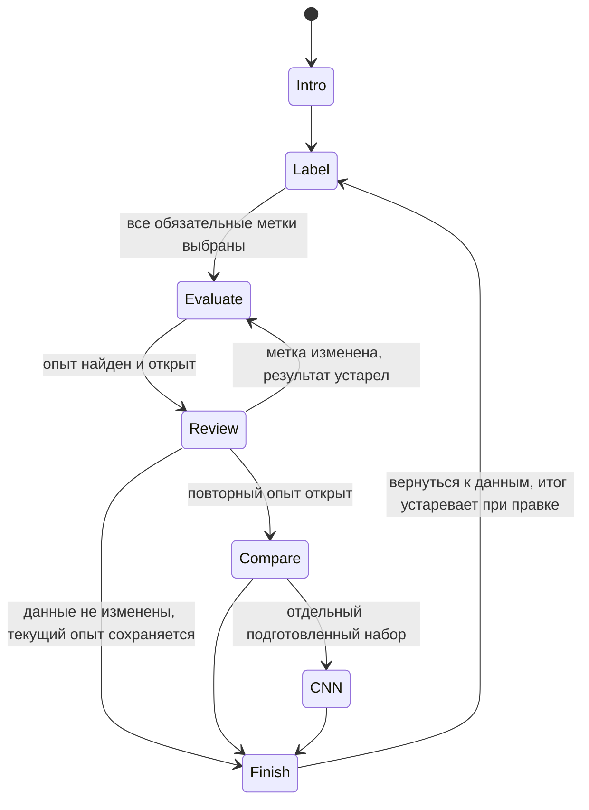

# План сборки редакции «Ника и модель»

> Актуализация 8 октября: см. раздел 12 [дизайн-документа](game-design.md#12-актуализация-после-тестирования-8-октября-2026). Ниже сохранён исходный план; единый опыт CNN уже реализован, мобильная версия исключена из требований, постоянная телеметрия не реализована.

## 1. Что уже есть и что отсутствует

Проверено в исходниках 6 октября 2026: действующая игра `designlab/comparison/night.html` и `night-model.js` посвящена наблюдениям и движущимся объектам. Её состояние, двоичные метки и мастерская `training-workshop.js` не реализуют новый сценарий. Переносим принцип разделения состояния и интерфейса, не подменяем в старой модели названия объектов.

`assets/nightshift/nika-v1.png` — существующий художественный образ Ники; происхождение в соседнем `CREDITS.md`. Для макета он пригоден, для дневной сцены нужно проверить свет и масштаб. Фоны `laboratory-*-v*.png` содержат утку и остаются историческими концептами до отдельной переработки графики.

В `assets/galaxies/sources.json` находятся четыре справочных снимка. Они не образуют готовый набор для обучения и проверки. Нет допущенного манифеста новой игры, рассчитанных опытов, результатов двух CNN и измерения длительности детского прохода.

## 2. Минимальная реализация

Предлагаем отдельный каталог `designlab/galaxy-shift/`, обычные HTML/CSS/JavaScript и локальные ресурсы. Это решение для первого среза. WebGL для комнаты остаётся следующим визуальным слоем: он не управляет данными и результатами. Новая игра не заменяет действующий сайт автоматически.

| Файл | Ответственность |
|---|---|
| `index.html`, `galaxy.css` | Рабочее место, Ника, крупные снимки, доступные кнопки и смена этапов |
| `data.js` | Версия набора, изображения, подписи и источники, подготовленные опыты |
| `model.js` | Чистые переходы, выбранные метки, ключ опыта, актуальность результатов |
| `game.js` | Отрисовка состояния и обработка действий |
| `check-model.mjs` | Достижимые состояния, точное соответствие данных и результатов |
| `check-browser.py` | Проход по UI, возвраты, помощь, отсутствие сетевых зависимостей |
| `build-galaxy.py` | Упаковка после рабочего среза: ресурсы, атрибуция, контрольные суммы |

В первом срезе состояние живёт в памяти вкладки; возврат в лабораторию его сохраняет. Перезагрузка начинает новую смену с ясным предупреждением. localStorage, миграции и экспорт журнала добавляются только при подтверждённой потребности. Общий сервер комментариев относится к документам, не к игре.

## 3. Контракт подготовленных опытов

Свободная разметка должна влиять на показанный опыт. Двух записей «до / после» недостаточно, если три собственные метки ребёнка тоже входят в обучение: они имеют 27 сочетаний. При двух исправляемых старых метках с тремя доступными категориями верхняя граница — 3^5 = 243 состояния одного базового метода. Первый совместный пример и остальная подготовленная выборка фиксированы.

Это проектный предел, не существующий пакет. Перед реализацией генератора подтверждаем число редактируемых карточек. Не возвращаемся автоматически к прежним шести меткам и 729 вариантам. Если расчёт слишком дорог, сокращаем число редактируемых примеров явно, а не игнорируем действия ребёнка.

Ключ опыта включает `datasetVersion`, все эффективные метки в стабильном порядке, `modelVariant` и версию протокола. Запись результата содержит ключ, идентификаторы учебных и проверочных объектов, предсказания, справочные ответы, показатели и происхождение расчёта. Нет подходящей записи — нет результата: интерфейс сообщает, что этот опыт не подготовлен, а выпуск блокируется до покрытия всех разрешённых состояний.

Для CNN-сравнения первого среза готовим ровно два опыта на одном явно обозначенном исправленном наборе. Это отдельная ветка с собственными ключами; нельзя переносить её показатели на текущие пользовательские метки. Покрытие всех 243 состояний двумя архитектурами не является обязательством первой поставки.

Каждый опыт воспроизводим: версии кода и данных, подготовка изображений, разбиение по объектам, seed и условия обучения записаны. Базовую модель и пару CNN выбираем после малого расчётного эксперимента. Если модель не показывает подходящего объяснимого изменения, меняем постановку опыта с документированием, а не сочиняем предсказания. Сценарная ошибка должна наблюдаться в рассчитанном результате, в том числе проверяется ветка без ошибок.

## 4. Состояния и инвалидация

Храним текущие метки и ключ, отдельно снимок первого результата для сравнения. Кнопка сравнения требует нового рассчитанного опыта после изменения. Переход назад не меняет метки. Правка аннулирует актуальность зависимых проверки и финала, но прежние ответы можно видеть с подписью «до изменения».

Если эффективные метки не изменились, ключ и текущий результат сохраняются; показываем «Данные не изменены», предлагаем вернуться к карточкам или закончить. Не создаём фиктивный результат «после». Финал использует актуальный базовый опыт с метками ребёнка; отдельная CNN-ветка не выбирает модель основной смены. Итоговая подборка не участвует в выборе данных, категорий, сюжетной ошибки, модели или пары CNN.

Проверочная подборка повторно используется для сравнения «до / после». Итоговые объекты отделены по галактикам и впервые открываются в финале. Флаг просмотра финальной подборки сохраняется до сброса всей смены; после возврата она не называется невиданной.

## 5. Очерёдность сборки

1. **Подготовить данные и один причинный опыт.** Допустить ясные изображения и справочные метки, разделить объекты, получить реальную ошибку старой разметки и результат исправления. Выход: воспроизводимый маленький пакет, а не экран с ожидаемыми процентами.
2. **Собрать основной путь на рабочем столе.** Ника → три метки → проверка → исправление → повторная проверка → финал. Сначала проверить конечное число вариантов и ключи, затем подключить интерфейс. Изображения уже настоящие; декор комнаты может быть временным.
3. **Добавить сравнение двух CNN.** Рассчитать фиксированную пару, показать схему одного изменения и конкретные ответы. Сохранить возможность закончить основной путь раньше.
4. **Проверить со стендистом и детьми.** Измерить время, затруднения и понимание; сократить шаги при необходимости.
5. **Довести пространство и упаковать.** Единая дневная лаборатория без утки, Ника, утро/день/вечер, фиксированная камера и доступный слой управления. Выбор WebGL-библиотеки — после пробы на стендовом устройстве, не обязательное условие расчёта данных.

Этапы 1–3 — ближайший план, ещё не выполненная сборка. Публикация и замена действующей игры являются отдельным решением после проверенного среза.

## 6. Проверки перед показом

- Источники, атрибуция, разрешённые преобразования и SHA-256 каждой картинки; отсутствие одной галактики в разных группах.
- Покрытие всех разрешённых ключей, показатели пересчитаны из ответов; результат не улучшается только от клика «повторить».
- Верные и неверные метки ребёнка, помощь, изменение старой подписи, ветка без ошибки, возврат из финала и корректная инвалидация.
- Раздельный набор CNN явно обозначен; сравнение не меняет метки основной смены и не выдаётся за её результат.
- Весь путь после распаковки через `file://` без HTTP-запросов, без `fetch` локального JSON, CDN и обязательного сервера; данные подключаются обычным локальным script.
- Клавиатура, видимый фокус, reduced motion, 1280×720, 390 px и масштаб 150%; изображение не обрезает диагностический признак.
- Научные и детские проверки фиксируются отдельно от автоматических тестов. Проверки старой ночной игры не доказывают готовность новой.
