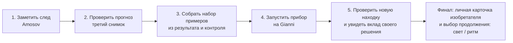

# Аудит сборки: от набора испытаний к детской научной игре

Дата: 4 октября 2026. Это аудит текущего `designlab/comparison`, а не обещание
того, что уже сделано. Цель — собрать за 10–15 минут законченную первую смену
для 10–13 лет: ребёнок сам замечает изменение на настоящем снимке, изобретает
полезный способ поиска, видит, как его решение меняет работу прибора, и
проверяет новую находку. Продолжение открывает следующий вопрос, а не ещё один
экран с тем же действием.

## Вердикт

Сейчас есть **научно честный интерактивный прототип из трёх разрозненных
испытаний**, а не завершённая игра. Его сильное ядро уже следует сохранять:

1. Игрок выбирает реальную точку; координаты входят в расчёт траектории.
2. Третий кадр проверяет зафиксированный прогноз, а не раскрывает заранее
   подготовленный ответ.
3. В измерении света выбирается область игрока; результат зависит от неё.
4. Автоматический запуск отделяет предложение прибора от проверки человеком и
   может честно дать пустой или неопределённый результат.

Но обещание «собери инструмент ИИ» пока не выполнено. Установка двух готовых
правил открывает фиксированный поиск; примеры игрока не являются обучающим
набором, правила не меняются, очередь не перестраивается. Финал наступает после
двух сохранённых полей, даже если ребёнок не увидел, что его изобретение помогло
найти нечто новое. Это и есть главный продуктовый разрыв.

Не следует переходить на взрослый движок ради исправления этого разрыва.
Браузерный Canvas/Phaser уже достаточен для 2D-наблюдений, ввода, анимаций и
локального состояния. Сначала надо сделать причинную цепочку игры; визуальная
постановка и возможный переход на Godot имеют смысл после неё.

## Что подтверждено сейчас

| Требование готовой первой смены | Текущее доказательство | Статус |
| --- | --- | --- |
| Действие меняет научный результат | `TrackingModel.select()` строит прогноз из первого и второго положения и их времени; `confirm()` ищет объект около прогноза на третьем кадре. | Есть |
| Ошибка остаётся исследовательской, а не «минусом жизни» | Неподвижная/неоднозначная точка даёт отдельный результат; успешная старая проверка не уничтожается повторной неудачей. | Есть |
| Измерение света не подменено заранее заданным объектом | `BrightnessModel.measure()` работает с выбранной областью; история SN открывается только для совпавшего измерения. | Есть |
| Прибор умеет просмотреть больше точек, чем игрок | `LaunchModel.scan()` реально ранжирует измеренные пики и `verify()` проверяет выбранное предложение третьим кадром. | Есть |
| Игрок учит или настраивает модель | В состоянии смены есть только `installed.movement` и `installed.fading`; запуск использует два фиксированных режима. | Нет |
| Изменение игрока видно на новом независимом небе | Автозапуск использует независимые поля, но его кандидаты не зависят от действий до него. | Нет |
| Законченная 10–15-минутная драматургия | Первые два испытания обязательны по порядку, затем два поля запуска; реальная длительность и желание продолжать не измерены на детях. | Не доказано |
| Детская постановка, которая зовёт начать | Рабочее место намеренно нейтрально. Художественные SVG исключены после негативного отзыва; новая визуальная система, звук и анимационная режиссура отсутствуют. | Нет |
| Три уровня сложности не равны повтору одного кейса | В текущем runtime доступны пять ролей; локальный научный манифест содержит 12 случаев, но остальные ещё не превращены в игровые срезы и проверяемые эпизоды. | Нет |

Техническая проверка не заменяет плейтест, но она сильнее словесного заявления:
4 октября прошли браузерные `check-opening.py`, `check-shift.py` и две
модельные проверки без runtime-ошибок. В частности, `check-shift.py` фиксирует
58 проверок: независимость полей запуска от личных испытаний, честный пустой
результат, третью дату, сохранение результатов и мобильный экран.

## Реальный материал, из которого можно собрать кампанию

| Роль в истории | Реальные данные, доступные в `comparison` | Чему учит / что нельзя утверждать |
| --- | --- | --- |
| Личная первая находка | `s02`: Amosov, 3 кадра за 25 марта 2025, 6/5/6 измеренных источников. | Можно предсказать короткое продолжение движения; нельзя выводить орбиту или опасность. |
| Независимая проверка переноса | `s07`, переизданный как `launch-motion`: Gianni, 3 кадра, по 10 источников. | Подходит для новой находки после обучения/настройки; не считать его «вторым разом Amosov». |
| Свет и контрольная интерпретация | `BRIGHTNESS_DATA`: SN 2023tyk, 2 даты, 5/5 источников, разностные массивы и ограничения смешения. | Можно измерить ослабление выбранной области; тип сверхновой не выводится из этих двух изображений. |
| Ошибка прибора/помеха | `s04`, 3 кадра, 4/2/3 источника. | Подходит для отрицательного примера только после ручной научной проверки причины следа. |
| Новое поле с поворотом сюжета | `launch-variable`: 3 даты 2018/2021/2024, 40/31/36 источников. | Есть честное «ослабло, затем усилилось»: первые две даты не позволяют обещать дальнейшее угасание. |

Это **пять ролей в текущем runtime, а не девять готовых игровых дел**. `launch-motion` и `s07`
— одни и те же кадры, поэтому их нельзя продавать как два независимых дела.
Нынешних данных достаточно для одного плотного маршрута из трёх содержательных
сцен и двух-трёх контролей. Их недостаточно, чтобы честно заполнить девять
разнообразных миссий или обучить настоящий обобщающий классификатор на
астрофизические классы.

В `assets/observations/manifest.json` локально зафиксированы 12 случаев:
`mover1`, `mover2`, `sn2023tyk`, `variable1`, `weak1`, `weakmid1`, два
артефакта и четыре спокойных контроля. Это достаточная заготовка для шести
разных расследований, но она ещё не импортирована в этот runtime как набор
нормализованных вырезок, признаков, независимых train/test-пар и игровых
контрпримеров. Два артефакта сняты в одних родительских экспозициях, поэтому
это разные окна и вопросы, но не две независимые ночи. До подготовки нельзя
рисовать в интерфейсе «9 дел».

## Приоритетная кампания: «Первый сигнал»

Это одна история, а не обязательный обход станций. Ника не объясняет науку до
действия: она ведёт небольшую команду, которая собирает для фестиваля прибор
«Небо меняется». У игрока есть ясная цель на весь сеанс: **до конца смены
оставить в приборе хотя бы один проверенный способ, который найдёт новую точку
в другом поле**.

### Сцена 1 — «Где она будет?» (0:00–2:30)

Игрок в текущем хорошем механическом ядре выбирает движущуюся точку на двух
кадрах Amosov. До третьего кадра прибор показывает ровно три вещи: две даты,
вектор, область будущего положения. Неверная неподвижная точка — полезная
первая гипотеза: третья дата показывает, что прогноз остался у звезды. При
успехе игрок видит совпадение своего прогноза с новым пикселем, затем имя
Amosov и сохранённые три положения.

Награда: в лотке появляется **«образец: настоящее движение»**, а не медаль.
Он нужен в следующем действии.

### Сцена 2 — «Чему верить прибору?» (2:30–5:30)

На том же рабочем столе — три коротких вырезки, а не новый длинный урок:

* свой Amosov: «проверять»;
* неподвижная звезда, ошибочно выбранная игроком: «не считать движением»;
* один проверенный шум/артефакт из `s04`: «не считать движением».

Игрок кладёт **два или три** примера в гнёзда «проверять» и «не отвлекаться».
Инструмент строит не магическую классификацию объекта, а понятный детектор
кандидатов движения из трёх измеряемых признаков: смещение, согласованность
яркости и близость к неподвижному источнику. В интерфейсе показываются не
термины ML, а шкалы «похоже на след», «похоже на неподвижную звезду» и «похоже
на помеху». Кнопка «попробовать на новом поле» недоступна, пока не выбраны
минимум один положительный и один отрицательный пример.

Это минимально честный локальный kNN или взвешенное расстояние, а не заявление,
что ребёнок обучил нейросеть. Его входы, выбранные метки, соседние примеры и
выходной рейтинг должны храниться в журнале.

### Сцена 3 — «Видит ли он дальше?» (5:30–9:00)

Прибор запускается на независимом Gianni (`launch-motion`). На снимке видны
кандидаты и **до/после**: базовый фиксированный поиск и личный поиск игрока.
Игрок выбирает один из верхних кандидатов, открывает два исходных снимка и
подтверждает продолжение третьим кадром. Только здесь возникает фраза «прибор
помог»: без ручного обзора десяти точек он поднял этот след в короткий список;
решение всё равно подтверждает человек.

Обязательный контрфакт: если игрок не положил отрицательный пример, в списке
есть лишняя помеха; если не положил образец движения, Gianni остаётся ниже
порога. Никакой автоподстановки нужной точки в первой строке. Игрок может
исправить набор, перезапустить и увидеть другую очередь. Это тот момент,
которого сейчас нет и который делает факультет ИИ причиной игры.

### Финал и продолжение (9:00–12:00)

Финал — одна крупная «карта изобретения»: **«Ты научил прибор искать короткие
следы; он помог проверить Gianni»**. На ней остаются два факта: личная
траектория и новая проверка с прибором. Под ними один осмысленный выбор
продолжения:

* «Точка не сдвинулась, но изменила свет» — уже реализуемое измерение SN 2023tyk;
* «Свет сначала упал, а потом вернулся» — `launch-variable` с честным третьим
  кадром;
* «Хочу больше неба» — каталог последующих дел, который открывается только
  после подготовки дополнительных проверенных данных.

Свет не должен быть вторым обязательным экзаменом до финала: иначе пропадает
связь между первой находкой, инструментом и новой находкой. Он лучше работает
как добровольная следующая загадка и показывает, что один метод не решает все
вопросы.

### Очередь первой кампании из шести расследований

Карта должна показывать все шесть названий с самого начала, но для
10–15-минутной фестивальной сессии вести по обязательному пути только через
первые четыре: остальные становятся осмысленным продолжением, а не штрафом за
медленное чтение.

| № | Поле и отдельный вопрос | Роль в прогрессии | Статус данных |
| --- | --- | --- | --- |
| 1 | `mover1` / Amosov: «где точка будет на третьем снимке?» | Личная находка и эталон движения. | В runtime |
| 2 | `normal_1`: «всякая яркая точка — это след?» | Спокойный отрицательный пример, который учит не доверять сходству по одному кадру. | В манифесте, требуется импорт |
| 3 | `artifact_track`: «почему длинная вспышка не стала объектом?» | Отрицательный пример: форма и маска ZTF, а не угадывание имени самолёта/спутника. | В манифесте, требуется импорт |
| 4 | `mover2` / Gianni: «сработает ли мой прибор на другом поле?» | Закрытый transfer-test, новая подтверждённая находка. | Уже есть как `s07`/`launch-motion` |
| 5 | `sn2023tyk`: «точка стоит, но меняется ли её свет?» | Добровольный второй инструмент: относительная фотометрия и граница смешения. | В runtime |
| 6 | `weakmid1` (либо `variable1`): «значит ли первое падение, что свет будет падать дальше?» | Третья дата ломает слишком быстрый вывод, подводит к вопросу о времени. | `weakmid1` есть как `launch-variable`; для самостоятельного эпизода нужен импорт |

`artifact_track` и `artifact_spike` делят родительские экспозиции; в этом
первом наборе выбран только один из них. Если позже открыть оба, карта обязана
писать «другое окно тех же трёх наблюдений», а не изображать их разными ночами.

## Сложность 3 / 6 / 9: правила, а не количество одинаковых экранов

| Режим | Содержательные кейсы | Изменение сложности | Реальное требование к данным |
| --- | --- | --- | --- |
| 3 — фестивальный | Amosov → набор из 3 примеров → Gianni → один выбор продолжения. | Ясные кандидаты, один отрицательный пример, подсказка об очереди. | Можно собрать из доступных пяти ролей. Это первый готовый build. |
| 6 — исследовательский | mover1, спокойный контроль, артефакт, mover2, SN 2023tyk, weakmid1/variable1. | Игрок сам выбирает признаки/порог, получает ложный плюс и пропуск, исправляет набор. | Данные есть в манифесте; нужны импорт, нормализация срезов и отдельный тестовый набор. |
| 9 — клубный | Три мини-истории: движение, свет, ритм/время; у каждой независимый контроль. | Неоднозначные соответствия, качество данных, выбор следующего наблюдения, а не более мелкие кружки. | Нужны 9+ уникальных проверенных случаев; для «ритма» — отдельно валидированный временной ряд или честно подписанный симулятор. |

## Что именно строить дальше

### P0 — вертикальный срез, который можно назвать игрой

1. Заменить последовательность «испытание движения → обязательный свет →
   статический запуск» на описанный маршрут Amosov → набор примеров → Gianni.
2. Добавить `TrainingSet` и маленький детерминированный `CandidateRanker`:
   входы, метки и отборы должны быть данными, а не ветками сценарного текста.
3. Добавить экран сравнения очередей: базовая / моя; показать, какие выбранные
   примеры подняли или опустили каждый кандидат.
4. Сделать Gianni закрытым тестовым полем: его исходники, метки и третий кадр
   не участвуют в обучении до первого запуска.
5. Завершать смену только после одной новой подтверждённой или честно
   неопределённой проверки, которую игрок получил через свой запуск, а не после
   двух произвольных сохранений.
6. Сделать нейтральный UI читабельным, но не производить новую декоративную
   графику до утверждения художественного направления. Временная визуальная
   награда — живая карта следа, изменяющаяся очередь, краткая анимация
   «прогноз → наблюдение → совпадение», звук и личная карточка результата.

### P1 — научная подготовка и расширение

1. Подготовить из Night Shift отдельные `train`, `validation`, `test`-вырезки;
   зафиксировать происхождение, признаки, эталонные метки и причины помех.
2. Ручно проверить каждый кейс для 6/9 режима. Один и тот же объект в другой
   оболочке — не новый кейс.
3. Добавить редактор примеров: убрать ошибочную метку, посмотреть, почему
   кандидат похож, сохранить снимок решения.
4. Провести шесть коротких сессий с детьми 10–13. Наблюдать не только
   завершение: понимает ли ребёнок цель, может ли сказать, что поменялось в
   приборе, находит ли контрпример сам, хочет ли открыть продолжение.

### P2 — постановка после доказанного цикла

Построить художественное направление на утверждённых концептах, а не на
быстрых SVG: ключевой кадр обсерватории, силуэт/позы Ники, анимации состояний
прибора, звук подтверждения и доступный reduced-motion вариант. Арт должен
усиливать переходы результата, не прятать снимки и не выдавать вымышленное за
научные данные. Phaser остаётся разумным для браузерной 2D-версии; смена
движка допускается, когда команда действительно выигрывает от редактора сцен
и пайплайна ассетов, а не как замена геймдизайну.

## Приёмка P0

| Проверяемое условие | Доказательство готовности |
| --- | --- |
| Ребёнок понимает ближайшую цель | Первый экран формулирует «построй способ, который найдёт новую точку»; в плейтесте 5 из 6 начинают без устного объяснения. |
| Его действие меняет инструмент | После добавления/удаления каждого примера изменяются сохранённые признаки, рейтинг и видимые кандидаты. Автотест сравнивает два разных набора. |
| Новое поле действительно независимо | Gianni отсутствует из обучающих примеров и разблокирует третий кадр только после прогноза. Тест проверяет разделение идентификаторов и дат. |
| Вклад ИИ понятен, но не преувеличен | Интерфейс показывает: «прибор сузил список», а не «нашёл объект»; игрок вручную подтверждает результат. |
| Неудача ведёт к следующему решению | Плохой набор порождает хотя бы один видимый ложный плюс или пропуск; можно исправить набор без сброса смены. |
| Финал — следствие кампании | Нельзя получить его двумя пустыми сохранениями. В журнале есть личный Amosov, конфигурация прибора и проверка Gianni. |
| Сеанс годится фестивалю | Пять из шести детей завершают P0 за 8–12 минут и могут своими словами показать: «что я заметил», «чему я научил прибор», «что он предложил проверить». |

## Риски, которые не стоит маскировать

* На пяти ролях текущего runtime легко сделать красивую постановку, но нельзя
  честно обещать 9 разнообразных дел. Сначала импорт и проверка данных, затем
  меню сложности.
* Tiny kNN может быть менее выразителен, чем один понятный взвешенный детектор.
  Принимать нужно тот вариант, где изменение набора даёт наблюдаемое различие
  на закрытом поле; название алгоритма вторично.
* «Изобрести прибор» не значит написать нейросеть с нуля. Для ребёнка верный
  масштаб — выбрать, на каких настоящих примерах ему доверять, увидеть
  ограничения и проверить предложение.
* Красивый арт без причинного цикла вернёт игру к набору экранов. Нейтральная
  версия полезна только как короткий этап до P0, не как финальный визуальный
  стиль.

## Опорные файлы

* `designlab/comparison/tracking.js` — причинная механика прогноза и третьего
  кадра.
* `designlab/comparison/brightness.js` — выбор области и фотометрический
  результат.
* `designlab/comparison/launch-model.js` и `launch.js` — текущий фиксированный
  автоматический поиск, который следует превратить в проверяемый персональный
  ранжировщик.
* `designlab/comparison/{data,brightness-data,launch-data}.js` — фактический
  объём кадров в текущем runtime.
* `docs/redesign-2026-10-03/science-and-story.md` — научные границы и
  предложенная связка «личная находка → обучение → новая проверка».
