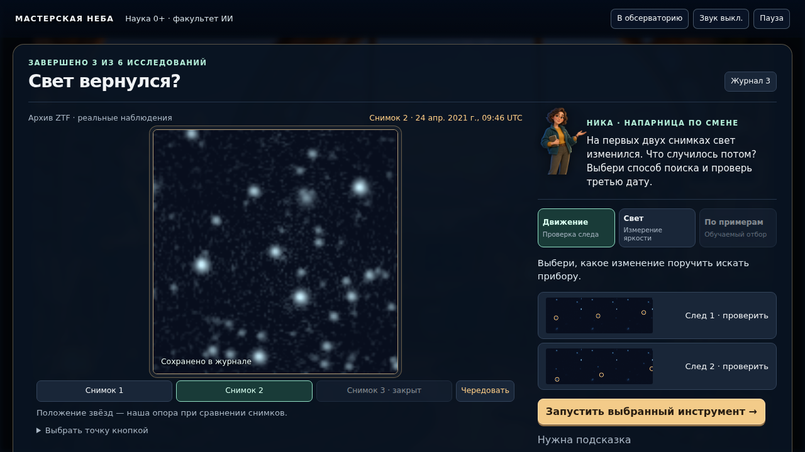
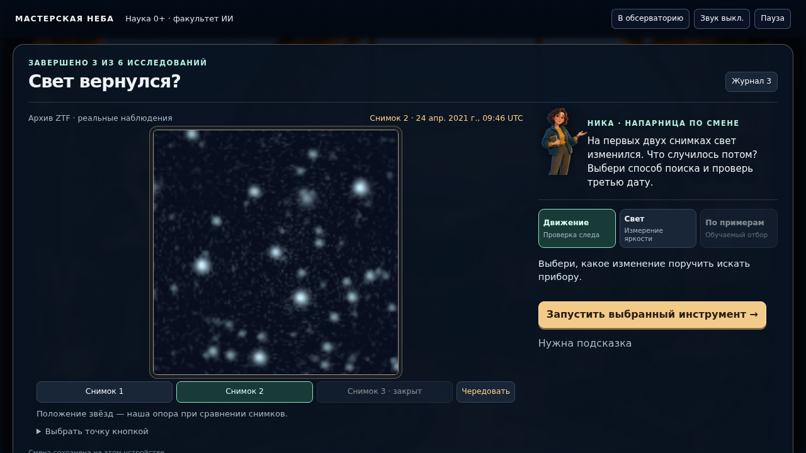
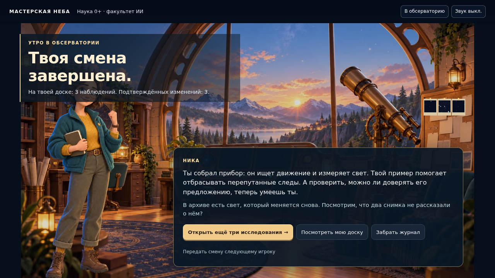

# Ночная смена — выпуск 2026.10.05-ready

Готовый браузерный билд: [играть](http://192.168.50.12:8081/).
Автономный билд: [night-shift.zip](http://192.168.50.12:8081/night-shift.zip).
Распаковать весь архив и открыть `index.html`. Установка и сеть не нужны.
Код и артефакты: [PR #1](https://github.com/fall-out-bug/msu_science_day_2026/pull/1),
ветка `codex/comparison-tracking`. PR не слит.

## Что доставлено

Целая научная игра для 10–13 лет: обсерватория с Никой → наведение по
звёздному атласу → реальные архивные снимки → собственная проверка →
инструмент и пример для обучения → проверка на другом поле → доска
наблюдений → рассвет. Режимы 3/6/9, продолжение, помощь, пауза, звук,
клавиатура, сохранение и самостоятельный HTML-журнал входят в билд.

Исследование референсов и отзывов сохранено в [references.md](references.md).
В игре применены сравнение свидетельств, постепенная помощь и накопление
собственных наблюдений. Снимки и выводы опираются на ZTF; происхождение,
лицензии и научные ограничения включены в архив. Учебный отбор по примерам
действительно пересчитывается, но его качество на всём небе не заявляется.

## Финальные исправления

- Открытие старого наблюдения из журнала больше не отправляет игрока
  повторять завершённое задание: возврат ведёт к незавершённому полю.
- Новое поле очищает предложения и подпись прошлого исследования.
  До исправления четвёртое поле показывало две чужие версии и «Сохранено
  в журнале» ещё до запуска прибора.
- Урок обучения очищает подсказку предыдущего упражнения.
- Пояснение цветов обновляется сразу при вычитании снимков и переключении даты.

## Проверка выпуска

| Проверка | Результат |
|---|---|
| Полная кампания через кнопки комнаты, карты и прибора | 230 проверок HTTP и 230 проверок скачанного ZIP через file://; режимы 3/6/9 |
| Ручное наведение, возвраты, несохранённый выбор, размеры экрана | 36 проверок исходной сборки |
| Реальные пиксели рассвета, пауза canvas, reduced-motion, финальные кнопки | 29 проверок исходной сборки |
| Правила кампании | 12 проверок |
| Обучение и перенос примера | 9 проверок, сверка с независимыми Python-числами |
| Дополнительные архивные поля | 4 поля; проверены честные исходы и контрольные измерения |
| Тождество сборок | SHA-256 всех 36 ресурсов совпали у исходников, HTTP и скачанного ZIP |
| Ошибки JavaScript и внешние загрузки | Не обнаружены в обоих полных прохождениях |
| Основное приложение на 8080 | ID контейнера, образ и время старта сохранены |

Разработчик также визуально прошёл короткую смену: просмотрел комнату и карту,
сравнил реальные кадры, проверил неподвижную звезду, ошибочную связь и ложное
предложение модели, просмотрел журнал, дошёл до рассвета и продолжил смену.
Это не слепой детский тест. Технические проверки не оценивают увлекательность.

Отчёты: `designlab/comparison/evidence/night-deployment.json`,
`night-browser.json`, `night-offline.json`, `world-browser.json`, `scene-browser.json`.
Воспроизведение: команды `check-night-browser.py`, `check-world-browser.py`,
`check-scene-browser.py` из [README приложения](../../designlab/comparison/README.md).

SHA-256 ZIP: `3b646bbec3a13d94641c4ef04a0d5761c3b98091f45630f2bafc23fe42d8cdd3`.
Размер: 9928908 байт.

## Граница завершения

Цель получить законченный запускаемый билд выполнена. Детский интерес,
самостоятельное прохождение за 10–15 минут и работа на конкретном фестивальном
оборудовании не измерены. Пользовательская приёмка не приписывается пользователю.
Для этой проверки подготовлен [короткий сценарий](child-playtest.md).

Для следующего игрока используйте «Передать смену следующему игроку» в финале.
Старое прохождение продолжается через «Продолжить мою смену». При проблемах
с локальным сохранением журнал можно скачать отдельно.
