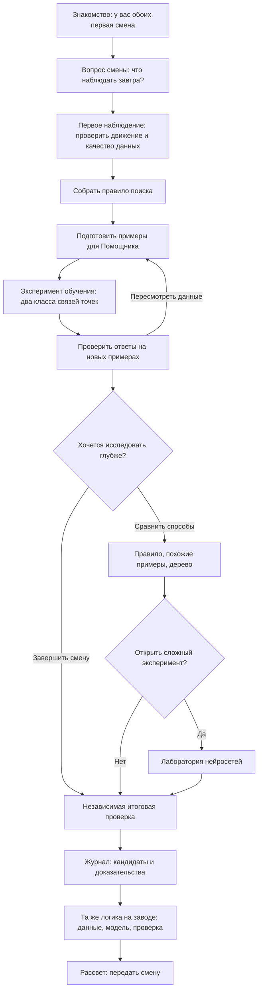
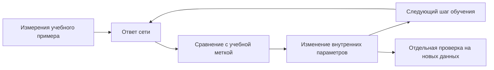
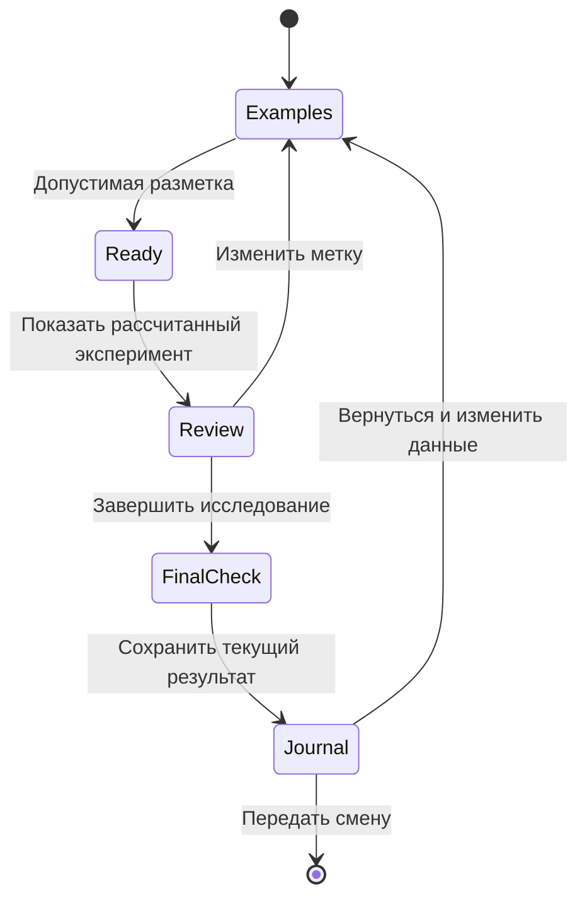

# Ночная смена: первая смена вместе

Единый сценарий игры и работы стендиста · проект для обсуждения · редакция 6 октября 2026

Это целевая концепция следующей редакции игры, а не описание уже реализованной версии. Реплики ниже — сценарные тексты. Имя ИИ-помощника пока не выбрано: в документе он называется «Помощник».

## 1. Замысел

У ребёнка и нового ИИ-помощника первая смена в обсерватории. Ника помогает им разобраться в наблюдениях. За ночь команда должна подготовить список кандидатов в движущиеся объекты, которые стоит наблюдать ещё. Сначала ребёнок исследует снимки сам, затем готовит примеры для помощника, испытывает его и передаёт следующей смене журнал с доказательствами.

Главная цель — понять, как из данных получается полезное решение: что такое наука о данных, машинное обучение и ИИ, какую работу они помогают выполнять в науке и индустрии.

Игра работает полностью без интернета. Все варианты работы алгоритмов и этапы обучения рассчитаны заранее. Выбор ребёнка определяет, какой подготовленный эксперимент будет показан. В игре нет живого чат-бота, обращений к внешним моделям и случайно генерируемых ответов.

## 2. Что ребёнок должен понять

| Понятие | Объяснение простыми словами | Где ребёнок это проживает |
|---|---|---|
| Наука о данных | Мы ставим вопрос, собираем и проверяем данные, исследуем их и обосновываем вывод | Выбирает пригодные снимки, сравнивает наблюдения, готовит журнал |
| Алгоритм | Последовательность действий для решения задачи | Собирает и испытывает правило поиска |
| Машинное обучение | Способ подготовить программу к задаче с помощью примеров; после этого её проверяют на новых данных | Размечает примеры, выбирает эксперимент обучения, проверяет ответы |
| ИИ | Компьютерные системы, которые решают задачи вроде распознавания изображений, работы с речью и текстом; их возможности ограничены | Знакомится с помощником и определяет его конкретную задачу |
| Польза для индустрии | Системы помогают обрабатывать данные и принимать решения; полезность подтверждают проверкой в конкретной работе | Передаёт список для наблюдений и переносит опыт на задачу завода |

Отношения понятий: машинное обучение — один из подходов к созданию ИИ. Наука о данных может использовать ML и ИИ, но включает также постановку вопроса, качество данных, анализ и проверку выводов. Не каждый алгоритм обучается.

Минимальный результат: ребёнок своими словами, выбором карточек или действиями показывает, какие примеры получил помощник, как его проверили и зачем результат нужен людям. Определения наизусть не требуются.

### Одна конкретная задача помощника

**Основной маршрут — бинарная классификация, а не поиск аномалий.** Научная цель смены — выбрать кандидатов для дальнейшего наблюдения. Учебная задача модели уже: отличить след одного движущегося объекта от неподвижных точек и случайных связей.

| Элемент задачи | Что зафиксировано в игре |
|---|---|
| Один пример | Предложенная связь трёх точек, по одной с каждого из трёх последовательных снимков |
| Вход модели | Измерения этой связи: смещение, согласованность движения по времени, изменение яркости |
| Учебные метки | «Движущийся след» и «Не движущийся след» |
| Выход модели | Одна из этих двух групп; ответ подлежит проверке |
| Основание проверки | Подготовленные независимые сведения о положении и времени, с указанными ограничениями |
| Чего модель не делает | Не определяет физический тип небесного тела, не ищет любые неизвестные явления и не объявляет открытия |

Связи точек подготовлены авторами заранее. Игра не изображает, будто ребёнок этим же опытом обучает выделение точек из изображения или полный поиск объектов на всём небе. Совместимость движения на трёх кадрах достаточна для учебного кандидата, но не для окончательного установления природы объекта.

«Недостаточно данных», «Нужен ещё снимок» и версии научного объяснения — решения исследователя вне двух учебных классов. Сомнительное наблюдение нельзя автоматически размечать как отрицательный пример: сначала требуется уточнение данных. В обязательную разметку включаются только примеры с достаточными основаниями для проверки.

### Где проходит граница с поиском аномалий

Классификация отвечает «К какой из известных групп относится пример?». Поиск аномалий отвечает «Насколько наблюдение отличается от принятого представления об обычном?». Две кнопки на экране сами по себе не делают эти постановки одинаковыми. Одноклассовое обучение — один из подходов к обнаружению необычного; поиск аномалий шире этого подхода. См. [различие обнаружения выбросов и новых необычных наблюдений в документации scikit-learn](https://scikit-learn.org/stable/modules/outlier_detection.html).

В основном маршруте отсутствуют оценка аномальности, порог необычности и обещание научить помощника «искать всё необычное». Многоклассовое объяснение астрономического явления также не подменяет учебные метки классификатора.

Отдельный опыт по поиску аномалий возможен в будущем, но **не входит в эту редакцию**. Для него нужно отдельно задать обычные наблюдения, подготовку данных и смысл оценки необычности. Необычность может означать интересное явление, помеху или недостаточность привычных примеров; сама по себе она не объясняет причину и не доказывает открытие.

## 3. Персонажи и роли

### Ребёнок — исследователь первой смены

Принимает решения: чему доверять в наблюдениях, как отметить пример, что проверить и что передать следующей смене. Может ошибаться, возвращаться и менять решения.

### Ника — наставница

Ставит задачу, направляет внимание, помогает проверять объяснения. Не выдаёт правильную метку до самостоятельной попытки и не хвалит автоматически любой ответ.

Карточка «Познакомиться с Никой»:

> Я Ника. В этой игре я работаю в обсерватории и помогу тебе провести первую смену. Мне интересно находить изменения на небе и разбираться, чем они вызваны. Иногда первая догадка оказывается неверной — поэтому мы сохраняем наблюдения и проверяем свои идеи.

Ника — вымышленный персонаж. Реальные телескопы и источники данных обозначаются отдельно.

### Помощник — ИИ на первой смене

Дружелюбный персонаж с конкретной задачей: относить предложенную связь трёх точек к одной из двух групп: «Движущийся след» или «Не движущийся след». Его развитие видно по примерам, ответам и результатам проверки. Он не обижается на исправления; ребёнок не несёт ответственности за его «чувства».

Карточка «Познакомиться с Помощником»:

> У меня тоже первая смена! Моя задача — отличать движущийся след от неподвижных точек и случайных связей. Мне дают три отмеченные точки с трёх снимков и их измерения. Ты покажешь примеры, а потом мы проверим мои предложения. Я могу ошибаться.
>
> Мои реплики написали авторы игры. Сегодня мы изучаем обучение поиску следов, а не обучение разговору. Все эксперименты здесь подготовлены заранее, чтобы игра работала без интернета.

## 4. Общая схема

Основной маршрут содержит весь цикл. Сравнение алгоритмов и нейросеть — необязательные продолжения до финала. Возраст не выбирается на входе; глубину определяют интерес ребёнка, помощь стендиста и доступное время.

Карта показывает происхождение наблюдений. Комната связывает действия: поступившие снимки, рабочее место, примеры помощника и доска результатов. Созвездия, история БТА и реальные применения ИИ доступны как остановки с явной кнопкой возврата к текущему заданию.

## 5. Сцены, реплики и работа стендиста

### Сцена 1. Двое новичков

**На экране:** комната обсерватории, Ника, выключенная панель Помощника. Игрок включает её.

**Ника:** «Хорошо, что ты пришёл! Сегодня у тебя первая смена. У нашего помощника — тоже. Вместе подготовим список объектов, за которыми стоит понаблюдать ещё».

**Помощник:** «Привет! Покажешь мне, что мы будем искать?»

**Выбор:** «Начать смену», «О Нике», «О помощнике». Карточки можно открыть и позднее.

**Стендист:** «Встречал раньше ИИ? Что с ним делал?» При необходимости называет знакомые примеры: ChatGPT, Claude, Алиса, ГигаЧат, DeepSeek, Qwen. Не перечисляет все названия, если ребёнок уже ответил.

**Связующая реплика стендиста:** «У разных систем разные задачи. Наш помощник будет искать следы на снимках. Сегодня посмотрим, как его к этому подготовить».

**Учебный смысл:** у системы есть назначение. Разговор с готовым ИИ и подготовка обучающих данных — разные действия.

### Сцена 2. Сначала вопрос и данные

**На экране:** участок неба на карте, затем последовательные снимки. Ребёнок переключает кадры и отмечает предполагаемое движение относительно звёзд.

**Ника:** «Какие объекты стоит посмотреть ещё раз? Начнём с этих снимков. Что изменилось?»

**После выбора:** «Покажи, какие наблюдения поддерживают твою догадку».

Ребёнок также видит подготовленный пример непригодного или сомнительного наблюдения и выбирает «Использовать» либо «Нужно другое наблюдение». Причина должна быть видна: например, нужная точка закрыта помехой. Учебная помеха явно обозначена как добавленная авторами, если её нет в исходных данных.

**Помощник:** «Если по снимку нельзя надёжно измерить положение, мой ответ тоже может оказаться ненадёжным».

**Стендист:** «Мы начали с вопроса, посмотрели данные и проверили их качество. Это часть науки о данных».

**Если трудно:** предложить сравнить небольшой участок и соседние звёзды. Не требовать чтения координат.

**Результат:** на доске появляется наблюдение с доказательством или пометкой «Недостаточно данных». Это ещё не открытие.

### Сцена 3. Как объяснить задачу машине

**Ника:** «Теперь наблюдений больше. Попробуем описать, какой след искать».

Из ограниченного набора ребёнок собирает правило: есть смещение; движение примерно согласовано по направлению и времени. Каждая разрешённая комбинация имеет подготовленный результат на общей подборке.

**Помощник:** «Я проверил условия, которые ты выбрал. Вот что они пропустили, а вот что отметили».

**Стендист:** «Это алгоритм по заданному правилу. Правило составил ты; по примерам оно сейчас не обучалось».

**Ника:** «Можно пойти другим путём — подготовить примеры с ответами. Посмотрим, как это меняет поиск».

**Смысл:** появляется контраст между явно заданным правилом и обучением по данным. Ручное правило не изображается заведомо плохим.

### Сцена 4. Примеры для первой смены

**На экране:** шесть подготовленных примеров. В каждом показаны точки с последовательных снимков. Каждый пример — заранее предложенная связь трёх точек, по одной с каждого снимка. Доступны ровно две учебные метки: «Движущийся след» и «Не движущийся след». «Нужна подсказка» помогает разобрать пример и не является третьим классом.

**Ника:** «Мог ли один движущийся объект оставить эти три точки? Отметь примеры двух групп. По твоим меткам помощник будет учиться различать такие связи».

**Помощник:** «Мне нужны примеры обеих групп: что искать и с чем это можно перепутать».

**Стендист:** на первом примере спрашивает «Почему ты так решил?», затем поясняет: «Мы распределяем примеры по двум известным группам. Это бинарная классификация». После этого даёт ребёнку действовать самостоятельно.

Если все примеры отнесены к одной группе:

**Помощник:** «В этом эксперименте нужны обе группы. Посмотрим, нет ли среди примеров неподвижных точек или случайных связей?»

Это ограничение конкретного эксперимента, а не утверждение о любых моделях ML.

**После разметки:** экран показывает всю выборку и кнопку «Посмотреть обучение на этих примерах».

**Постоянная короткая подпись:** «Учебная симуляция. Результаты экспериментов рассчитаны заранее».

### Сцена 5. Откуда взялся ответ

Показывается подготовленная последовательность для выбранной разметки: измерения следов, примеры с метками, новый пример и его сравнение с учебными.

**Помощник:** «Эта связь точек похожа на такие учебные примеры. По ним я выбрал одну из двух групп. Проверим мой ответ?»

**Ника:** «Так работает выбранный нами способ машинного обучения. Примеры повлияли на ответ для нового случая».

**Стендист:** «В настоящем эксперименте программа выполняет расчёты обучения. Здесь мы заранее рассчитали варианты и показываем тот, который соответствует твоим решениям».

Ребёнок открывает «Почему?» и видит конкретные похожие примеры, а не декоративную анимацию вычислений. Метки, объяснение и ответ принадлежат одной версии эксперимента.

### Сцена 6. Испытание помощника

**На экране:** новые связи трёх точек, не входившие в обучение. Проверяется тот же вопрос: движущийся след или нет. Перед открытием ответа ребёнок может сделать собственное предположение.

**Ника:** «На знакомых примерах мы готовили помощника. Теперь проверим его на других».

**Помощник:** «Вот мои предложения. Давай сверим их с наблюдениями».

Для выбранного случая показываются ответ, объяснение и независимая проверка по подготовленным данным о положении и времени. Совпадение не объявляется открытием.

**При ложной тревоге, Ника:** «Помощник предложил эту связь, но наблюдения её не подтверждают».

**При пропуске, Ника:** «Здесь есть подтверждённый след, а помощник его не выделил».

**Стендист:** «Где он поднял лишнюю тревогу? Где пропустил важное? Что могло повлиять на ответ?»

**Выбор:** «Проверить мои метки», «Сравнить способы», «Завершить исследование».

После исправления метки прежняя проверка и зависимый итог помечаются устаревшими. Показывается новый согласованный вариант. Нельзя сохранить прежнее сообщение об успехе при изменённых исходных решениях.

Улучшение счёта не гарантируется. Если ответы не изменились, объяснение прямо говорит об этом. Уже разобранный контроль используется для исследования ошибок; заключительная проверка проводится на отдельной подборке.

### Сцена 7. Дополнительное исследование: три способа

**Помощник:** «Я могу разными способами отличать движущийся след от других связей точек. Сравним их на одних примерах?»

| Способ | Что показывает объяснение | Откуда берётся решение |
|---|---|---|
| Правило | Какие условия сработали | Условия выбрал человек |
| Похожие примеры | Какие учебные примеры оказались близкими | Размеченная выборка и выбранный способ сравнения |
| Дерево решений | Путь по вопросам до ответа | Вопросы и пороги подобраны при подготовленном обучении |

Все способы решают одну задачу бинарной классификации связей точек и используют общую проверочную подборку. Оценка необычности и порог аномальности в этом сравнении не используются. У обучаемых способов одинаковая выбранная учебная выборка; правило её не использует. Показываем одинаковые признаки, чтобы не смешивать сравнение алгоритмов со сменой исходных данных.

**Стендист:** «В правиле вопросы задал человек. В дереве их подобрали по примерам. Посмотрим, почему ответы разошлись».

Нет обязательного победителя. Если способы дают одинаковые ответы, можно открыть заранее предусмотренный трудный случай; нельзя искусственно менять ответ ради драматургии.

### Сцена 8. Сложный сценарий: лаборатория нейросетей

**Ника:** «Есть ещё один способ. Небольшая нейросеть может учиться сочетать измерения следа. Хочешь посмотреть эксперимент?»

**Помощник:** «Я получу те же измерения: смещение, ровность движения и изменение яркости. В этом опыте я не рассматриваю весь снимок целиком».

Ребёнок выбирает один из подготовленных учебных наборов и открывает рассчитанную историю обучения бинарного классификатора. Сеть выдаёт одну из тех же двух групп; задача поиска аномалий здесь не вводится. Здесь используется расширенный архив: шесть примеров основного маршрута не выдаются за достаточную базу для убедительного сравнения нейросети. Если сравниваем сеть с другими обучаемыми методами, повторно готовим все методы на этом же расширенном наборе и проверяем на общей отдельной подборке.

**Ника:** «При обучении ответ сравнивают с учебной меткой и меняют внутренние настройки сети».

Кнопки: «Начало», «Следующий этап», «Сравнить результаты». Это просмотр сохранённых этапов, без имитации загрузки с сервера и фиктивного ожидания расчётов.

Показываются результаты на учебной и отдельной проверочной подборках. Заранее подготовленный эксперимент с переобучением должен действительно демонстрировать расхождение, подтверждённое расчётами.

**Стендист:** «На учебных примерах ошибок стало меньше. А что произошло на новых? Почему одной первой цифры недостаточно?»

**Помощник:** «Чтобы выбрать способ для смены, нужно проверить его на задаче. Самый сложный способ не обязан оказаться лучшим».

Если ребёнок просит детали, открываются схема небольшой сети и значения признаков. По умолчанию достаточно одного разобранного примера и двух результатов. Готовые проверочные ответы не участвуют в показанном обновлении параметров.

### Сцена 9. Рассвет и журнал

Команда проходит отдельную итоговую подборку и выбирает, какие предложения подтверждены достаточно для следующего наблюдения. Завершение смены возможно и с нерешёнными случаями: они помечаются «Нужны дополнительные данные».

**Ника:** «Наша смена заканчивается. Что передадим тем, кто будет наблюдать дальше?»

Журнал содержит:

- вопрос исследования;
- использованные данные и ограничения;
- выбранный способ и версию учебной выборки;
- результаты проверки: совпадения, ложные тревоги, пропуски;
- кандидатов для повторного наблюдения и основания выбора;
- случаи, где данных недостаточно.

**Помощник:** «Я помог подготовить предложения. В журнале видно, какие из них мы проверили и что ещё нужно выяснить».

**Ника:** «Ты поставил вопрос, разобрался в данных, подготовил примеры и проверил результат. Это работа исследователя данных».

Не показывать «Ты всё сделал правильно» по факту достижения последнего экрана. Финал описывает реальные решения текущей ветки. Не выдумывать экономию времени, точность и число открытий.

### Сцена 10. За пределами обсерватории

Обязательный короткий мост к индустрии; его можно пройти выбором картинок.

**Ника:** «Представь завод, где нужно проверять фотографии деталей. Что из нашей смены пригодится там?»

Ребёнок составляет цепочку из карточек:

**Вопрос:** есть ли на детали конкретный известный дефект → **Данные:** фотографии и результаты экспертной проверки → **Учебные примеры:** «Есть этот дефект» / «Нет этого дефекта» → **Модель:** классифицирует новые примеры → **Проверка:** новые детали и ошибки классификации → **Решение:** какие детали отправить на дополнительный осмотр. Это перенос той же задачи классификации; неизвестные виды дефектов требуют отдельной постановки задачи и проверки.

**Стендист:** «Какую работу здесь помогает делать ИИ? Как узнаем, что он полезен?»

При поддержке младшего ребёнка достаточно выбрать данные для задачи и показать, кто проверит предложение. Для заинтересованного: обсудить цену пропуска дефекта, ложные тревоги и изменение освещения на фотографиях.

**Помощник:** «Для другой задачи нужны подходящие данные и новая проверка. Мои примеры со звёздами для деталей не подойдут».

**Финальная реплика Ники:** «Данные помогают задать вопрос точнее. Машинное обучение помогает подготовить инструмент. Проверка показывает, можно ли использовать его в работе».

Это учебный пример применения, без заявлений о конкретной компании. Реальные отраслевые истории добавляются только с проверенными источниками.

## 6. Памятка стендисту

### Перед посетителями

Открыть локальную сборку без сети, начать чистую смену, проверить звук и доступность основных кнопок. Знать, как вернуться из дополнительных материалов, завершить короткий маршрут и сбросить состояние для следующего игрока.

### Во время смены

1. Дать цель одной фразой: «Подготовим помощника и решим, что наблюдать дальше».
2. Предложить действие и дождаться попытки. Ответ жестом или выбором картинки полноценен.
3. Помогать от меньшего вмешательства к большему: повторить цель → указать область внимания → разобрать один пример вместе.
4. После действия назвать понятие: данные, учебный пример, проверка. Не объяснять всё одновременно.
5. Спросить «Почему?» в одном значимом месте; не превращать каждую кнопку в экзамен.
6. Завершить переносом на другую задачу и передачей смены.

Четыре опорных вопроса: **«Что заметил? Почему так решил? Как ответил помощник? Как это проверить?»**

### Разная глубина участия

| Ситуация | Действие стендиста |
|---|---|
| Ребёнок не читает уверенно | Читает реплики вслух, принимает указание на снимке, сохраняет решения за ребёнком |
| Ребёнок действует самостоятельно | Вмешивается в переходах между этапами и при разборе ошибки |
| Ребёнок хочет устройство модели | Открывает сравнение алгоритмов и признаки |
| Ребёнок хочет больше | Предлагает нейросеть и эксперимент с переобучением |
| Нужно закончить раньше | Возвращает в краткий маршрут с обязательной проверкой и финалом; не оставляет историю на разметке |
| Несколько детей | Предлагает одному разметить, другому обосновать проверку, затем поменяться ролями |

Длительности пока не заявлены: их нужно измерить на пробных прохождениях. В игре нет обязательного таймера и наказания за медленный темп.

### Разговор о современных ИИ

Названия ChatGPT, Claude, Алиса, ГигаЧат, DeepSeek и Qwen служат знакомыми точками входа. Это не каталог равноценных продуктов: важно различать семейство моделей, приложение и голосового помощника. Состав и возможности конкретных продуктов могут меняться; отдельную справку для стендиста нужно проверить перед выпуском.

Безопасная общая формулировка: «Когда ты разговариваешь с готовой системой, ты используешь её возможности. Это не то же самое, что переобучить модель. В нашей игре мы специально рассматриваем подготовку примеров и проверку».

Демонстрация этих сервисов онлайн не входит в сценарий. Регистрация, телефоны и личные данные детей не нужны.

## 7. Контракт предсказуемой симуляции

Каждый допустимый выбор имеет заранее рассчитанный результат и объяснение. Нельзя принимать свободный ответ, а затем незаметно подменять его ближайшим удобным вариантом.

| Решение игрока | Ограничение | Подготовленный ответ |
|---|---|---|
| Правило | Конечный набор разрешённых условий | Результаты каждой доступной комбинации |
| Шесть двоичных меток | 64 комбинации; пригодность проверяется явно | Таблица для каждой комбинации либо объяснение, почему этот эксперимент недоступен |
| Исправление метки | Переход к другой комбинации | Новая версия результатов и объяснений |
| Сравнение способов | Фиксированные данные и доступные модели | Ответы каждого способа и данные для «Почему?» |
| Нейросеть | Несколько фиксированных учебных наборов и этапов | Сохранённые параметры/ответы и история ошибок для выбранного опыта |
| Итог | Отдельная подборка | Проверочные основания и журнал текущей ветки |

Для расширенного архива выбирать целые подготовленные наборы; не обещать свободную разметку произвольного числа объектов. Число вариантов рассчитывается до реализации интерфейса.

В подготовке экспериментов используются реальные расчёты выбранных методов. Вместе с результатами сохраняются версия данных, признаки, метки, параметры метода, разделение подборок и основания проверки. В браузере выбирается готовый вариант. Персонаж озвучивает его через фиксированные шаблоны.

Любое изменение исходных решений аннулирует зависимые проверки и финал. При возврате из журнала старый результат можно хранить только как явно подписанную историю прошлой версии.

Все необходимые данные, изображения, шрифты, реплики и результаты включены в локальную поставку. Ссылки на источники доступны как справка и не нужны для завершения игры. Одинаковые действия дают одинаковый результат, включая после восстановления сохранённой смены.

## 8. Что проверить до реализации и выпуска

### До реализации

- Выбрать конкретные наблюдения и проверить, что они подходят для каждого учебного момента.
- Проверить единицу классификации, две одинаково названные метки во всех сценах и отсутствие оценки аномальности в основном маршруте.
- Отделить решения о качестве данных и научные версии от учебных меток; сомнение не записывать автоматически в отрицательный класс.
- Рассчитать варианты и убедиться, что разметка действительно влияет на ответы хотя бы в предусмотренных показательных случаях.
- Подтвердить корректность дерева, метода похожих примеров и нейросетевого эксперимента; не подбирать вымышленные цифры под реплики.
- Проверить основания эталонных ответов и разделение учебных, разбираемых и итоговых данных.
- Согласовать персонажа визуально и выбрать имя; это не блокирует чтение сценария.

### На пробном прохождении

- Ребёнок понимает цель смены до начала разметки.
- Может показать, что стало данными для обучения и что проверялось отдельно.
- Не считает, что разметка следов научила персонажа разговаривать.
- Понимает хотя бы на примере, какую работу помогает выполнить ИИ.
- Стендист может вести основную смену по памятке, без отдельной лекции.
- Дополнительные ветки не мешают закончить основную историю.

### В готовой сборке

- Полное прохождение без сети, включая новые и восстановленные смены.
- Проверка всех доступных комбинаций выбора и согласованности объяснений.
- Пересмотр метки сбрасывает зависимые результаты, в том числе после перезагрузки.
- Повторно выполненное действие явно отмечено; лишнее нажатие не меняет результат неожиданно.
- Счётчики и русские формы слов корректны; интерфейс пригоден для 14-дюймового Full HD с масштабированием.
- Журнал отражает текущую ветку и ограничения наблюдений.

## 9. Граница этой редакции

Документ задаёт сюжет, реплики и педагогическую логику. Он не подтверждает готовность данных, рассчитанных экспериментов или реализации. Следующий рабочий артефакт — таблица конкретных примеров и результатов для сцен 2–8; после неё можно собирать экраны по этому сценарию.
